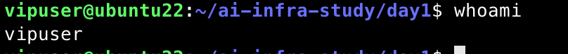
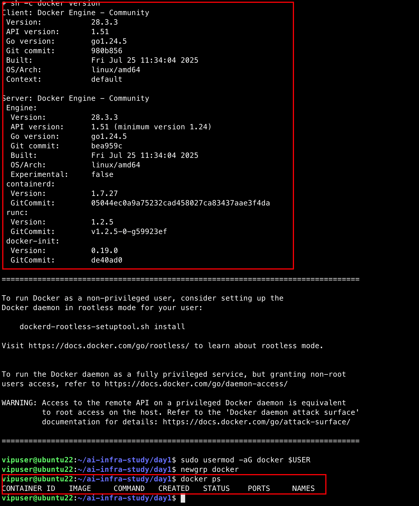
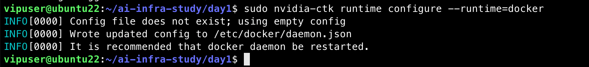
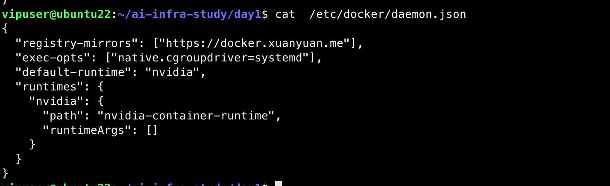
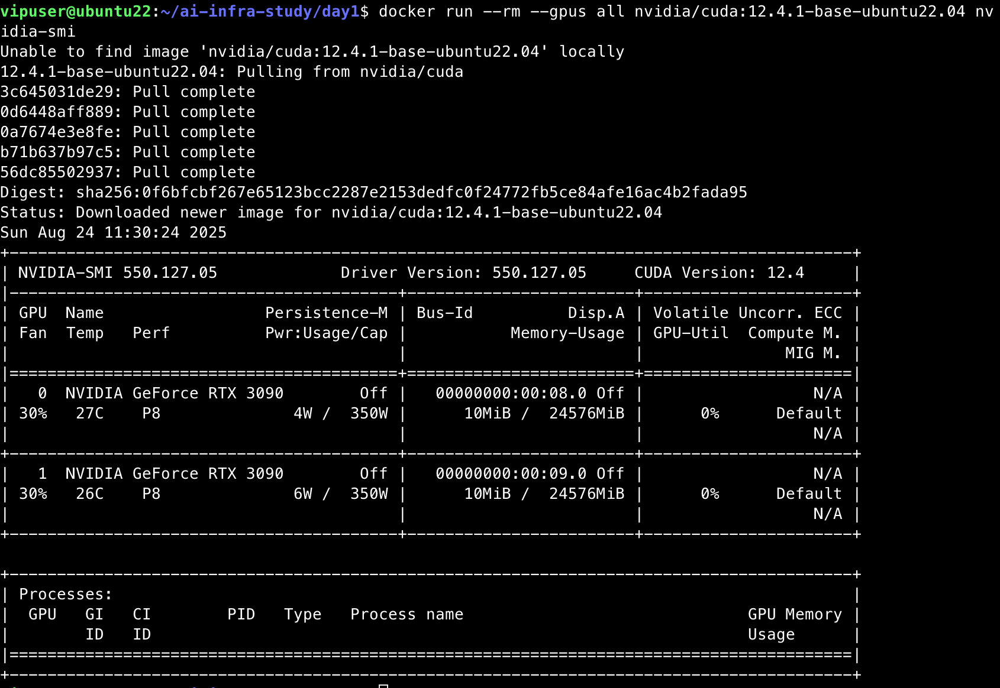

# Day 1-Docker & GPU 容器化

## 一、目标

- 在 **vipuser** 账号下安装并配置 Docker（含 NVIDIA 容器运行时）
- 使用 **docker.xuanyuan.me** 作为镜像加速
- 基于 **NGC 官方 PyTorch 镜像**（含 TensorRT SDK）构建最小推理环境
- 在容器里同时验证 **PyTorch + ONNX Runtime + TensorRT** 可用

## 二、用 **vipuser** 登录

```bash
# 回到普通用户（非 root）
whoami        # 应显示 vipuser
```

> 之后所有命令都以 `vipuser` 执行（遇到系统级操作用 sudo）。



### 1) 基础工具 & DNS/证书兜底（避免网络/证书导致的 curl/apt 失败）

```bash
sudo apt-get update
sudo apt-get install -y ca-certificates curl gnupg lsb-release
sudo update-ca-certificates
```

### 2) 安装 Docker CE（官方一键脚本，遇网络问题自动重试）

```bash
curl -fsSL https://get.docker.com | sudo sh || \
{ echo "Docker 安装失败，尝试 apt 源安装"; \
  sudo apt-get update && \
  sudo apt-get install -y docker-ce docker-ce-cli containerd.io docker-buildx-plugin docker-compose-plugin; }
```

把 **vipuser 加入 docker 组**（退出并重新登录一次让组权限生效）：

```bash
sudo usermod -aG docker $USER
newgrp docker  # 让当前 shell 立即生效，或重新登录
docker ps      # 不用 sudo 就能跑成功
```

运行结果如图所示，包含docker版本和docker ps命令运行结果：



### 3) 安装 NVIDIA Container Toolkit（nvidia-docker）

```bash
# 添加官方 Keyring 与源
distribution=$(. /etc/os-release; echo $ID$VERSION_ID) && \
curl -fsSL https://nvidia.github.io/libnvidia-container/gpgkey | \
  sudo gpg --dearmor -o /usr/share/keyrings/nvidia-container-toolkit-keyring.gpg

curl -fsSL https://nvidia.github.io/libnvidia-container/$distribution/libnvidia-container.list | \
  sed 's#deb https://#deb [signed-by=/usr/share/keyrings/nvidia-container-toolkit-keyring.gpg] https://#g' | \
  sudo tee /etc/apt/sources.list.d/nvidia-container-toolkit.list

sudo apt-get update
sudo apt-get install -y nvidia-container-toolkit
```

配置 Docker 使用 NVIDIA runtime：

```bash
sudo nvidia-ctk runtime configure --runtime=docker
```

运行结果如图所示：

### 4) **启用“轩辕镜像”**并设置默认 runtime

编辑 `/etc/docker/daemon.json`（不存在就新建）：

```bash
cat <<'JSON' | sudo tee /etc/docker/daemon.json
{
  "registry-mirrors": ["https://docker.xuanyuan.me"],
  "exec-opts": ["native.cgroupdriver=systemd"],
  "default-runtime": "nvidia",
  "runtimes": {
    "nvidia": {
      "path": "nvidia-container-runtime",
      "runtimeArgs": []
    }
  }
}
JSON

# 重载并重启
sudo systemctl daemon-reload
sudo systemctl restart docker
# 打印最新的配置文件
cat  /etc/docker/daemon.json
```

结果如图所示：

### 5) GPU 容器基础自检（排除驱动/运行时问题）

```
docker run --rm --gpus all nvidia/cuda:12.4.1-base-ubuntu22.04 nvidia-smi
```

看到两张 **RTX 3090** 与驱动/CUDA 版本，说明容器内 GPU 通了



### 6) 构建 AI 环境镜像（包含PyTorch + ONNX + TensorRT SDK）

在 `day1/` 目录下创建 `Dockerfile`：

```dockerfile
# NGC 官方 PyTorch 镜像（含 CUDA/cuDNN/NCCL + TRT SDK）
FROM nvcr.io/nvidia/pytorch:25.06-py3

ENV DEBIAN_FRONTEND=noninteractive \
    PIP_NO_CACHE_DIR=1 PIP_DEFAULT_TIMEOUT=120 PIP_RETRIES=5

# 只补必要工具
RUN apt-get update && apt-get install -y --no-install-recommends \
    ca-certificates curl && rm -rf /var/lib/apt/lists/*

WORKDIR /workspace

# 仅补 ONNX + ORT（TRT SDK 已在基镜像里）
RUN python -m pip install --extra-index-url https://pypi.org/simple -i https://mirrors.aliyun.com/pypi/simple \
    --only-binary=:all: --prefer-binary \
    onnx==1.16.1 onnxruntime-gpu==1.20.0

# 快速自检，构建时就能早发现环境问题（可注释）
RUN python - <<'PY'
import sys, torch, onnx, onnxruntime as ort
print("Python:", sys.version.split()[0])
print("Torch:", torch.__version__, "| CUDA:", torch.version.cuda, "| cuDNN:", torch.backends.cudnn.version())
print("ONNX:", onnx.__version__)
print("ORT:", ort.__version__, "| Providers:", ort.get_available_providers())
PY
```

**创建文件torch_check.py（容器内运行）**

```python
import torch, onnxruntime as ort, platform
print("Torch:", torch.__version__, "| Python:", platform.python_version())
print("CUDA available:", torch.cuda.is_available())
if torch.cuda.is_available():
    print("GPU count:", torch.cuda.device_count())
    for i in range(torch.cuda.device_count()):
        print(f"  [{i}] {torch.cuda.get_device_name(i)}")
print("ORT:", ort.__version__)
print("Providers:", ort.get_available_providers())
```

**构建 & 运行：**

```bash
cd ~/ai-infra-study/day1
docker build -t ai-infra:day1 .
docker run --gpus all --rm -it -v $PWD:/workspace ai-infra:day1 bash -lc "python torch_check.py"
```


