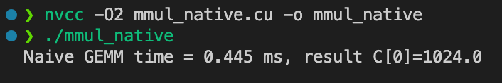
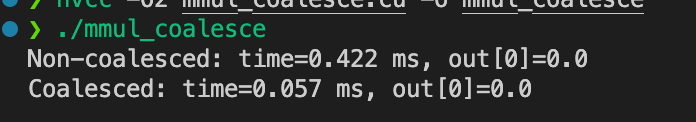
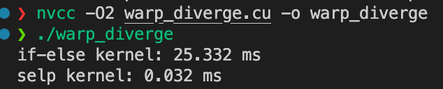
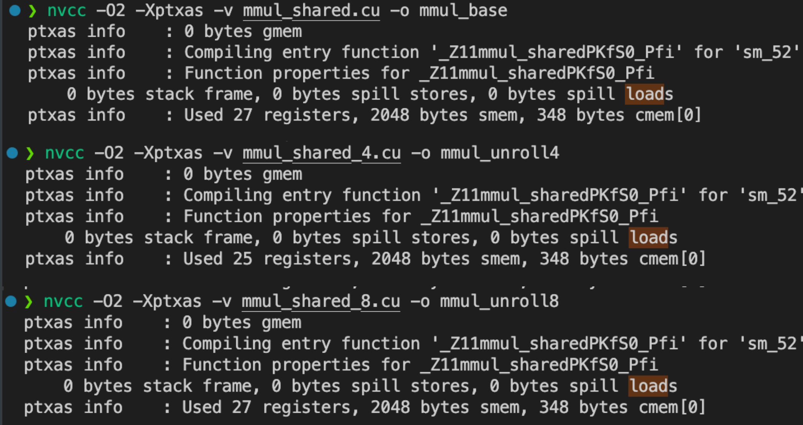
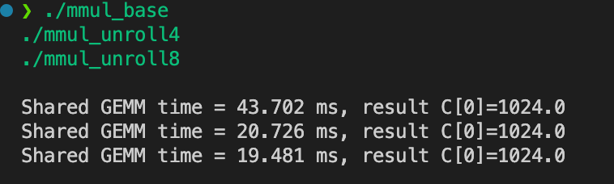
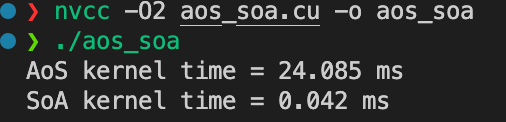
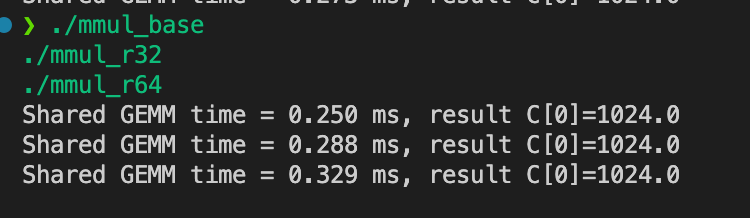
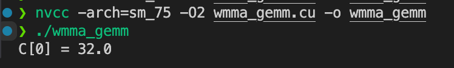

# Day 10 - CUDA 优化技巧

---

## 🎯 学习目标

- 理解 warp divergence 与 memory coalescing
- 使用 shared memory 优化矩阵乘法
- 学会用 Nsight 分析 occupancy、访存带宽、寄存器使用

  

## 1️⃣ 基础理论

### (1) Warp divergence（分支发散）

- 一个 **warp = 32 个线程**。
- 如果 warp 内线程遇到分支（if/else），不同线程走不同路径 → GPU 必须顺序执行不同分支 → **性能下降**。

例子：

```c++
if (threadIdx.x % 2 == 0) { ... } else { ... }
```

👉 一半线程在等另一半，效率减半。

### (2) Memory coalescing（内存合并访问）

- Global Memory 带宽利用率取决于 warp 内线程是否访问连续地址。
- **连续访问**（0,1,2,3...） → 合并成一次大内存事务。
- **乱序访问** → 每个线程单独访问，带宽利用率极低。

### (3) Shared memory 矩阵乘

- Naive GEMM：每个线程从 global memory 多次加载同一元素，浪费带宽。
- Shared memory tiling：把数据块读进 shared memory，让 block 内线程共享，减少 global memory 访问。


### (4) Occupancy

- **定义**：一个 SM 上同时活跃的 warp 数 / 最大 warp 数。
- Occupancy 高有助于掩盖内存延迟，但不是越高越好（计算密集型内核反而可能性能下降）。


## 2️⃣ 矩阵乘法

### (1) Naive 矩阵乘：`mmul_naive.cu`

```c++
#include <cuda_runtime.h>
#include <stdio.h>

__global__ void mmul_native(const float* A, const float* B, float* C, int N)
{
    int row = blockIdx.y * blockDim.y + threadIdx.y;
    int col = blockIdx.x * blockDim.x + threadIdx.x;

    if (row < N && col < N)
    {
        float sum = 0;
        for (int k = 0; k < N; k++)
        {
            sum += A[row * N + k] * B[k * N + col];
        }
        C[row * N + col] = sum;
    }
}

int main()
{
    const int N = 512;
    size_t bytes = N * N * sizeof(float);

    float host_a[N * N], host_b[N * N], host_c[N * N];

    for (int i = 0; i < N * N; i++)
    {
        host_a[i] = 1.0f;
        host_b[i] = 2.0f;
    }

    float *device_a, *device_b, *device_c;
    cudaMalloc(&device_a, bytes);
    cudaMalloc(&device_b, bytes);
    cudaMalloc(&device_c, bytes);

    cudaMemcpy(device_a, host_a, bytes, cudaMemcpyHostToDevice);
    cudaMemcpy(device_b, host_b, bytes, cudaMemcpyHostToDevice);

    dim3 block(16, 16);
    dim3 grid((N + block.x - 1) / block.x, (N + block.y - 1) / block.y);

    float ms = 0;
    cudaEvent_t start, stop;
    cudaEventCreate(&start);
    cudaEventCreate(&stop);

    cudaEventRecord(start);
    mmul_native<<<grid, block>>>(device_a, device_b, device_c, N);
    cudaEventRecord(stop);
    cudaEventSynchronize(stop);

    cudaEventElapsedTime(&ms, start, stop);
    cudaMemcpy(host_c, device_c, bytes, cudaMemcpyDeviceToHost);

    printf("Naive GEMM time = %.3f ms, result C[0]=%.1f\n", ms, host_c[0]);

    cudaFree(device_a);
    cudaFree(device_b);
    cudaFree(device_c);

    return 0;
}

```

预期输出：



C = A×B = 1×2×N = 8

### (2) Shared memory 矩阵乘：`mmul_shared.cu`

```c++
#include <cuda_runtime.h>
#include <stdio.h>

#define TILE 16
// shared memory
__global__ void mmul_shared(const float* A, const float* B, float* C, int N)
{
    __shared__ float a_shared[TILE][TILE];
    __shared__ float b_shared[TILE][TILE];

    int row = blockIdx.y * TILE + threadIdx.y;
    int col = blockIdx.x * TILE + threadIdx.x;

    float sum = 0;
    for (int t = 0; t < (N + TILE - 1) / TILE; t++)
    {
        if (row < N && (t * TILE + threadIdx.x) < N)
        {
            a_shared[threadIdx.y][threadIdx.x] = A[row * N + t * TILE + threadIdx.x];
        }
        else
        {
            a_shared[threadIdx.y][threadIdx.x] = 0;
        }

        if (col < N && (t * TILE + threadIdx.y) < N)
        {
            b_shared[threadIdx.y][threadIdx.x] = B[(t * TILE + threadIdx.y) * N + col];
        }
        else
        {
            b_shared[threadIdx.y][threadIdx.x] = 0;
        }

        __syncthreads();

        for (int k = 0; k < TILE; k++)
        {
            sum += a_shared[threadIdx.y][k] * b_shared[k][threadIdx.x];
        }

        __syncthreads();
    }
    if (row < N && col < N)
    {
        C[row * N + col] = sum;
    }
}

int main()
{
    const int N = 512;
    size_t bytes = N * N * sizeof(float);

    float* host_a = (float*)malloc(bytes);
    float* host_b = (float*)malloc(bytes);
    float* host_c = (float*)malloc(bytes);

    for (int i = 0; i < N * N; i++)
    {
        host_a[i] = 1.0f;
        host_b[i] = 2.0f;
    }

    float *device_a, *device_b, *device_c;
    cudaMalloc(&device_a, bytes);
    cudaMalloc(&device_b, bytes);
    cudaMalloc(&device_c, bytes);

    cudaMemcpy(device_a, host_a, bytes, cudaMemcpyHostToDevice);
    cudaMemcpy(device_b, host_b, bytes, cudaMemcpyHostToDevice);

    dim3 block(TILE, TILE);
    dim3 grid((N + TILE - 1) / TILE, (N + TILE - 1) / TILE);

    cudaEvent_t start, stop;
    cudaEventCreate(&start);
    cudaEventCreate(&stop);

    cudaEventRecord(start);
    mmul_shared<<<grid, block>>>(device_a, device_b, device_c, N);
    cudaEventRecord(stop);
    cudaEventSynchronize(stop);

    float ms;
    cudaEventElapsedTime(&ms, start, stop);
    cudaEventDestroy(start);
    cudaEventDestroy(stop);

    cudaMemcpy(host_c, device_c, bytes, cudaMemcpyDeviceToHost);

    printf("Shared GEMM time = %.3f ms, result C[0]=%.1f\n", ms, host_c[0]);

    cudaFree(device_a);
    cudaFree(device_b);
    cudaFree(device_c);

    free(host_a);
    free(host_b);
    free(host_c);

    return 0;
}

```

预期输出：


👉 可以看到比 Naive 快很多。  

### (3) Coalesced vs Non-Coalesced 访存：`mmul_coalesce.cu`

```c++
#include <cuda_runtime.h>
#include <stdio.h>

// 非合并访存（行错位）
__global__ void kernel_non_coalesce(float* out, const float* in, int N)
{
    int tid = blockIdx.x * blockDim.x + threadIdx.x;
    if (tid < N)
    {
        // 故意乱序
        out[tid] = in[(tid * 17) % N];
    }
}

// 合并访存
__global__ void kernel_coalesce(float* out, const float* in, int N)
{
    int tid = blockIdx.x * blockDim.x + threadIdx.x;
    if (tid < N)
    {
        // 顺序访问
        out[tid] = in[tid];
    }
}

int main()
{
    const int N = 1 << 20; // 1M元素
    size_t bytes = N * sizeof(float);

    float* host_in = (float*)malloc(bytes);
    float* host_out = (float*)malloc(bytes);
    for (int i = 0; i < N; i++)
    {
        host_in[i] = i;
    }

    float *device_in, *device_out;
    cudaMalloc(&device_in, bytes);
    cudaMalloc(&device_out, bytes);

    cudaMemcpy(device_in, host_in, bytes, cudaMemcpyHostToDevice);

    dim3 block(256);
    dim3 grid((N + block.x - 1) / block.x);

    float ms_1;
    cudaEvent_t start, stop;
    cudaEventCreate(&start);
    cudaEventCreate(&stop);

    cudaEventRecord(start);
    kernel_non_coalesce<<<grid, block>>>(device_out, device_in, N);
    cudaEventRecord(stop);
    cudaEventSynchronize(stop);

    cudaEventElapsedTime(&ms_1, start, stop);
    cudaMemcpy(host_out, device_out, bytes, cudaMemcpyDeviceToHost);
    printf("Non-coalesced: time=%.3f ms, out[0]=%.1f\n", ms_1, host_out[0]);

    cudaEventRecord(start);
    kernel_coalesce<<<grid, block>>>(device_out, device_in, N);
    cudaEventRecord(stop);
    cudaEventSynchronize(stop);

    cudaEventElapsedTime(&ms_1, start, stop);
    cudaMemcpy(host_out, device_out, bytes, cudaMemcpyDeviceToHost);
    printf("Coalesced: time=%.3f ms, out[0]=%.1f\n", ms_1, host_out[0]);

    cudaFree(device_in);
    cudaFree(device_out);

    free(host_in);
    free(host_out);

    return 0;
}

```

### 输出

👉 **合并访存明显更快**，在 Nsight 里能看到 **Global Load Efficiency 由 ~30% → ~100%**。

  

## 3️⃣ 深度追问

### 1. 分支消除与查表法在 GPU 上的适用性？

#### 🔎 1. 分支消除 (Branch Elimination)

##### 背景

- GPU 的执行单元以 **warp (32个线程)** 为调度粒度。
- 如果 warp 内线程在 `if/else` 中走了不同路径，就会发生 **warp divergence (分支发散)**：
  - GPU 会串行执行每条分支路径；
  - 没走该分支的线程在等待，浪费资源。

##### 分支消除的思路

- 用 **三目运算符 `?:`** 或 **PTX `selp` 指令** 替代 if-else，让所有线程执行相同指令流。

例子：

```
// 有分支
if (x > 0) y = a; else y = b;

// 消除分支
y = (x > 0) ? a : b; // 编译成 selp
```

##### 适用性

✅ **适合**：

- 分支逻辑简单，开销小。
- 两个分支路径执行代价差不多。
- 条件判断频繁出现在核心循环里。

⚠️ **不适合**：

- 两个分支路径差异极大（比如一个分支做大量计算，另一个什么都不做）。
- 这种情况下，分支消除会导致所有线程都执行“重分支”的运算（即使不需要），反而更慢。

------

#### 🔎 2. 查表法 (Lookup Table, LUT)

##### 背景

- 当分支条件是**有限离散取值**时，可以预先把结果放到查表数组里，避免 `switch/if`。

例子：

```
// 有分支
if (state == 0) y = f0(x);
else if (state == 1) y = f1(x);
else y = f2(x);

// 查表
__device__ float (*funcs[3])(float) = {f0, f1, f2};
y = funcs[state](x);
```

或者更简单：

```
__device__ int lut[4] = {0,1,3,7};
y = lut[input & 3];
```

##### 适用性

✅ **适合**：

- 条件是 **小范围枚举值**（0/1/2/3 …）。
- 每次计算分支逻辑比一次内存访问更昂贵（比如复杂表达式）。
- 查表数组能放到 **常量内存 / shared memory**，命中率高，访问快。

⚠️ **不适合**：

- 条件范围大（LUT 很大，超出常量缓存），会退化成随机 global memory 访问。
- 每个线程查不同索引，LUT 访问不合并，cache 效率差。

------

#### 🔬 3. 实战经验总结

- **分支消除**：
  - 在 GPU 核心循环中非常常见（避免 warp divergence）。
  - 但要平衡“避免 divergence” vs “强制多做无用计算”。
- **查表法**：
  - 对 **小范围离散值** 是利器。
  - 尤其适合放在 **常量内存** 或 **shared memory**。
  - 如果索引大且分布乱，就不如直接分支。

------

#### ✅ 总结

- **分支消除**：适合轻量分支，避免 warp divergence；但重分支会变慢。
- **查表法**：适合小范围枚举，常量/共享内存存 LUT 时非常高效；大表/乱访问不适合。

### 2. loop unrolling 的收益与 register 膨胀的权衡？

#### 🔎 1. Loop Unrolling 的收益

##### (1) 减少循环开销

- 展开后不需要每次迭代判断 `i < N`，也少了 `i++`。
- 节省了控制流指令（branch/jump）。

##### (2) 增加指令级并行度 (ILP)

- 编译器可以把展开后的多次迭代指令交叉调度，提升 pipeline 利用率。
- 能更好地掩盖访存延迟。

##### (3) 更适合指令优化

- GPU 的 warp scheduler 可以把展开后的算子更好地塞满执行单元。
- 对访存型代码，可以增加 prefetch 效果。

------

#### 🔎 2. Loop Unrolling 的代价

##### (1) **寄存器压力增加**

- 展开后的多个迭代变量同时存在 → 需要更多寄存器。
- 例如：
  - 不展开：一个循环体用 10 个寄存器。
  - 展开 4 倍：可能要用 30–40 个寄存器。

##### (2) **Occupancy 下降**

- 每个 SM 的寄存器数是有限的（Ampere 通常 64K × 32-bit）。
- 如果单线程寄存器用量过大 → 能同时驻留的线程数减少 → **并行度下降**。

##### (3) **可能触发 spill**

- 如果寄存器不够，编译器会把部分变量 spill 到 **local memory（显存）**。
- Local memory 延迟几百 cycle，比寄存器慢几个数量级。

------

#### 🔎 3. 权衡点

- **访存受限 (memory bound) 内核**：
  - Loop unrolling 可以掩盖访存延迟 → 有收益。
  - 适度增加寄存器一般没关系。
- **计算受限 (compute bound) 内核**：
  - Loop unrolling 提升不大，反而因为寄存器增加 → occupancy 下降 → 性能下降。
- **经验法则**：
  - 展开 2× 或 4× 通常收益明显。
  - 展开 8× 或以上 → 寄存器数膨胀，容易得不偿失。

------

#### ✅ 总结

- **Unrolling 提升 ILP，减少控制流开销 → 有助于性能**。
- **但会增加寄存器使用 → 降低 occupancy，甚至导致 spill**。
- **最佳点在 2× 或 4× unroll**，要用 Nsight 观察寄存器 & occupancy 找平衡。

------

### 3. 访存对齐与 coalescing 的关系？

#### 1️⃣ 什么是访存对齐 (Memory Alignment)

- GPU global memory 是按 **transaction (内存事务)** 来访问的，大小通常是 **32B / 64B / 128B**。
- **对齐 (aligned)**：线程访问的地址落在这些 transaction 的边界上。
- **不对齐 (misaligned)**：访问跨越边界，会触发额外的 transaction。

例子（warp=32个线程，每个线程访问4字节）：

- 如果从地址 **0 开始**：一次 128B transaction 就能搞定。
- 如果从地址 **4 开始**：可能需要 2 次 transaction，因为地址 4–131 跨越了 128B 边界。

------

#### 2️⃣ 什么是 Coalescing (合并访存)

- 一个 warp (32线程) 发起的访问会尽量被 GPU **合并成尽可能少的 transaction**。
- 合并成功条件：
  1. **线程访问连续地址**
  2. **地址按数据大小对齐**
- 合并失败：warp 内每个线程的访问被拆成多个 transaction → 带宽利用率大幅下降。

------

#### 3️⃣ 对齐与 Coalescing 的关系

✅ **对齐是 coalescing 的前提之一**：

- 如果 warp 内线程访问是连续的，但起始地址不对齐 → 仍可能需要多一次 transaction。

举例：

- **对齐 + 连续**：
  - 线程0 → addr0, 线程1 → addr4, … → 线程31 → addr124
  - 完美合并 → 1 次 128B transaction
- **不对齐 + 连续**：
  - 线程0 → addr4, 线程1 → addr8, … → 线程31 → addr128
  - 跨越 128B 边界 → 需要 2 次 transaction
- **不连续**：
  - 线程0 → addr0, 线程1 → addr64, 线程2 → addr128 …
  - 完全无法合并 → 每个线程单独一个 transaction

------

#### 4️⃣ 实践中的优化技巧

1. **结构体对齐**

   - 避免 AoS (Array of Structures)，因为结构体大小可能不是 4B/8B/16B 的倍数。
   - 改成 SoA (Structure of Arrays)，保证每个数组是连续的 float/int。

2. **显式对齐**

   - 使用 `__align__(16)` 或 `float4` 来保证内存对齐。

   - 例如：

     ```
     struct __align__(16) Particle { float x, y, z, w; };
     ```

3. **pitch 分配**

   - 对 2D 数组使用 `cudaMallocPitch`，保证行对齐到 128B。

------

#### ✅ 总结一句

- **访存对齐** 决定 warp 的内存访问是否落在内存事务边界上。
- **coalescing** 需要 **对齐 + 连续访问**，否则会拆 transaction，降低 Global Load Efficiency。
- 所以：
  - **对齐是 coalescing 的必要条件**，
  - 但 **连续访问**同样必不可少。

### 4. inline PTX 的价值与可维护性风险？

#### 🔎 1. Inline PTX 的价值

##### (1) 使用编译器未公开的硬件指令

- CUDA C++ 提供的 API 并不覆盖 GPU 的所有指令。
- 用 `asm volatile("...");` 可以直接调 PTX 指令，比如：
  - `shfl.sync` warp shuffle
  - `bar.sync` warp 屏障
  - `ldmatrix` / `mma.sync` (Tensor Core 指令)
- 场景：你需要手工调用最新架构支持的特殊硬件指令，而 CUDA 头文件还没封装。

------

##### (2) 精细控制寄存器 / 内存操作

- 你可以决定哪些变量放寄存器、如何使用 load/store 指令。
- 对 **访存模式敏感的内核**（如矩阵乘、卷积）可以手动优化，减少不必要的访存或避免编译器生成低效指令。

------

##### (3) 高级性能调优

- 可以手动调度指令，减少 pipeline stall。
- 在极限场景（比如 GPU kernel 优化到瓶颈）中，inline PTX 能挤出 10%–30% 的性能。

------

#### 🔎 2. Inline PTX 的可维护性风险

##### (1) 可移植性差

- PTX 不是最终的机器码（SASS），不同 GPU 架构对 PTX 的实现可能不同。
- 一段在 **sm_70** 上好用的 inline PTX，可能在 **sm_90** 上性能退化甚至报错。

------

##### (2) 可读性和可维护性差

- PTX 是低层汇编，代码冗长，难以阅读。
- 团队开发时，后续维护人员可能根本看不懂，难以修改和扩展。

------

##### (3) 与编译器优化冲突

- CUDA 编译器会对 C++ 和 PTX 混合代码进行寄存器分配、优化。
- 如果 PTX 部分和编译器生成的代码产生冲突（寄存器分配不一致、控制流异常），可能导致难以定位的 bug。

------

##### (4) 向前兼容性风险

- 新版 CUDA toolkit 有时会更改 PTX 指令集或语义。
- 内嵌 PTX 可能编译报错，或者行为和旧版不同。

------

#### 🔎 3. 实际使用建议

✅ **适合用 inline PTX 的场景**：

- 研究/实验性质的性能极限优化。
- CUDA 官方 API 暂未覆盖的最新硬件指令。
- 内核的性能瓶颈极难优化，必须精细控制。

⚠️ **不适合用的场景**：

- 项目需要长期维护、跨 GPU 架构运行。
- 代码由多人协作开发。
- 优化收益很小（<10%）。

------

#### ✅ 总结

- **价值**：inline PTX 能让你调用 CUDA API 不提供的指令、精细控制寄存器和访存，是性能极限优化的利器。
- **风险**：可读性差、可移植性差、和编译器优化容易冲突，长期维护成本极高。
- **实践建议**：能用 CUDA intrinsics/库函数就别用 PTX，把 inline PTX 留到“性能卡死在瓶颈 + 官方 API 覆盖不到”的特殊场景。

### 5. occupancy 并非越高越好，何时会反向影响性能？

#### 🔎 1. 什么是 Occupancy

- **定义**：一个 SM 上的活跃 warp 数 / 该 SM 的最大 warp 数。
- 高 occupancy → 更多 warp 并发，能更好地掩盖内存延迟。
- 低 occupancy → 并发 warp 少，GPU 核心可能空闲。

------

#### 🔎 2. 为什么 “并非越高越好”

##### (1) 寄存器 & Shared Memory 被压缩

- 每个线程的寄存器数 = 总寄存器数 / 活跃线程数。
- 如果 occupancy 过高，编译器会给每个线程分配更少的寄存器。
- 一旦寄存器不够用 → **变量 spill 到 local memory (显存)** → 访存延迟比寄存器高几个数量级 → 性能下降。

👉 **典型场景**：你在实验 4 (`--maxrregcount=32 vs 64`) 已经看到：

- 32 寄存器版本 → occupancy 更高，但因为寄存器不够 → spill → 反而比 64 慢了 8 倍。

------

##### (2) 内核是 Compute-bound 而不是 Memory-bound

- Memory-bound 内核：warp 多一点可以掩盖访存延迟 → Occupancy 提升有效。
- Compute-bound 内核：主要耗时在算术运算，不怎么卡内存。
  - 在这种情况下，occupancy 高低对性能影响不大。
  - 如果为了追求高 occupancy 而降低寄存器 → 反而会因为寄存器不足导致性能下降。

------

##### (3) Warp Scheduling Overhead

- Warp 太多时，调度器需要在更多 warp 中切换 → 上下文切换成本增加。
- 如果 kernel 本身 latency 不高，warp 过多会让调度开销大于收益。

------

##### (4) Cache / Bandwidth 争用

- Occupancy 高意味着并发线程数多，**同时访问内存的请求也更多**。
- 可能导致 **L1/L2 cache thrashing** 或 **DRAM 带宽饱和**，甚至性能下降。

------

#### 🔎 3. 实际经验法则

- **低 occupancy (<25%)**：一般性能差，因为 warp 太少，无法掩盖访存延迟。
- **中等 occupancy (50%~70%)**：常常是最佳点，寄存器和并发度平衡。
- **极高 occupancy (90%~100%)**：不一定更快，尤其是 compute-bound 内核，甚至更慢。

------

#### 🔎 4. 实践怎么判断

1. 用 **Nsight Compute** 看指标：
   - 如果 **Memory Latency High / Warp Stall: Memory Dependency** 占比高 → 提升 occupancy 有用。
   - 如果 **Warp Stall: Execution Dependency** 占比高 → 说明是计算瓶颈，occupancy 高低无关。
2. 对比不同 `--maxrregcount` 或 block size，找出 **时间最短**的配置，而不是 occupancy 最大的。

------

#### ✅ 总结

Occupancy 只是 GPU 并发能力的一个指标，**不是越高越好**。

- **内存受限内核** → 适当提升 occupancy 有利。
- **计算受限内核** → 盲目追求高 occupancy 会导致寄存器不足、spill、cache thrashing，反而性能下降。

### 6. Tensor Core 前置条件（shape/对齐/数据类型）？

#### 🔎 1. 矩阵尺寸 (Shape)

Tensor Core 硬件的基本计算单元是 **16×16×16 tile**：

- **M, N, K** 都必须是 **16 的倍数**（Ampere 支持 8 的倍数，但 16 最保险）。
- 如果矩阵大小不是 16 的倍数，WMMA 内核会退化到 CUDA Core 计算，无法使用 Tensor Core。

例子：

- ✅ `M=N=K=1024`（16 的倍数 → 可以）
- ❌ `M=1000`（不是 16 的倍数 → 退化）

------

#### 🔎 2. 内存对齐 (Alignment)

- 矩阵存储必须保证 **16 元素对齐**（一般用 `__align__(128)` 或 `cudaMallocPitch`）。
- 访存必须满足 **ldmatrix** 指令的对齐要求，否则会 fallback 到普通 load。

常见要求：

- 每行 pitch 至少是 **16 × sizeof(dtype)** 的倍数。
- 比如 FP16 (2B)：pitch 至少 32B 对齐。

------

#### 🔎 3. 数据类型 (Data Type)

不同架构支持的 Tensor Core 输入/输出精度不同：

- **Volta (sm_70)**：
  - 输入：FP16
  - 输出：FP16 或 FP32
- **Turing (sm_75)**：
  - 输入：FP16, INT8
  - 输出：FP16, FP32, INT32
- **Ampere (sm_80/86)**：
  - 输入：FP16, BF16, TF32, INT8
  - 输出：FP32 (float accumulate), INT32
- **Hopper (sm_90)**：
  - 输入：FP16, BF16, FP8
  - 输出：FP32

特别说明：

- **TF32** 是 Ampere 引入的，输入 19-bit (10-bit mantissa)，accumulate 到 FP32。
- **FP8** 是 Hopper 引入的。

------

#### 🔎 4. 软件接口的限制

- **WMMA API (`nvcuda::wmma`)**：
  - 固定支持 `16×16×16` 的 tile。
  - 数据类型必须是 `half` / `wmma::precision::tf32` / `__nv_bfloat16`。
- **cuBLAS / CUTLASS**：
  - 会自动选择 Tensor Core 路径，但前提是矩阵规模、对齐、数据类型满足要求。
  - 否则 fallback 到 CUDA Core。

------

#### 🔎 5. 如何确认自己用了 Tensor Core？

- **Nsight Compute** → 看 **Tensor Core Utilization (%)**。
- **Instruction Statistics** → 查是否有 `mma.sync.aligned.m16n16k16` 指令。

------

#### ✅ 总结

要用上 Tensor Core，必须满足：

1. **矩阵 shape**：M, N, K 是 16 的倍数（Ampere 可放宽到 8 的倍数）。
2. **内存对齐**：pitch 对齐到 16 × sizeof(dtype)，保证 `ldmatrix` 对齐。
3. **数据类型**：FP16/BF16/TF32/FP8/INT8，具体取决于 GPU 架构；累加结果一般是 FP32。
4. **验证方式**：用 Nsight Compute，检查是否出现 `mma.sync` 指令。

## 4️⃣ 实验

### 🧪 实验 1：if-else vs `selp` (避免 warp divergence)

#### 1️⃣  背景

Warp 内分支发散会导致串行执行，效率下降。
 可以用 **三目运算符** 或编译器 `selp` 指令消除分支

#### 2️⃣ 代码：`warp_diverge.cu`

```c++
#include <stdio.h>
#include <cuda_runtime.h>

__global__ void kernel_if(int *out, const int *in, int N) {
    int tid = blockIdx.x * blockDim.x + threadIdx.x;
    if (tid < N) {
        if (in[tid] % 2 == 0)
            out[tid] = in[tid] * 2;
        else
            out[tid] = in[tid] * 3;
    }
}

__global__ void kernel_selp(int *out, const int *in, int N) {
    int tid = blockIdx.x * blockDim.x + threadIdx.x;
    if (tid < N) {
        int val = in[tid];
        // 三目运算避免分支发散
        out[tid] = (val % 2 == 0) ? (val * 2) : (val * 3);
    }
}

int main() {
    const int N = 1<<20;
    size_t bytes = N * sizeof(int);

    int *h_in = (int*)malloc(bytes);
    int *h_out = (int*)malloc(bytes);
    for (int i = 0; i < N; i++) h_in[i] = i;

    int *d_in, *d_out;
    cudaMalloc(&d_in, bytes);
    cudaMalloc(&d_out, bytes);
    cudaMemcpy(d_in, h_in, bytes, cudaMemcpyHostToDevice);

    dim3 block(256);
    dim3 grid((N+block.x-1)/block.x);

    // 计时
    cudaEvent_t start, stop;
    float ms;

    cudaEventCreate(&start); cudaEventCreate(&stop);
    cudaEventRecord(start);
    kernel_if<<<grid, block>>>(d_out, d_in, N);
    cudaEventRecord(stop); cudaEventSynchronize(stop);
    cudaEventElapsedTime(&ms, start, stop);
    printf("if-else kernel: %.3f ms\n", ms);

    cudaEventRecord(start);
    kernel_selp<<<grid, block>>>(d_out, d_in, N);
    cudaEventRecord(stop); cudaEventSynchronize(stop);
    cudaEventElapsedTime(&ms, start, stop);
    printf("selp kernel: %.3f ms\n", ms);

    cudaFree(d_in); cudaFree(d_out);
    free(h_in); free(h_out);
}
```

#### 3️⃣ 运行

```bash
nvcc -O2 warp_diverge.cu -o warp_diverge
./warp_diverge
```

#### 4️⃣ 输出



- `selp kernel` 时间更短。
- Nsight Compute → **Warp Execution Efficiency** 更高。


### 🧪 实验 2：Loop Unrolling

#### 1️⃣ 背景

手动展开循环能减少循环控制开销，但会增加寄存器数。

#### 2️⃣代码片段（修改 `mmul_shared.cu` 内部循环）

```c++
#pragma unroll 4
for (int k = 0; k < TILE; k++) {
    sum += As[threadIdx.y][k] * Bs[k][threadIdx.x];
}
```

#### 3️⃣ 编译（对比三种情况）

```bash
# baseline：不加 pragma unroll
nvcc -O2 -Xptxas -v mmul_shared.cu -o mmul_base

# unroll 4
 nvcc -O2 -Xptxas -v mmul_shared_4.cu -o mmul_unroll4

# 手动改成 #pragma unroll 8
nvcc -O2 -Xptxas -v mmul_shared_8.cu -o mmul_unroll8
```

编译输出里会看到寄存器使用情况，例如：



👉 记录三种版本的寄存器数。

#### 4️⃣ 输出



#### 5️⃣ Nsight Compute 分析

运行：

```
ncu --set full ./mmul_unroll4
```

重点看：

- **Registers per Thread**
- **Achieved Occupancy**
- **Duration**

👉 现象：

- 循环展开度越高 → 时间更短，但寄存器数上升。
- 如果寄存器数太大 → Occupancy 下降，甚至触发 spill → 性能反而下降。

| Unroll   | Registers/Thread (from `-Xptxas -v`) | Achieved Occupancy (%) | Duration (ms) |
|   -- |              |       ---- |     - |
| baseline | 27                                   | 85.66                  | 0.386         |
| unroll=4 | 25(编译器在展开时优化了寄存器分配)   | 86.30                  | 0.335         |
| unroll=8 | 27                                   | 86.30                  | 0.257         |

### 🧪 实验 3：AoS vs SoA

#### 1️⃣ 背景

- **AoS (Array of Structures)**：每个粒子是一个结构体 `{x,y,z}`，连续存储。

  - Warp 内不同线程访问 `arr[tid].x` → 相邻线程的地址跨度 = `sizeof(ParticleAoS)` (12 字节)，不对齐，导致访存不合并。

  **SoA (Structure of Arrays)**：分别存储 `x[]`, `y[]`, `z[]`，每个数组连续。

  - Warp 内不同线程访问 `x[tid]` → 相邻线程地址相差 4 字节，完美连续，合并访存效率接近 100%。

#### 2️⃣ 代码：`aos_soa.cu`

```c++
#include <cuda_runtime.h>
#include <stdio.h>

// AoS
struct ParticleAos
{
    float x, y, z;
};

__global__ void kernel_aos(ParticleAos* arr, float* out, int N)
{
    int tid = blockIdx.x * blockDim.x + threadIdx.x;
    if (tid < N)
    {
        out[tid] = arr[tid].x + arr[tid].y + arr[tid].z;
    }
}

// SoA
__global__ void kernel_soa(float* x, float* y, float* z, float* out, int N)
{
    int tid = blockIdx.x * blockDim.x + threadIdx.x;
    if (tid < N)
    {
        out[tid] = x[tid] + y[tid] + z[tid];
    }
}

// 计时函数封装
template <typename Kernel_Func, typename... Args>
float runKernel(Kernel_Func Kernel, dim3 grid, dim3 block, Args... args)
{
    cudaEvent_t start, stop;
    cudaEventCreate(&start);
    cudaEventCreate(&stop);

    cudaEventRecord(start);
    Kernel<<<grid, block>>>(args...);
    cudaEventRecord(stop);
    cudaEventSynchronize(stop);

    float ms;
    cudaEventElapsedTime(&ms, start, stop);
    cudaEventDestroy(start);
    cudaEventDestroy(stop);

    return ms;
}

int main()
{
    const int N = 1 << 20;
    size_t bytes = N * sizeof(float);

    float* host_x = (float*)malloc(bytes);
    float* host_y = (float*)malloc(bytes);
    float* host_z = (float*)malloc(bytes);
    for (int i = 0; i < N; i++)
    {
        host_x[i] = 1.0f;
        host_y[i] = 2.0f;
        host_z[i] = 3.0f;
    }

    ParticleAos* host_aos = (ParticleAos*)malloc(N * sizeof(ParticleAos));
    for (int i = 0; i < N; i++)
    {
        host_aos[i].x = 1.0f;
        host_aos[i].y = 2.0f;
        host_aos[i].z = 3.0f;
    }

    ParticleAos* device_aos;
    float *device_x, *device_y, *device_z, *device_out;
    cudaMalloc(&device_aos, N * sizeof(ParticleAos));
    cudaMalloc(&device_x, bytes);
    cudaMalloc(&device_y, bytes);
    cudaMalloc(&device_z, bytes);
    cudaMalloc(&device_out, bytes);

    cudaMemcpy(device_aos, host_aos, N * sizeof(ParticleAos), cudaMemcpyHostToDevice);
    cudaMemcpy(device_x, host_x, bytes, cudaMemcpyHostToDevice);
    cudaMemcpy(device_y, host_y, bytes, cudaMemcpyHostToDevice);
    cudaMemcpy(device_z, host_z, bytes, cudaMemcpyHostToDevice);

    dim3 block(256);
    dim3 grid((N + block.x - 1) / block.x);

    // AoS 内核计时
    float time_aos = runKernel(kernel_aos, grid, block, device_aos, device_out, N);
    // SoA 内核计时
    float time_soa =
        runKernel(kernel_soa, grid, block, device_x, device_y, device_z, device_out, N);

    printf("AoS kernel time = %.3f ms\n", time_aos);
    printf("SoA kernel time = %.3f ms\n", time_soa);

    cudaFree(device_aos);
    cudaFree(device_x);
    cudaFree(device_y);
    cudaFree(device_z);
    cudaFree(device_out);

    free(host_x);
    free(host_y);
    free(host_z);
    free(host_aos);

    return 0;
}

```

#### 3️⃣ 编译 & 运行

```bash
nvcc -O2 aos_soa.cu -o aos_soa
./aos_soa
```

#### 4️⃣ 输出



👉 **SoA 更快**，因为 warp 内存访问连续 → **合并访存**。

### 🧪 实验 4：寄存器限制 `--maxrregcount`

#### 1️⃣ 背景

- 每个 SM 的寄存器资源是有限的。
- `--maxrregcount=N` 强行限制编译器给每个线程分配的寄存器数。
- 限制寄存器数的效果：
  - **优点**：能让更多线程/warp 并发（Occupancy ↑）。
  - **缺点**：如果寄存器不够用，变量会溢出到 **local memory（显存）**，延迟非常大，可能性能反而更差。

#### 2️⃣ 准备代码

我们用 **共享内存矩阵乘** (`mmul_shared.cu`)，里面寄存器需求比较高，能明显看到差异。

```c++
#include <cuda_runtime.h>
#include <stdio.h>

#define TILE 16
// shared memory
__global__ void mmul_shared(const float* A, const float* B, float* C, int N)
{
    __shared__ float a_shared[TILE][TILE];
    __shared__ float b_shared[TILE][TILE];

    int row = blockIdx.y * TILE + threadIdx.y;
    int col = blockIdx.x * TILE + threadIdx.x;

    float sum = 0;
    for (int t = 0; t < (N + TILE - 1) / TILE; t++)
    {
        if (row < N && (t * TILE + threadIdx.x) < N)
        {
            a_shared[threadIdx.y][threadIdx.x] = A[row * N + t * TILE + threadIdx.x];
        }
        else
        {
            a_shared[threadIdx.y][threadIdx.x] = 0;
        }

        if (col < N && (t * TILE + threadIdx.y) < N)
        {
            b_shared[threadIdx.y][threadIdx.x] = B[(t * TILE + threadIdx.y) * N + col];
        }
        else
        {
            b_shared[threadIdx.y][threadIdx.x] = 0;
        }

        __syncthreads();

        for (int k = 0; k < TILE; k++)
        {
            sum += a_shared[threadIdx.y][k] * b_shared[k][threadIdx.x];
        }

        __syncthreads();
    }
    if (row < N && col < N)
    {
        C[row * N + col] = sum;
    }
}

int main()
{
    const int N = 512;
    size_t bytes = N * N * sizeof(float);

    float* host_a = (float*)malloc(bytes);
    float* host_b = (float*)malloc(bytes);
    float* host_c = (float*)malloc(bytes);

    for (int i = 0; i < N * N; i++)
    {
        host_a[i] = 1.0f;
        host_b[i] = 2.0f;
    }

    float *device_a, *device_b, *device_c;
    cudaMalloc(&device_a, bytes);
    cudaMalloc(&device_b, bytes);
    cudaMalloc(&device_c, bytes);

    cudaMemcpy(device_a, host_a, bytes, cudaMemcpyHostToDevice);
    cudaMemcpy(device_b, host_b, bytes, cudaMemcpyHostToDevice);

    dim3 block(TILE, TILE);
    dim3 grid((N + TILE - 1) / TILE, (N + TILE - 1) / TILE);

    cudaEvent_t start, stop;
    cudaEventCreate(&start);
    cudaEventCreate(&stop);

    cudaEventRecord(start);
    mmul_shared<<<grid, block>>>(device_a, device_b, device_c, N);
    cudaEventRecord(stop);
    cudaEventSynchronize(stop);

    float ms;
    cudaEventElapsedTime(&ms, start, stop);
    cudaEventDestroy(start);
    cudaEventDestroy(stop);

    cudaMemcpy(host_c, device_c, bytes, cudaMemcpyDeviceToHost);

    printf("Shared GEMM time = %.3f ms, result C[0]=%.1f\n", ms, host_c[0]);

    cudaFree(device_a);
    cudaFree(device_b);
    cudaFree(device_c);

    free(host_a);
    free(host_b);
    free(host_c);

    return 0;
}

```

#### 3️⃣ 编译

分别编译不同寄存器限制版本：

```bash
# 限制寄存器数为 32
nvcc -O2 --maxrregcount=32 mmul_shared.cu -o mmul_r32

# 限制寄存器数为 64
nvcc -O2 --maxrregcount=64 mmul_shared.cu -o mmul_r64

# 不限制（baseline）
nvcc -O2 mmul_shared.cu -o mmul_base
```

#### 4️⃣ 运行 & 对比

```
./mmul_base
./mmul_r32
./mmul_r64
```

记录每个版本的运行时间。



#### 5️⃣ Nsight Compute 分析

运行 Nsight 查看寄存器和 local memory 使用情况：

```
ncu --kernel-name regex:mmul_shared ./mmul_r32
ncu --kernel-name regex:mmul_shared ./mmul_r64
```

重点看两个地方：

- **Launch Statistics**
  - Registers Per Thread
- **Memory Workload Analysis**
  - Local Memory Access (是否有 spill)


#### ✅ 结果

| 内核版本                  | Registers/Thread | Achieved Occupancy | Kernel Time (ms) | 说明                              |
|         - |     ---- |        |     ---- |           --- |
| r32 (`--maxrregcount=32`) | 32               | ~85%               | 3568 ms          | 寄存器不足，大量 spill → 性能极差 |
| r64 (`--maxrregcount=64`) | 38               | ~85%               | 443 ms           | 寄存器够用，spill 少 → 性能正常   |

**结论**：Occupancy 并非越高越好。寄存器限制过严会导致 spill 到 local memory，严重拖慢性能。需要在 **寄存器数量 vs occupancy** 之间找到平衡点

### 🧪 实验 5：WMMA (Tensor Core) vs 普通 Shared Tiling

#### 1️⃣ 背景知识

- **普通 shared tiling GEMM**：用 shared memory 做 block tiling，每个线程块计算一个 tile。计算全靠 CUDA core，效率受限。
- **WMMA API**：Warp Matrix Multiply Accumulate，调用硬件 **Tensor Core**，在 FP16/TF32 下吞吐量比 CUDA core 高很多。
- 限制条件：
  - Tile 大小固定为 **16×16×16**。
  - 数据类型必须是 `half` (FP16)、`bf16` 或 `tf32`。
  - 矩阵维度必须是 16 的倍数。

------

#### 2️⃣ 完整代码：`wmma_gemm.cu`

```c++
#include <cuda_fp16.h>
#include <mma.h>
#include <stdio.h>

using namespace nvcuda;

#define M 16
#define N 16
#define K 16

// WMMA GEMM kernel
__global__ void wmma_geem(half* a, half* b, float* c)
{
    // 每个 warp 计算一个 16 * 16 tile
    wmma::fragment<wmma::matrix_a, M, N, K, half, wmma::row_major> a_frag;
    wmma::fragment<wmma::matrix_b, M, N, K, half, wmma::col_major> b_frag;
    wmma::fragment<wmma::accumulator, M, N, K, float> c_frag;

    // warp 内 id
    int warpId = (blockIdx.x * blockDim.x + threadIdx.x) / 32;

    // 每个 warp 加载一个 tile
    wmma::load_matrix_sync(a_frag, a + warpId * M * N * K, K);
    wmma::load_matrix_sync(b_frag, a + warpId * M * N * K, K);

    wmma::mma_sync(c_frag, a_frag, b_frag, c_frag);

    wmma::store_matrix_sync(c + warpId * M * N, c_frag, N, wmma::mem_row_major);
}

int main()
{
    int numWarps = 1;
    int numThreads = 32 * numWarps;

    size_t bytes_a = M * K * sizeof(half);
    size_t bytes_b = K * N * sizeof(half);
    size_t bytes_c = M * N * sizeof(float);

    half* host_a = (half*)malloc(bytes_a);
    half* host_b = (half*)malloc(bytes_b);
    float* host_c = (float*)malloc(bytes_c);

    // 初始化
    for (int i = 0; i < M * K; i++)
    {
        host_a[i] = __float2half(1.0f);
    }

    for (int i = 0; i < K * N; i++)
    {
        host_b[i] = __float2half(2.0f);
    }

    half *device_a, *device_b;
    float* device_c;

    cudaMalloc(&device_a, bytes_a);
    cudaMalloc(&device_b, bytes_b);
    cudaMalloc(&device_c, bytes_c);

    cudaMemcpy(device_a, host_a, bytes_a, cudaMemcpyHostToDevice);
    cudaMemcpy(device_b, host_b, bytes_b, cudaMemcpyHostToDevice);

    // 启动kernel
    wmma_geem<<<1, numThreads>>>(device_a, device_b, device_c);
    cudaMemcpy(host_c, device_c, bytes_c, cudaMemcpyDeviceToHost);

    printf("C[0] = %.1f\n", host_c[0]);

    cudaFree(device_a);
    cudaFree(device_b);
    cudaFree(device_c);
    free(host_a);
    free(host_b);
    free(host_c);

    return 0;
}

```

------

#### 3️⃣ 编译

注意：WMMA 需要 **Volta (sm_70) 及以上**，建议用 `sm_75` (Turing) 或 `sm_80` (Ampere)：

```bash
nvcc -arch=sm_75 -O2 wmma_gemm.cu -o wmma_gemm
```

------

#### 4️⃣ 运行

```bash
./wmma_gemm
```

输出：



因为计算的是 `1×2` 累加 16 次。

------

#### 5️⃣ Nsight Compute 对比

##### 普通 Shared Tiling GEMM

```
ncu --kernel-name regex:mmul_shared ./mmul_shared
```

观察：

- **Tensor Core Utilization = 0%**
- 全部计算在 CUDA core 上完成。

##### WMMA GEMM

```
ncu --kernel-name regex:wmma_gemm ./wmma_gemm
```

观察：

- **Tensor Core Utilization > 0%**（如果矩阵足够大，可以接近 100%）
- FP16 Tensor Core 指令（`mma.sync`）在指令统计中出现。

### ✅ 总结

1. **if-else vs selp** → Warp divergence 效率差异。
2. **Unrolling** → 循环展开提升性能，但寄存器膨胀风险。
3. **AoS vs SoA** → SoA 更适合合并访存。
4. **maxrregcount** → 限制寄存器会增加 occupancy，但可能导致 spill。
5. **WMMA** → Tensor Core 显著加速 GEMM。

## 5️⃣ Nsight Profiling 指南

#### 常用指标

- **Warp Execution Efficiency**（分支发散）
- **Global Load Efficiency**（访存是否合并）
- **Registers per Thread**（寄存器压力）
- **Achieved Occupancy**（并发度）
- **Tensor Core Utilization**（使用 WMMA 时关注）

#### 使用方法

```
ncu --set full ./mmul_naive
ncu --set full ./mmul_shared
```

查看 Memory Workload Analysis、Scheduler Statistics。
