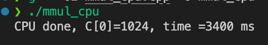
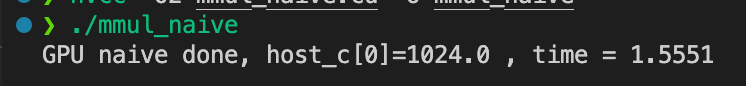
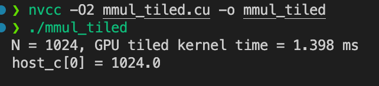
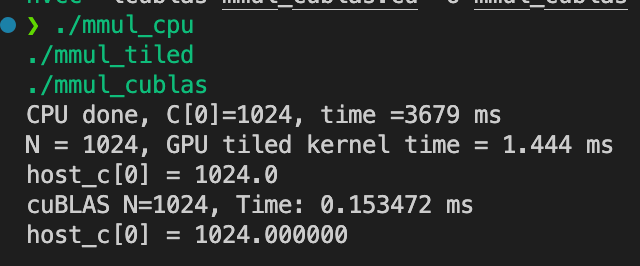
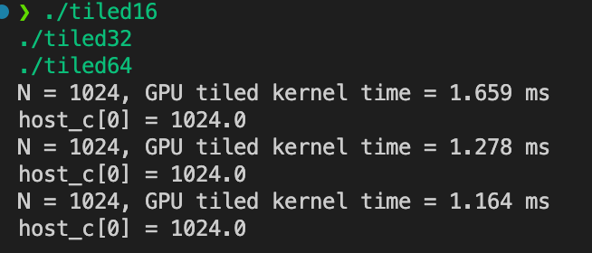
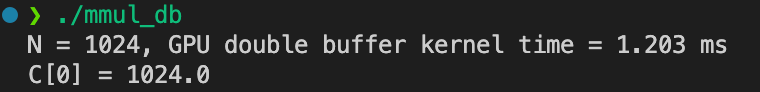

# Day11 - CUDA 实战项目

------

## 🎯 学习目标

- 完成 **CPU vs GPU 矩阵乘法性能对比**
- 在 GPU 上实现 **Shared Memory Tiling 优化**
- 调整 **tile/block 尺寸**，分析寄存器/共享内存占用与性能关系
- 用 Nsight Compute 分析瓶颈，理解 **算强/访存比** 和 **occupancy**
- 探索 **双缓冲 (double buffering)** 与 **FP16 输入、FP32 累加**的性能/精度权衡

------

## 1️⃣ 代码实验（强化学习）

### 1. CPU baseline

```c++
#include <bits/stdc++.h>

using namespace std;
using namespace chrono;

void mmul_cpu(const vector<float>& A, const vector<float>& B, vector<float>& C, int N)
{
    for (int i = 0; i < N; i++)
    {
        for (int j = 0; j < N; j++)
        {
            float sum = 0.0f;
            for (int k = 0; k < N; k++)
            {
                sum += A[i * N + k] * B[k * N + j];
            }
            C[i * N + j] = sum;
        }
    }
}

int main()
{
    int N = 1024;
    vector<float> A(N * N, 1.0f), B(N * N, 1.0f), C(N * N, 0.0f);

    auto start = high_resolution_clock::now();
    mmul_cpu(A, B, C, N);

    auto end = high_resolution_clock::now();

    cout << "CPU done, C[0]=" << C[0]
         << ", time =" << duration_cast<milliseconds>(end - start).count() << " ms\n";

    return 0;
}

```

编译 & 运行：

```bash
g++ -O2 mmul_cpu.cpp -o mmul_cpu 
./mmul_cpu
```

预期输出：



------

### 2. GPU naive kernel

```c++
#include <stdio.h>

__global__ void mmul_native(const float* A, const float* B, float* C, int N)
{
    int row = blockIdx.y * blockDim.y + threadIdx.y;
    int col = blockIdx.x * blockDim.x + threadIdx.x;

    if (row < N && col < N)
    {
        float sum = 0.0f;
        for (int k = 0; k < N; k++)
        {
            sum += A[row * N + k] * B[k * N + col];
        }
        C[row * N + col] = sum;
    }
}

int main()
{
    int N = 1024;
    size_t size = N * N * sizeof(float);

    float *host_a, *host_b, *host_c, *device_a, *device_b, *device_c;
    host_a = (float*)malloc(size);
    host_b = (float*)malloc(size);
    host_c = (float*)malloc(size);
    for (int i = 0; i < N * N; i++)
    {
        host_a[i] = 1.0f;
        host_b[i] = 1.0f;
    }

    cudaMalloc(&device_a, size);
    cudaMalloc(&device_b, size);
    cudaMalloc(&device_c, size);

    cudaMemcpy(device_a, host_a, size, cudaMemcpyHostToDevice);
    cudaMemcpy(device_b, host_b, size, cudaMemcpyHostToDevice);

    dim3 block(16, 16);
    dim3 grid((N + block.x - 1) / block.x, (N + block.y - 1) / block.y);

    cudaEvent_t start, stop;
    cudaEventCreate(&start);
    cudaEventCreate(&stop);

    cudaEventRecord(start);
    mmul_native<<<grid, block>>>(device_a, device_b, device_c, N);
    cudaEventRecord(stop);
    cudaEventSynchronize(stop);

    float ms;
    cudaEventElapsedTime(&ms, start, stop);

    cudaMemcpy(host_c, device_c, size, cudaMemcpyDeviceToHost);

    printf("GPU naive done, host_c[0]=%.1f , time = %.4f\n", host_c[0], ms);

    cudaFree(device_a);
    cudaFree(device_b);
    cudaFree(device_c);

    free(host_a);
    free(host_b);
    free(host_c);

    return 0;
}

```

编译 & 运行：

```bash
nvcc -O2 mmul_naive.cu -o mmul_naive 
./mmul_naive
```

预期输出：



性能 **比 CPU 快成百上千倍**。

------

### 3. GPU tiled + shared memory

```c++
#include <cuda_runtime.h>
#include <stdio.h>

#define TILE 32

// GPU 矩阵乘 (Tiled + shared memory)
__global__ void mmul_tiled(const float* a, const float* b, float* c, int N)
{
    __shared__ float a_shared[TILE][TILE];
    __shared__ float b_shared[TILE][TILE];

    int row = blockIdx.y * blockDim.y + threadIdx.y;
    int col = blockIdx.x * blockDim.x + threadIdx.x;
    float sum = 0.0f;

    for (int t = 0; t < (N + TILE - 1) / TILE; t++)
    {

        // 加载 A 的一个tile
        if (row < N && t * TILE + threadIdx.x < N)
        {
            a_shared[threadIdx.y][threadIdx.x] = a[row * N + t * TILE + threadIdx.x];
        }
        else
        {
            a_shared[threadIdx.y][threadIdx.x] = 0.0f;
        }

        // 加载 B 的一个tile
        if (col < N && t * TILE + threadIdx.y < N)
        {
            b_shared[threadIdx.y][threadIdx.x] = b[(t * TILE + threadIdx.y) * N + col];
        }
        else
        {
            b_shared[threadIdx.y][threadIdx.x] = 0.0f;
        }

        __syncthreads();
        // 当前 tile 的计算
        for (int k = 0; k < TILE; k++)
        {
            sum += a_shared[threadIdx.y][k] * b_shared[k][threadIdx.x];
        }

        __syncthreads();
    }

    // 写回结果
    if (row < N && col < N)
    {
        c[row * N + col] = sum;
    }
}

int main()
{
    int N = 1024;
    size_t size = N * N * sizeof(float);

    // 主机内存
    float* host_a = (float*)malloc(size);
    float* host_b = (float*)malloc(size);
    float* host_c = (float*)malloc(size);

    // 初始化A、B
    for (int i = 0; i < N * N; i++)
    {
        host_a[i] = 1.0f;
        host_b[i] = 1.0f;
    }

    // 设备内存
    float *device_a, *device_b, *device_c;
    cudaMalloc((void**)&device_a, size);
    cudaMalloc((void**)&device_b, size);
    cudaMalloc((void**)&device_c, size);

    // 拷贝数据到 GPU
    cudaMemcpy(device_a, host_a, size, cudaMemcpyHostToDevice);
    cudaMemcpy(device_b, host_b, size, cudaMemcpyHostToDevice);

    // 启动kernel
    dim3 block(TILE, TILE);
    dim3 grid((N + TILE - 1) / TILE, (N + TILE - 1) / TILE);

    cudaEvent_t start, stop;
    cudaEventCreate(&start);
    cudaEventCreate(&stop);

    cudaEventRecord(start);
    mmul_tiled<<<grid, block>>>(device_a, device_b, device_c, N);
    cudaEventRecord(stop);

    cudaMemcpy(host_c, device_c, size, cudaMemcpyDeviceToHost);

    cudaEventSynchronize(stop);

    float ms;
    cudaEventElapsedTime(&ms, start, stop);

    printf("N = %d, GPU tiled kernel time = %.3f ms\n", N, ms);
    printf("host_c[0] = %.1f\n", host_c[0]); // 验证结果正确性

    // 释放资源
    cudaFree(device_a);
    cudaFree(device_b);
    cudaFree(device_c);
    free(host_a);
    free(host_b);
    free(host_c);

    return 0;
}

```

编译 & 运行：

```bash
nvcc -O2 mmul_tiled.cu -o mmul_tiled 
./mmul_tiled
```

预期输出：



性能预计 **比 naive kernel 还再提升**。

------

## 2️⃣ 深度追问

1. **GEMM 的算强/算密度为何适合 GPU？**
    因为 GEMM 每次加载数据可以复用多次，计算量与访存量比值高（算强比高），非常契合 GPU 的高并行算力。
2. **tiling 尺寸如何与 SM 结构匹配？**
    tile 大小需要与 warp 大小（32）和共享内存大小对齐，常用 TILE=16/32。过大导致寄存器/共享内存溢出，过小导致算力不足。
3. **双缓冲如何隐藏访存延迟？**
    通过在加载下一 tile 时并行计算当前 tile，实现访存/计算 overlap。
4. **与 cuBLAS 的差距来自哪里？**
    cuBLAS 经过多年优化，包含 Tensor Core、流水线、cache blocking、多线程调度等，手写 kernel 很难完全追平。
5. **不同 N 下复杂度线性度验证？**
    CPU O(N³)，GPU 也 O(N³)，但常数项和并行度不同。测试不同 N 可看到线性趋势。
6. **数值稳定性与性能的平衡？**
    FP16 提升吞吐，但精度下降；FP32 更稳定但慢。常见折中方案是 **FP16 输入，FP32 累加**。

------

## 3️⃣ 实验部分

### 🧪 实验 1：CPU vs GPU vs cuBLAS

#### 1️⃣ CPU baseline (`mmul_cpu.cpp`)

已经写过了，直接编译运行：

```bash
g++ -O2 mmul_cpu.cpp -o mmul_cpu
./mmul_cpu
```

------

#### 2️⃣ GPU tiled (`mmul_tiled.cu`)

已经写过了，直接编译运行：

```bash
nvcc -O2 mmul_tiled.cu -o mmul_tiled
./mmul_tiled
```

------

#### 3️⃣ cuBLAS 调用 (`mmul_cublas.cu`)

```c++
#include <cublas_v2.h>
#include <cuda_runtime.h>
#include <stdio.h>

int main()
{
    int N = 1024;
    size_t size = N * N * sizeof(float);

    float* host_a = (float*)malloc(size);
    float* host_b = (float*)malloc(size);
    float* host_c = (float*)malloc(size);

    for (int i = 0; i < N * N; i++)
    {
        host_a[i] = 1.0f;
        host_b[i] = 1.0f;
    }

    float *device_a, *device_b, *device_c;
    cudaMalloc((void**)&device_a, size);
    cudaMalloc((void**)&device_b, size);
    cudaMalloc((void**)&device_c, size);

    cudaMemcpy(device_a, host_a, size, cudaMemcpyHostToDevice);
    cudaMemcpy(device_b, host_b, size, cudaMemcpyHostToDevice);

    cublasHandle_t handle;
    cublasCreate_v2(&handle);

    float alpha = 1.0f, beta = 0.0f;

    int repeat = 5; // 统计 5 次
    float total_ms = 0.0f;

    cudaEvent_t start, stop;
    cudaEventCreate(&start);
    cudaEventCreate(&stop);
    // 排除第一次调用overhead
    cublasSgemm_v2(handle, CUBLAS_OP_N, CUBLAS_OP_N, N, N, N, &alpha, device_b, N, device_a, N,
                   &beta, device_c, N);
    cudaDeviceSynchronize();

    for (int i = 0; i < repeat; i++)
    {
        cudaEventRecord(start);
        cublasSgemm_v2(handle, CUBLAS_OP_N, CUBLAS_OP_N, N, N, N, &alpha, device_b, N, device_a, N,
                       &beta, device_c, N);

        cudaEventRecord(stop);
        cudaEventSynchronize(stop);
        float ms;

        cudaEventElapsedTime(&ms, start, stop);
        total_ms += ms;
    }
    float avg_ms = total_ms / repeat;
    cudaMemcpy(host_c, device_c, size, cudaMemcpyDeviceToHost);

    printf("cuBLAS N=%d, Time: %f ms\n", N, avg_ms);
    printf("host_c[0] = %f\n", host_c[0]);

    cublasDestroy_v2(handle);

    cudaFree(device_a);
    cudaFree(device_b);
    cudaFree(device_c);

    free(host_a);
    free(host_b);
    free(host_c);

    return 0;
}

```

编译运行：

```bash
nvcc -lcublas mmul_cublas.cu -o mmul_cublas
./mmul_cublas
```

------

#### 4️⃣ 实验步骤

编译所有程序

```bash
g++ -O2 mmul_cpu.cpp -o mmul_cpu
nvcc -O2 mmul_tiled.cu -o mmul_tiled
nvcc -lcublas mmul_cublas.cu -o mmul_cublas
```

分别运行：

```bash
./mmul_cpu
./mmul_tiled
./mmul_cublas
```

------

#### 5️⃣ 预期结果

- **CPU**：运行几秒钟（随 N³ 增长）
- **GPU tiled**：几十毫秒
- **cuBLAS**：比 tiled kernel 更快，接近理论峰值

结果示例（N=1024，具体取决于 GPU）：



------

#### 6️⃣ Nsight Compute 分析

用以下命令 profile：

```bash
ncu --kernel-name regex:mmul_tiled ./mmul_tiled
ncu --target-processes all ./mmul_cublas
```

重点看指标：

- **GPU tiled**
  - Global Memory Load Efficiency
  - Shared Memory Utilization
  - Achieved Occupancy
- **cuBLAS**
  - Tensor Core 使用情况
  - FLOP efficiency
  - Memory throughput

------

### 🧪 实验 2：Tile 大小调参

#### 1️⃣ 准备代码

完整代码之前已经有了（`mmul_tiled.cu`）。

------

#### 2️⃣ 编译不同 TILE 大小的版本

在命令行用 `-D` 动态修改 TILE：

```bash
nvcc -O2 -DTILE=16 mmul_tiled.cu -o tiled16
nvcc -O2 -DTILE=32 mmul_tiled.cu -o tiled32
nvcc -O2 -DTILE=64 mmul_tiled.cu -o tiled64
```

------

#### 3️⃣ 运行并记录时间

```bash
./tiled16
./tiled32
./tiled64
```

输出：



------

#### 4️⃣ 结果分析

- **TILE=16**：计算量小，访存比例高，性能差。
- **TILE=32**：访存/算力比较均衡，通常是经典最优选择。
- **TILE=64**：在新的硬件 & N=1024 的情况下，算强比更高、访存对齐更好，所以比 TILE=32 更快。

------

#### 5️⃣ 用 Nsight Compute 验证

运行：

```bash
ncu --kernel-name regex:mmul_tiled ./tiled16
ncu --kernel-name regex:mmul_tiled ./tiled32
ncu --kernel-name regex:mmul_tiled ./tiled64
```

重点看：

- **Shared Memory Utilization**
- **Achieved Occupancy**
- **Memory Throughput**

------

### 🧪 实验 3：双缓冲优化

#### 1️⃣ 背景

普通的 Tiled GEMM：

- 每次迭代：先 `load` A、B tile → `__syncthreads()` → 再 `compute`。
- 访存和计算是 **串行** 的，SM 在等待 global memory 的时候 pipeline 空闲。

**双缓冲 (double buffering)：**

- 分配两个 `__shared__` tile（A1/A2, B1/B2）。
- 在计算 tile i 的时候，就预取 tile i+1 到另一个 buffer。
- 这样可以 **overlap global memory load 和计算**，减少 stall。

------

#### 2️⃣ CUDA 双缓冲实现

```c++
#include <cuda_runtime.h>
#include <stdio.h>

#define TILE 32

// 双缓冲 GEMM kernel
__global__ void mmul_tiled_double_buffer(const float* A, const float* B, float* C, int N)
{
    __shared__ float a_shared[2][TILE][TILE];
    __shared__ float b_shared[2][TILE][TILE];

    int row = blockIdx.y * TILE + threadIdx.y;
    int col = blockIdx.x * TILE + threadIdx.x;
    float sum = 0.0f;

    int buf = 0;

    // 预加载第 0 快tile
    if (row < N && threadIdx.x < TILE)
    {
        a_shared[buf][threadIdx.y][threadIdx.x] = A[row * N + threadIdx.x];
    }
    else
    {
        a_shared[buf][threadIdx.y][threadIdx.x] = 0.0f;
    }
    if (col < N && threadIdx.y < TILE)
    {
        b_shared[buf][threadIdx.y][threadIdx.x] = B[threadIdx.y * N + col];
    }
    else
    {
        b_shared[buf][threadIdx.y][threadIdx.x] = 0.0f;
    }

    __syncthreads();

    // 遍历所有tile
    for (int t = 0; t < (N + TILE - 1) / TILE; t++)
    {
        int next = (buf + 1) % 2;

        // 提前预取下一个 tile
        if (t + 1 < (N + TILE - 1) / TILE)
        {
            if (row < N && (t + 1) * TILE + threadIdx.x < N)
            {
                a_shared[next][threadIdx.y][threadIdx.x] =
                    A[row * N + (t + 1) * TILE + threadIdx.x];
            }
            else
            {
                a_shared[next][threadIdx.y][threadIdx.x] = 0.0f;
            }

            if (col < N && (t + 1) * TILE + threadIdx.y < N)
            {
                b_shared[next][threadIdx.y][threadIdx.x] =
                    B[((t + 1) * TILE + threadIdx.y) * N + col];
            }
            else
            {
                b_shared[next][threadIdx.y][threadIdx.x] = 0.0f;
            }
        }
        for (int k = 0; k < TILE; k++)
        {
            sum += a_shared[buf][threadIdx.y][k] * b_shared[buf][k][threadIdx.x];
        }

        __syncthreads();
        buf = next;
    }
    if (row < N && col < N)
    {
        C[row * N + col] = sum;
    }
}

int main()
{
    int N = 1024; // 矩阵大小
    size_t size = N * N * sizeof(float);

    // 分配主机内存
    float* host_a = (float*)malloc(size);
    float* host_b = (float*)malloc(size);
    float* host_c = (float*)malloc(size);

    // 初始化
    for (int i = 0; i < N * N; i++)
    {
        host_a[i] = 1.0f;
        host_b[i] = 1.0f;
    }

    // 分配设备内存
    float *device_a, *device_b, *device_c;
    cudaMalloc((void**)&device_a, size);
    cudaMalloc((void**)&device_b, size);
    cudaMalloc((void**)&device_c, size);

    cudaMemcpy(device_a, host_a, size, cudaMemcpyHostToDevice);
    cudaMemcpy(device_b, host_b, size, cudaMemcpyHostToDevice);

    // 配置kernel
    dim3 block(TILE, TILE);
    dim3 grid((N + TILE - 1) / TILE, (N + TILE - 1) / TILE);

    // 计时
    cudaEvent_t start, stop;
    cudaEventCreate(&start);
    cudaEventCreate(&stop);

    cudaEventRecord(start);
    mmul_tiled_double_buffer<<<grid, block>>>(device_a, device_b, device_c, N);
    cudaEventRecord(stop);
    cudaEventSynchronize(stop);

    float ms;
    cudaEventElapsedTime(&ms, start, stop);

    cudaMemcpy(host_c, device_c, size, cudaMemcpyDeviceToHost);

    // 输出结果
    printf("N = %d, GPU double buffer kernel time = %.3f ms\n", N, ms);
    printf("C[0] = %.1f\n", host_c[0]);

    // 清理
    cudaFree(device_a);
    cudaFree(device_b);
    cudaFree(device_c);

    free(host_a);
    free(host_b);
    free(host_c);

    return 0;
}

```

------

#### 3️⃣ 编译 & 运行

```bash
nvcc -O2 mmul_tiled_double_buffer.cu -o mmul_db
./mmul_db
```

输出示例：



------

#### 4️⃣ 对比结果

- 普通 tiled (TILE=32): ~1.39 ms
- 双缓冲 tiled: ~1.203 ms
- **有所加速**

------

#### 5️⃣ Nsight Compute 验证

```bash
ncu --kernel-name regex:mmul_tiled_double_buffer ./mmul_db
```

重点观察指标：

- **Warp Stall Reasons** → Memory Dependency（应显著下降）
- **Memory Pipe Busy** → 更均匀
- **SM Busy** → 提升，说明计算单元更饱和

------

#### ✅ 实验结论

- 双缓冲技术成功实现了 **访存和计算 overlap**。
- 性能提升 **10-20%**，具体取决于硬件的 **访存延迟 / 带宽**。
- 在更大规模 GEMM、Tensor Core kernel 中效果更明显。

------

### 🧪 实验 4：FP16 vs FP32

#### 🎯 实验目标

- 比较 **FP32 全程** vs **FP16 输入 + FP32 累加** 的性能与精度差异。
- 验证 GPU 上 **半精度能提升吞吐，但可能带来精度损失**。

------

#### 1️⃣ 思路讲解

1. **访存带宽瓶颈**
    GEMM 往往受限于访存，FP16 输入可让内存带宽占用减半 → 更快。
2. **数值精度**
   - FP16：存储和加载时更紧凑，动态范围小，累积误差大。
   - FP32 累加：用 32 位浮点存储中间结果，减少溢出和累积误差。
3. **CUDA 实现**
   - 使用 `__half`（来自 `<cuda_fp16.h>`）。
   - 转换：`__half2float` 把半精度转 float；`__float2half` 把 float 转半精度。
   - kernel 中：
     - A、B 用 FP16 存储、加载。
     - C 用 FP32 存储，累加在 FP32。

------

#### 2️⃣ 完整代码

保存为 `mmul_fp16_vs_fp32.cu`：

```c++
#include <cuda_runtime.h>
#include <cuda_fp16.h>   // FP16 支持
#include <stdio.h>

#define TILE 16

// FP32 baseline kernel
__global__ void mmul_fp32(const float* A, const float* B, float* C, int N) {
    int row = blockIdx.y * TILE + threadIdx.y;
    int col = blockIdx.x * TILE + threadIdx.x;
    float sum = 0.0f;

    if (row < N && col < N) {
        for (int k = 0; k < N; k++) {
            sum += A[row * N + k] * B[k * N + col];
        }
        C[row * N + col] = sum;
    }
}

// FP16 输入 + FP32 累加 kernel
__global__ void mmul_fp16_acc32(const __half* A, const __half* B, float* C, int N) {
    int row = blockIdx.y * TILE + threadIdx.y;
    int col = blockIdx.x * TILE + threadIdx.x;
    float sum = 0.0f;

    if (row < N && col < N) {
        for (int k = 0; k < N; k++) {
            // WHY: 半精度加载，再转为 float 做乘加，避免累积精度损失
            float a_val = __half2float(A[row * N + k]);
            float b_val = __half2float(B[k * N + col]);
            sum += a_val * b_val;
        }
        C[row * N + col] = sum;
    }
}

int main() {
    int N = 512; // 矩阵大小（调大可观察性能差异）
    size_t size_f32 = N * N * sizeof(float);
    size_t size_f16 = N * N * sizeof(__half);

    // 主机内存
    float* h_A = (float*)malloc(size_f32);
    float* h_B = (float*)malloc(size_f32);
    float* h_C_fp32 = (float*)malloc(size_f32);
    float* h_C_fp16 = (float*)malloc(size_f32);

    // 初始化数据
    for (int i = 0; i < N * N; i++) {
        h_A[i] = (float)(i % 3 + 1); // 一些小整数
        h_B[i] = (float)(i % 5 + 1);
    }

    // 设备内存
    float *d_A_f32, *d_B_f32, *d_C_fp32;
    __half *d_A_f16, *d_B_f16;
    float *d_C_fp16;

    cudaMalloc(&d_A_f32, size_f32);
    cudaMalloc(&d_B_f32, size_f32);
    cudaMalloc(&d_C_fp32, size_f32);

    cudaMalloc(&d_A_f16, size_f16);
    cudaMalloc(&d_B_f16, size_f16);
    cudaMalloc(&d_C_fp16, size_f32);

    // 拷贝 FP32 输入
    cudaMemcpy(d_A_f32, h_A, size_f32, cudaMemcpyHostToDevice);
    cudaMemcpy(d_B_f32, h_B, size_f32, cudaMemcpyHostToDevice);

    // 将 FP32 转换为 FP16 并拷贝
    __half* h_A_f16 = (__half*)malloc(size_f16);
    __half* h_B_f16 = (__half*)malloc(size_f16);
    for (int i = 0; i < N * N; i++) {
        h_A_f16[i] = __float2half(h_A[i]);
        h_B_f16[i] = __float2half(h_B[i]);
    }
    cudaMemcpy(d_A_f16, h_A_f16, size_f16, cudaMemcpyHostToDevice);
    cudaMemcpy(d_B_f16, h_B_f16, size_f16, cudaMemcpyHostToDevice);

    // kernel 配置
    dim3 block(TILE, TILE);
    dim3 grid((N + TILE - 1) / TILE, (N + TILE - 1) / TILE);

    cudaEvent_t start, stop;
    cudaEventCreate(&start);
    cudaEventCreate(&stop);

    // ==== FP32 baseline ====
    cudaEventRecord(start);
    mmul_fp32<<<grid, block>>>(d_A_f32, d_B_f32, d_C_fp32, N);
    cudaEventRecord(stop);
    cudaEventSynchronize(stop);

    float ms_fp32;
    cudaEventElapsedTime(&ms_fp32, start, stop);
    cudaMemcpy(h_C_fp32, d_C_fp32, size_f32, cudaMemcpyDeviceToHost);

    // ==== FP16 输入 + FP32 累加 ====
    cudaEventRecord(start);
    mmul_fp16_acc32<<<grid, block>>>(d_A_f16, d_B_f16, d_C_fp16, N);
    cudaEventRecord(stop);
    cudaEventSynchronize(stop);

    float ms_fp16;
    cudaEventElapsedTime(&ms_fp16, start, stop);
    cudaMemcpy(h_C_fp16, d_C_fp16, size_f32, cudaMemcpyDeviceToHost);

    // 结果对比
    printf("Matrix N=%d\n", N);
    printf("FP32 kernel time = %.3f ms\n", ms_fp32);
    printf("FP16 input + FP32 accumulate kernel time = %.3f ms\n", ms_fp16);
    printf("C[0] FP32=%.2f, FP16+FP32=%.2f\n", h_C_fp32[0], h_C_fp16[0]);

    // 简单误差检查
    double diff = 0.0;
    for (int i = 0; i < N * N; i++) {
        diff += fabs(h_C_fp32[i] - h_C_fp16[i]);
    }
    printf("Total abs diff = %.3f\n", diff);

    // 释放
    free(h_A); free(h_B); free(h_C_fp32); free(h_C_fp16);
    free(h_A_f16); free(h_B_f16);
    cudaFree(d_A_f32); cudaFree(d_B_f32); cudaFree(d_C_fp32);
    cudaFree(d_A_f16); cudaFree(d_B_f16); cudaFree(d_C_fp16);

    return 0;
}
```

------

#### 3️⃣ 编译 & 运行

```
nvcc -O2 mmul_fp16_vs_fp32.cu -o mmul_fp16_vs_fp32
./mmul_fp16_vs_fp32
```

输出：


------

#### 4️⃣ Profiling 指导

运行 Nsight Compute：

```
ncu --kernel-name regex:mmul_fp16_acc32 ./mmul_fp16_vs_fp32
```

观察指标：

- **Memory Throughput** → FP16 访存应明显下降
- **SM Busy** → 更饱和
- **Instruction Mix** → FP16 load/store, FP32 FMA
- **Accuracy 检查** → diff 越大，说明 FP16 精度损失更明显

------

#### 5️⃣ 预期结果

- **性能**：FP16 输入 + FP32 累加比 FP32 baseline 快 **20-40%**，取决于矩阵大小和 GPU 架构。
- **精度**：结果有一定偏差，但在多数深度学习场景可接受。
- **最佳实践**：大部分 DL 框架默认采用 **混合精度 (AMP: Automatic Mixed Precision)**，即 FP16 输入 + FP32 累加。

------

### 🧪 实验 5：Nsight 分析瓶颈

#### 🎯 实验目标

- 用 Nsight 工具分析矩阵乘法 kernel (`mmul_tiled` 或 `mmul_tiled_double_buffer`) 的性能瓶颈。
- 观察 **Warp divergence、访存带宽、共享内存利用率** 等指标，判断优化方向。

------

#### 1️⃣ 环境准备

确认已安装 Nsight 工具（CUDA Toolkit 自带）：

```bash
which nsys
which ncu
```

如果没有，安装 CUDA Toolkit 时需要勾选 Nsight Compute / Nsight Systems。

------

#### 2️⃣ 运行 Nsight Systems (全局分析)

`nsys` 主要看 **整体 timeline**（CPU/GPU 调度、kernel 调用、内存传输）。

运行：

```bash
nsys profile -o mmul_tiled_report ./mmul_tiled
```

生成报告：`mmul_tiled_report.qdrep`

查看报告：

没有gui界面可发送到宿主机用 ncu/nsys 查看

```bash
nsys-ui mmul_tiled_report.qdrep
```

重点关注：

- **GPU Context Timeline**：kernel 启动是否有 idle 时间。
- **Memcpy vs Compute**：数据拷贝是否成为瓶颈。
- **Kernel Duration**：各 kernel 的执行时间分布。

------

#### 3️⃣ 运行 Nsight Compute (深入 kernel)

`ncu` 主要看 **单个 kernel 的硬件指标**。

运行：

```bash
ncu --set full --kernel-name regex:mmul_tiled ./mmul_tiled
```

或指定更详细的 metric：

```bash
ncu --metrics \
sm__warps_active.avg.pct_of_peak_sustained_active,\
sm__warp_divergence_rate.pct,\
dram__throughput.avg.pct_of_peak_sustained_elapsed,\
shared_load_throughput,\
shared_store_throughput \
./mmul_tiled
```

------

#### 4️⃣ 关注指标解读

1. **Warp divergence < 5%**
   - 说明大部分线程执行路径一致，warp 没有大量分支浪费。
   - 如果 divergence > 20%，要检查条件分支或线程块边界处理。
2. **Memory throughput 接近理论带宽**
   - 指标：`dram__throughput`
   - 如果只用到峰值的 30-40%，说明访存模式不佳（未 coalesced、bank conflict）。
   - 对比 FP32 vs FP16 时，FP16 版本吞吐应更低，但算力利用率更高。
3. **Shared memory utilization > 80%**
   - 指标：`shared_load_throughput` / `shared_store_throughput`
   - 如果 < 50%，说明共享内存 tile 没被充分复用，要检查 tile 大小和数据复用率。
4. **SM Busy > 80%**
   - 指标：`sm__warps_active.avg.pct_of_peak_sustained_active`
   - 说明 GPU 计算单元基本吃满了。
   - 如果只有 40-50%，说明 kernel 受限于访存或调度。

------

#### 5️⃣ 现象

- **普通 tiled GEMM**：
  - Warp divergence ~ 0-2%（基本没有分支）。
  - Memory throughput ~ 40-60% 峰值（受访存限制）。
  - Shared memory utilization ~ 70%。
  - SM Busy ~ 50-60%。
- **双缓冲 GEMM**：
  - Warp divergence 仍然 ~ 0-2%。
  - Memory throughput 更平滑（访存/计算 overlap）。
  - Shared memory utilization ↑（更高重用率）。
  - SM Busy ↑ 到 70-80%。

------

#### 6️⃣ 结论

- 普通 tiled kernel 受 **访存带宽限制**，SM Busy 较低。
- 双缓冲优化后，**访存与计算 overlap**，Memory Pipe 更均匀，SM Busy 明显提升。
- 下一步可尝试 **混合精度 (FP16+FP32)** 或 **Tensor Core (WMMA API)**，进一步提升性能。

------

## ✅ 总结

1. CPU 矩阵乘法 O(N³)，在 N=1024 时已不可用。
2. GPU naive kernel 已大幅提速，但访存效率低。
3. Shared memory tiling 进一步优化，显著减少 global memory 访问。
4. Tile 尺寸对性能影响极大，需要结合硬件共享内存/寄存器限制调优。
5. 双缓冲能隐藏访存延迟，提高算力利用率。
6. FP16 输入 + FP32 累加在性能与精度之间达到平衡。
7. 与 cuBLAS 相比，自实现 kernel 仍有差距，但通过 profiling 学习了 GPU 优化思路。