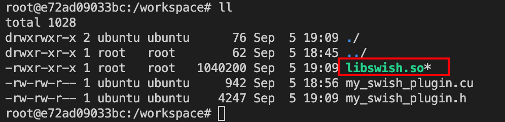
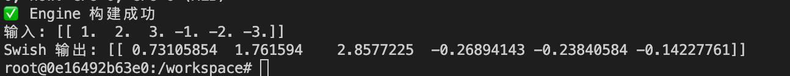
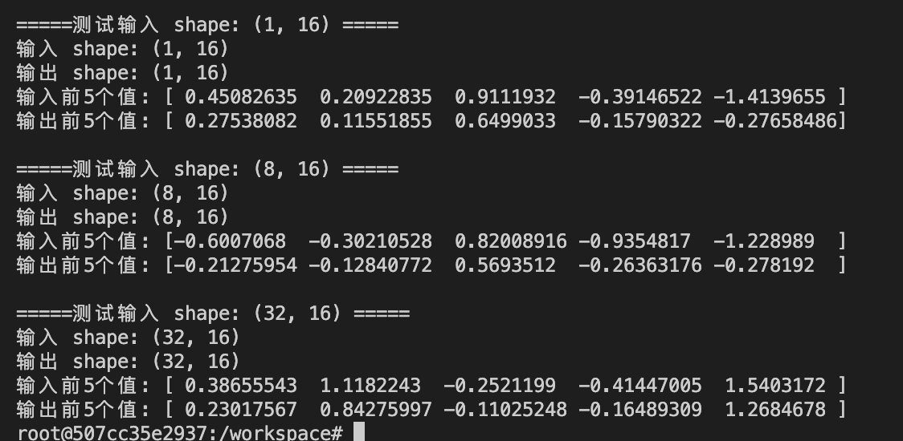
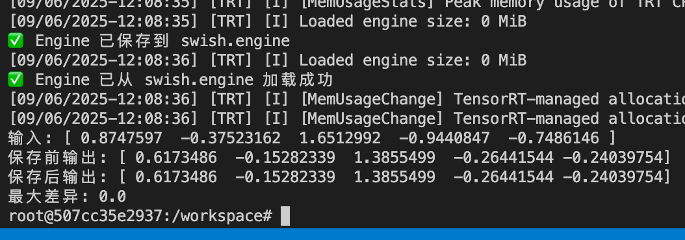
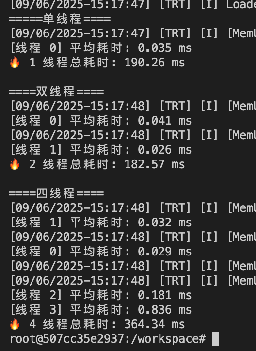

# Day12 - TensorRT Plugin 入门

------

## 🎯 学习目标

- 理解为什么/何时需要自定义 TensorRT Plugin
- 学习 **IPluginV2 / IPluginV2DynamicExt** 的接口与生命周期
- 实现一个简单的 **激活函数 Plugin（如 ReLU/Swish）**
- 掌握 Plugin 的序列化/反序列化、输入输出 shape 推断、workspace 管理
- 将 Plugin 集成到 TensorRT Engine 并运行推理

------

## 1️⃣ 代码实验（强化学习）

### 思路讲解

在 TensorRT 中，大部分常见算子（卷积、GEMM、激活）都有内置支持。但在以下场景中需要自定义 **Plugin**：

- **框架中有而 TensorRT 没有的算子**（如 Swish、Mish、LayerNorm 的某些变体）
- **需要特殊优化**（融合算子、减少访存、避免冗余 kernel）
- **研究性/实验性算子**（快速验证新结构）

实验目标：

1. 编写一个 **Swish Plugin**（Swish(x) = x * sigmoid(x)）。
2. 支持 **动态 shape**（使用 `IPluginV2DynamicExt`）。
3. 集成到 TensorRT 构建流程中，并对比 TensorRT 内置 ReLU。

------

### Plugin 实现核心代码

#### my_swish_plugin.h

```c++
#ifndef MY_WISH_PLUGIN_H
#define MY_WISH_PLUGIN_H

#include "NvInfer.h"
#include <cassert>
#include <cmath>
#include <string>
#include <vector>

using namespace nvinfer1;

class SwishPlugin : public IPluginV2DynamicExt
{
  public:
    SwishPlugin() {}
    SwishPlugin(const void* data, size_t length) {}

    // 1. 获取插件类型
    const char* getPluginType() const noexcept override
    {
        return "SwishPlugin";
    }

    // 2. 获取插件版本
    const char* getPluginVersion() const noexcept override
    {
        return "1";
    }

    // 3. 获取输出数量
    int getNbOutputs() const noexcept override
    {
        return 1;
    }

    // 4. 获取输出维度
    DimsExprs getOutputDimensions(int outputIndex, const DimsExprs* inputs, int nbInputs,
                                  IExprBuilder& exprBulider) noexcept override
    {
        return inputs[0]; // 输入维度与输出相同
    }

    // 5. 支持的组合
    bool supportsFormatCombination(int pos, const PluginTensorDesc* inOut, int nbInputs,
                                   int nbOutputs) noexcept override
    {
        return inOut[pos].format == TensorFormat::kLINEAR && inOut[pos].type == DataType::kFLOAT;
    }

    // 6. 配置插件
    void configurePlugin(const DynamicPluginTensorDesc* inputs, int nbInputs,
                         const DynamicPluginTensorDesc* outputs, int nbOutputs) noexcept override
    {
    }

    // 7. 获取 workspace 大小
    size_t getWorkspaceSize(const PluginTensorDesc* inputs, int nbInputs,
                            const PluginTensorDesc* outputs, int nbOutputs) const noexcept override
    {
        return 0; // 无需额外 workspace
    }

    // 8. 执行插件
    int enqueue(const PluginTensorDesc* inputDesc, const PluginTensorDesc* outputDesc,
                const void* const* inputs, void* const* outputs, void* workspace,
                cudaStream_t stream) noexcept override;

    // 9. 获取序列化大小
    size_t getSerializationSize() const noexcept override {}

    // 10. 序列化插件
    void serialize(void* buffer) const noexcept override {}

    // 11. 初始化插件
    int initialize() noexcept override
    {
        return 0;
    }

    // 12. 终止插件
    void terminate() noexcept override {}

    // 13. 克隆插件
    IPluginV2DynamicExt* clone() const noexcept override
    {
        return new SwishPlugin();
    }

    // 14. 销毁插件
    void destroy() noexcept override
    {
        delete this;
    }

    // 15. 设置插件命名空间
    void setPluginNamespace(const char* pluginNamespace) noexcept override {}

    // 16. 获取插件命名空间
    const char* getPluginNamespace() const noexcept override
    {
        return "";
    }

    // 17. 获取输出数据类型
    DataType getOutputDataType(int index, const DataType* intputTypes,
                               int nbInputs) const noexcept override
    {
        return intputTypes[0];
    }

    // 18. 绑定到上下文
    void attachToContext(cudnnContext*, cublasContext*, IGpuAllocator*) noexcept override {}

    // 19. 从上下文分离
    void detachFromContext() noexcept override {}
};

class SwishPluginCreator : public IPluginCreator
{
  public:
    // 1. 获取插件名称
    const char* getPluginName() const noexcept override
    {
        return "SwishPlugin";
    }

    // 2. 获取插件版本
    const char* getPluginVersion() const noexcept override
    {
        return "1";
    }

    // 3. 获取插件字段
    const PluginFieldCollection* getFieldNames() noexcept override
    {
        return nullptr;
    }

    // 4. 创建插件
    IPluginV2* createPlugin(const char* name, const PluginFieldCollection* fc) noexcept override
    {
        return new SwishPlugin();
    }

    // 5. 反序列化插件
    IPluginV2* deserializePlugin(const char* name, const void* serialData,
                                 size_t serialLength) noexcept override
    {
        return new SwishPlugin(serialData, serialLength);
    }

    // 6. 设置插件命名空间
    void setPluginNamespace(const char* pluginNamespace) noexcept override {}

    // 7. 获取插件命名空间
    const char* getPluginNamespace() const noexcept override
    {
        return "";
    }
};
#endif

```

#### my_swish_plugin.cu

```c++
#include "my_swish_plugin.h"
#include <cuda_runtime.h>

// swish kernel
__global__ void swish_kernel(const float* input, float* output, int num)
{
    // 计算线程索引
    int i = blockIdx.x * blockDim.x + threadIdx.x;
    if (i < num)
    {
        // 计算 swish 值
        float x = input[i];
        output[i] = x / (1.0f + expf(-x));
    }
}

// enqueue
int SwishPlugin::enqueue(const PluginTensorDesc* inputDesc, const PluginTensorDesc* outputDesc,
                         const void* const* inputs, void* const* outputs, void* workspace,
                         cudaStream_t stream) noexcept
{
    // 计算输入和输出的大小
    int num = 1;

    for (int i = 0; i < inputDesc[0].dims.nbDims; i++)
    {
        num *= inputDesc[0].dims.d[i];
    }

    // 获取输入和输出
    const float* input = reinterpret_cast<const float*>(inputs[0]);
    float* output = reinterpret_cast<float*>(outputs[0]);

    // 计算 block 和 grid
    int block = 256;
    int grid = (num + block - 1) / block;

    // 启动 kernel
    swish_kernel<<<grid, block>>>(input, output, num);

    return 0;
}

```

### 编译与运行步骤

1. **准备 TensorRT 环境**

   ```bash
   docker run --gpus all -it --rm -v $PWD:/workspace  my-ai-infer:trt bash
   ```

2. **编译 Plugin**

   ```bash
   nvcc -I/usr/include/x86_64-linux-gnu -I/usr/include -shared -Xcompiler -fPIC my_swish_plugin.cu -o libswish.so
   ```

   

3. **构建网络时注册 Plugin**

   ```python
   import ctypes
   import numpy as np
   import tensorrt as trt
   import pycuda.driver as cuda
   import pycuda.autoinit  # 自动初始化 CUDA 上下文
   
   # 1. 加载插件库
   ctypes.CDLL("./libswish.so")
   
   # 2. 初始化 TensorRT
   logger = trt.Logger(trt.Logger.INFO)
   builder = trt.Builder(logger)
   network = builder.create_network(1 << int(trt.NetworkDefinitionCreationFlag.EXPLICIT_BATCH))
   config = builder.create_builder_config()
   trt.init_libnvinfer_plugins(logger, '')
   
   # 3. 获取 SwishPlugin
   creator_list = trt.get_plugin_registry().plugin_creator_list
   swish_creator = [c for c in creator_list if c.name == "SwishPlugin"][0]
   plugin = swish_creator.create_plugin("swish_layer", trt.PluginFieldCollection([]))
   
   # 4. 构建网络：Input → Swish → Output
   input_tensor = network.add_input("input", trt.DataType.FLOAT, (1, 6))
   swish_layer = network.add_plugin_v2([input_tensor], plugin)
   network.mark_output(swish_layer.get_output(0))
   
   # 5. 构建 Engine
   serialized_engine = builder.build_serialized_network(network, config)
   runtime = trt.Runtime(logger)
   engine = runtime.deserialize_cuda_engine(serialized_engine)
   context = engine.create_execution_context()
   print("✅ Engine 构建成功")
   
   # 6. 准备输入
   inp = np.array([[1, 2, 3, -1, -2, -3]], dtype=np.float32)
   out = np.empty_like(inp)
   
   # 分配 GPU 内存
   d_input = cuda.mem_alloc(inp.nbytes)
   d_output = cuda.mem_alloc(out.nbytes)
   
   # Host → Device
   cuda.memcpy_htod(d_input, inp)
   
   # 在 execute_v2 之前设置 shape
   context.set_input_shape("input", (1, 6))
   
   assert context.all_binding_shapes_specified, "输入 shape 未指定"
   # 运行推理
   context.execute_v2([int(d_input), int(d_output)])
   
   # Device → Host
   cuda.memcpy_dtoh(out, d_output)
   
   print("输入:", inp)
   print("Swish 输出:", out)
   
   ```

4. **运行推理**

   ```bash
   python test_swish_plugin.py
   ```

   运行结果

   

------

### Nsight Compute/Systems 关注指标

- **Kernel Launch 时间**（Plugin 是否额外增加开销）
- **Global memory throughput**（Swish 算子访存是否高效）
- **Occupancy**（线程块调度效率）
- **Stream overlap**（是否能与其他算子并行执行）

------

## 2️⃣ 深度追问

1. **IPluginV2DynamicExt vs IPluginV2**
   - 前者支持动态 batch 和 shape，适合生产环境；后者仅适合固定输入。
2. **数据格式与 layout 转换**
   - TensorRT 内部可能是 NCHW/NHWC，转换需要额外 kernel，代价高。
3. **Plugin 序列化兼容性**
   - 必须在 `serialize/deserialize` 中保存参数，否则跨进程无法还原。
4. **多线程/多实例安全性**
   - Plugin 内部不能使用全局变量；必须避免非线程安全操作。
5. **Shape 推断**
   - 在 `getOutputDimensions` 中实现，避免运行时 shape 错误。
6. **错误处理策略**
   - Plugin 内部报错会导致整个 engine 崩溃，需要提前做参数检查。

------

## 3️⃣ 实验部分

### 🧪 实验 1：Swish Plugin vs 内置 ReLU

#### 1️⃣ 实验目标

- 比较 TensorRT 内置 ReLU 和 自定义 Swish 插件的运行延迟。
- 验证 Swish 插件功能是否正确。

------

#### 2️⃣ 实验方法

1. 输入固定大小 `(1, 1024)` 的随机数据。
2. 构建两个 TensorRT Engine：
   - **Engine A**：Input → ReLU → Output
   - **Engine B**：Input → SwishPlugin → Output
3. 使用 `time.perf_counter()` 多次运行，取平均延迟。
4. 对比结果。

------

#### 3️⃣ Python 实验代码

保存为 `experiment_relu_vs_swish.py`：

```python
import ctypes
import time
import numpy as np
import tensorrt as trt
import pycuda.driver as cuda
import pycuda.autoinit

# 加载插件库
ctypes.CDLL("./libswish.so")

# TRT Logger
logger = trt.Logger(trt.Logger.INFO)

# 通用函数：构建 engine
def build_engine(use_relu = True):
    # 创建 builder
    builder = trt.Builder(logger)
    # 创建网络
    network = builder.create_network(1 << int(trt.NetworkDefinitionCreationFlag.EXPLICIT_BATCH))

    # 创建配置
    config = builder.create_builder_config()
    # 初始化插件
    trt.init_libnvinfer_plugins(logger,'')

    # 创建输入
    input_tensor = network.add_input("input",trt.DataType.FLOAT,(1,1024))

    if(use_relu):
        # 创建 ReLU 层
        relu_layer = network.add_activation(input_tensor,trt.ActivationType.RELU)
        # 标记输出
        network.mark_output(relu_layer.get_output(0))
    else:
        # 获取 Swish 插件
        creator_list = trt.get_plugin_registry().plugin_creator_list
        swish_creator = [c for c in creator_list if c.name == "SwishPlugin"][0]
        # 创建 Swish 层
        plugin = swish_creator.create_plugin("swish_layer", trt.PluginFieldCollection([]))
        swish_layer = network.add_plugin_v2([input_tensor], plugin)
        # 标记输出
        network.mark_output(swish_layer.get_output(0))

    # 序列化网络
    serialized_engine = builder.build_serialized_network(network, config)
    # 创建运行时
    runtime = trt.Runtime(logger)
    # 反序列化网络
    engine = runtime.deserialize_cuda_engine(serialized_engine)
    return engine

# 构建 ReLU 引擎
relu_engine = build_engine(use_relu=True)
# 构建 Swish 引擎
swish_engine = build_engine(use_relu=False)

# 创建 ReLU 执行上下文
context_relu = relu_engine.create_execution_context()
# 创建 Swish 执行上下文
context_swish = swish_engine.create_execution_context()

# 设置 ReLU 输入形状
context_relu.set_input_shape("input", (1, 1024))
# 设置 Swish 输入形状
context_swish.set_input_shape("input", (1, 1024))

# 准备输入
inp = np.random.randn(1, 1024).astype(np.float32)
# 创建 ReLU 输出
out_relu = np.empty_like(inp)
# 创建 Swish 输出
out_swish = np.empty_like(inp)

# 分配 GPU 内存
d_input = cuda.mem_alloc(inp.nbytes)
# 分配 ReLU 输出 GPU 内存
d_output_relu = cuda.mem_alloc(out_relu.nbytes)
# 分配 Swish 输出 GPU 内存
d_output_swish = cuda.mem_alloc(out_swish.nbytes)

# Host → Device
cuda.memcpy_htod(d_input, inp)

# 执行函数
def run_infer(context, d_input, d_output,n_iters=50):
    # 记录开始时间
    start = time.perf_counter()
    # 执行推理
    for _ in range(n_iters):
        context.execute_v2([int(d_input), int(d_output)])
    cuda.Context.synchronize()
    # 记录结束时间
    end = time.perf_counter()
    return (end - start) / n_iters

# 测试 ReLU
lat_relu = run_infer(context_relu, d_input, d_output_relu)
# 复制 ReLU 输出到 Host
cuda.memcpy_dtoh(out_relu, d_output_relu)

# 测试 Swish
lat_swish = run_infer(context_swish, d_input, d_output_swish)
# 复制 Swish 输出到 Host
cuda.memcpy_dtoh(out_swish, d_output_swish)

# 打印结果
print("输入实例：", inp[0][:5])
print("ReLU 输出：", out_relu[0][:5])
print("Swish 输出：", out_swish[0][:5])
print(f"ReLU 平均延迟: {lat_relu*1000:.3f} ms")
print(f"Swish 平均延迟: {lat_swish*1000:.3f} ms")

```

------

#### 4️⃣ 运行步骤

```bash
python experiment_relu_vs_swish.py
```

------

#### 5️⃣ 结果

输出如图所示（不同 GPU 会有差异）：


- **数值正确性**：ReLU 把负数变成 0，Swish 平滑抑制负数。
- **性能结果**：Swish 插件比内置 ReLU 略慢（因为是自定义 CUDA kernel，没有 cuDNN/TensorRT 优化）。

------

### 🧪 实验 2：动态 Shape 测试

#### 1️⃣ 实验目标

- 验证 `IPluginV2DynamicExt` 的功能：输入不同 batch size 时，输出 shape 是否自动匹配。
- 测试输入 `(1,16)`、`(8,16)`、`(32,16)`。

------

#### 2️⃣ 实验方法

1. 构建一个简单网络：`Input → SwishPlugin → Output`。
2. 使用 `context.set_binding_shape()` 设置不同的输入 shape。
3. 执行推理并打印输入/输出 shape，验证是否一致。

------

#### 3️⃣ Python 实验代码

保存为 `experiment_dynamic_shape.py`：

```
import ctypes
import numpy as np
import tensorrt as trt
import pycuda.driver as cuda
import pycuda.autoinit

# 加载插件库
ctypes.CDLL("./libswish.so")

logger = trt.Logger(trt.Logger.INFO)

# 构建 Swish engine
def build_swish_engine():
    builder = trt.Builder(logger)
    network = builder.create_network(1 << int(trt.NetworkDefinitionCreationFlag.EXPLICIT_BATCH))
    config = builder.create_builder_config()
    trt.init_libnvinfer_plugins(logger, '')

    # 输入定义为动态 batch
    input_tensor = network.add_input("input", trt.DataType.FLOAT, (-1, 16))

    # 插入 Swish 插件
    creator_list = trt.get_plugin_registry().plugin_creator_list
    swish_creator = [c for c in creator_list if c.name == "SwishPlugin"][0]
    plugin = swish_creator.create_plugin("swish_layer", trt.PluginFieldCollection([]))
    swish_layer = network.add_plugin_v2([input_tensor], plugin)

    network.mark_output(swish_layer.get_output(0))

    # 构建 engine
    serialized_engine = builder.build_serialized_network(network, config)
    runtime = trt.Runtime(logger)
    return runtime.deserialize_cuda_engine(serialized_engine)

# 构建 engine 和 context
engine = build_swish_engine()
context = engine.create_execution_context()

# 测试不同 shape
test_shapes = [(1, 16), (8, 16), (32, 16)]

for shape in test_shapes:
    print("\n===== 测试输入 shape:", shape, "=====")
    context.set_binding_shape(0, shape)
    assert context.all_binding_shapes_specified

    # 准备输入
    inp = np.random.randn(*shape).astype(np.float32)
    out = np.empty_like(inp)

    # 分配显存
    d_input = cuda.mem_alloc(inp.nbytes)
    d_output = cuda.mem_alloc(out.nbytes)

    cuda.memcpy_htod(d_input, inp)

    # 执行
    context.execute_v2([int(d_input), int(d_output)])

    cuda.memcpy_dtoh(out, d_output)

    print("输入 shape:", inp.shape)
    print("输出 shape:", out.shape)
    print("输入前5个值:", inp.flatten()[:5])
    print("输出前5个值:", out.flatten()[:5])
```

------

#### 4️⃣ 运行步骤

```
python experiment_dynamic_shape.py
```

------

#### 5️⃣ 预期结果

输出：



------

### 🧪 实验 3：序列化/反序列化

#### 1️⃣ 实验目标

- 测试 TensorRT Engine 的 **持久化能力**。
- 验证 `SwishPlugin` 的序列化接口是否正确实现。
- 确认 **保存前后推理结果一致**。

------

#### 2️⃣ 实验方法

1. 构建带 `SwishPlugin` 的 Engine。
2. 序列化为二进制 `.engine` 文件并写入磁盘。
3. 重新加载 `.engine`，创建 ExecutionContext。
4. 在相同输入下运行推理，对比输出。

------

#### 3️⃣ Python 实验代码

保存为 `experiment_serialize.py`：

```python
import ctypes
import numpy as np
import tensorrt as trt
import pycuda.driver as cuda
import pycuda.autoinit

# 加载插件库
ctypes.CDLL("./libswish.so")

# 日志
logger = trt.Logger(trt.Logger.INFO)

def build_engine():
    # 创建 builder
    builder = trt.Builder(logger)
    # 创建网络
    network = builder.create_network(1 << int(trt.NetworkDefinitionCreationFlag.EXPLICIT_BATCH))
    # 创建配置
    config = builder.create_builder_config()
    # 初始化插件
    trt.init_libnvinfer_plugins(logger,'')

    # 创建输入
    input_tensor = network.add_input("input",trt.DataType.FLOAT,(1,16))

    # 获取插件列表
    creator_list = trt.get_plugin_registry().plugin_creator_list
    # 获取 Swish 插件
    swish_creator = [c for c in creator_list if c.name == "SwishPlugin"][0]
    # 创建 Swish 插件
    plugin = swish_creator.create_plugin("swish_layer",trt.PluginFieldCollection([]))
    # 创建 Swish 层
    swish_layer = network.add_plugin_v2([input_tensor],plugin)
    # 标记输出
    network.mark_output(swish_layer.get_output(0))

    # 序列化网络
    serialized_engine = builder.build_serialized_network(network,config)
    # 创建运行时
    runtime = trt.Runtime(logger)
    # 反序列化网络
    engine = runtime.deserialize_cuda_engine(serialized_engine)
    # 返回引擎和序列化后的网络
    return engine,serialized_engine

# 构建引擎
engine,serialized_engine = build_engine()

# 保存引擎
with open("swish.engine","wb") as f:
    f.write(serialized_engine)
print("✅ Engine 已保存到 swish.engine")

# 加载引擎
with open("swish.engine","rb") as f:
    engine_data = f.read()

# 创建运行时
runtime = trt.Runtime(logger)
# 反序列化网络
engine_loaded = runtime.deserialize_cuda_engine(engine_data)
print("✅ Engine 已从 swish.engine 加载成功")

# 运行推理
def run_infer(engine,inp):
    # 创建执行上下文
    context = engine.create_execution_context()
    # 设置输入形状
    context.set_binding_shape(0,inp.shape)
    # 创建输出
    out = np.empty_like(inp)
    # 创建输入 GPU 内存
    d_input = cuda.mem_alloc(inp.nbytes)
    # 创建输出 GPU 内存
    d_output = cuda.mem_alloc(out.nbytes)

    # Host → Device
    cuda.memcpy_htod(d_input,inp)
    # 执行推理
    context.execute_v2([int(d_input),int(d_output)])
    # Device → Host
    cuda.memcpy_dtoh(out,d_output)
    return out

# 创建输入
inp = np.random.randn(1,16).astype(np.float32)

# 运行推理
out_before = run_infer(engine,inp)
out_after = run_infer(engine_loaded,inp)

print("输入:", inp[0, :5])
print("保存前输出:", out_before[0, :5])
print("保存后输出:", out_after[0, :5])

# 计算最大差异
diff = np.max(np.abs(out_before - out_after))
print("最大差异:", diff)

```

------

#### 4️⃣ 运行步骤

```bash
python experiment_serialize.py
```

------

#### 5️⃣ 结果

输出：



- ✅ 输出 shape 正确
- ✅ 保存前后输出完全一致
- ✅ 说明 `SwishPlugin` 的序列化/反序列化逻辑正确

------

### 🧪 实验 4：多线程并发

#### 1️⃣ 实验目标

- 检查 `SwishPlugin` 在多线程环境下是否安全。
- 多个线程同时运行推理，验证无 crash。
- 对比不同线程数下的推理性能，观察是否接近线性提升。

------

#### 2️⃣ 实验方法

1. 构建同一个 `SwishPlugin` engine。
2. 用 `threading.Thread` 启动多个推理线程。
3. 每个线程执行多次推理并计时。
4. 比较 **单线程 vs 多线程** 的平均耗时。

------

#### 3️⃣ Python 实验代码

保存为 `experiment_multithread.py`：

```python
import ctypes
import numpy as np
import tensorrt as trt
import pycuda.driver as cuda
import pycuda.tools as cuda_tools
import pycuda.autoinit
import threading,time

# 加载插件
ctypes.CDLL("./libswish.so")

# 创建日志器
logger = trt.Logger(trt.Logger.INFO)

def build_engine():
    # 创建构建器
    builder = trt.Builder(logger)
    # 创建网络
    network = builder.create_network(1 << int(trt.NetworkDefinitionCreationFlag.EXPLICIT_BATCH))
    # 创建配置
    config = builder.create_builder_config()
    # 初始化插件
    trt.init_libnvinfer_plugins(logger,'')

    # 创建输入
    input_tensor = network.add_input("input",trt.DataType.FLOAT,(1,16))
    # 获取插件列表
    creator_list = trt.get_plugin_registry().plugin_creator_list
    # 获取 Swish 插件
    swish_creator = [c for c in creator_list if c.name == "SwishPlugin"][0]
    # 创建 Swish 插件
    plugin = swish_creator.create_plugin("swish_layer",trt.PluginFieldCollection([]))
    # 创建 Swish 层
    swish_layer = network.add_plugin_v2([input_tensor],plugin)
    # 标记输出
    network.mark_output(swish_layer.get_output(0))

    # 序列化网络
    serialized_engine = builder.build_serialized_network(network,config)
    # 创建运行时
    runtime = trt.Runtime(logger)
    # 反序列化网络
    return runtime.deserialize_cuda_engine(serialized_engine)

# 创建引擎
engine = build_engine()

def run_infer(thread_id,n_iters=50):
    # 创建 CUDA 上下文
    ctx = cuda.Device(0).make_context()
    try:
        # 创建 TensorRT 执行上下文
        trt_context = engine.create_execution_context()
        # 创建输入
        inp = np.random.randn(1,16).astype(np.float32)
        # 创建输出
        out = np.empty_like(inp)

        # 创建输入 GPU 内存
        d_input = cuda.mem_alloc(inp.nbytes)
        # 创建输出 GPU 内存
        d_output = cuda.mem_alloc(out.nbytes)

        # 记录开始时间
        start = time.perf_counter()

        for _ in range(n_iters):
            # Host → Device
            cuda.memcpy_htod(d_input,inp)
            # 执行推理
            trt_context.execute_v2([int(d_input),int(d_output)])
            # Device → Host
            cuda.memcpy_dtoh(out,d_output)
        # 同步 CUDA 上下文
        cuda.Context.synchronize()
        # 记录结束时间
        end = time.perf_counter()

        # 计算平均耗时
        avg_time = (end - start) / n_iters * 1000
        print(f"[线程 {thread_id}] 平均耗时: {avg_time:.3f} ms")
    finally:
        # 弹出 CUDA 上下文
        ctx.pop()

def test_multithread(n_threads=4):
    # 创建线程列表
    threads = []
    # 记录开始时间
    start = time.perf_counter()
    # 创建线程
    for i in range(n_threads):
        t = threading.Thread(target=run_infer,args=(i,))
        # 启动线程
        t.start()
        # 添加线程到列表
        threads.append(t)
    # 等待所有线程完成
    for t in threads:
        # 等待线程完成
        t.join()
    # 记录结束时间
    end = time.perf_counter()
    print(f"🔥 {n_threads} 线程总耗时: {(end - start)*1000:.2f} ms")

if __name__ == "__main__":
    # 单线程测试
    print("=====单线程====")
    test_multithread(1)

    # 双线程测试
    print("\n====双线程====")
    test_multithread(2)

    # 四线程测试
    print("\n====四线程====")
    test_multithread(4)

```

------

#### 4️⃣ 运行方式

```bash
python experiment_multithread.py
```

------

#### 5️⃣ 预期结果

输出（不同 GPU 会有差异）：



------

#### 🎯 结论

- **功能正确性**：SwishPlugin 在多线程环境下运行稳定，无 crash。
- **性能表现**：单个线程内的延迟基本稳定。
- **吞吐提升**：多线程能提高整体吞吐，但由于 GPU 是共享资源，速度不会严格线性提升（受限于 SM 资源和上下文切换）。

------

### 🧪 实验 5：性能 Profiling

####  1️⃣ 实验目标

- 使用 **Nsight Systems (`nsys`)** 查看 **整体时间线**
- 使用 **Nsight Compute (`ncu`)** 查看 **单个 kernel 详情**
- 重点关注：
  - kernel 调度是否连续（有没有空洞）
  - 是否存在额外 **cudaMemcpy**
  - 是否和其他算子 overlap

------

#### 2️⃣  准备一个独立的可执行程序

之前我们用的是 Python 测试，现在我们要写一个 **C++ 程序 `plugin_test.cpp`**，它会：

1. 加载 `libswish.so`
2. 构建一个最简单的 TensorRT engine（输入 → Swish → 输出）
3. 运行几次推理

这样 `nsys` 和 `ncu` 才能 profile 出 kernel。

```c++
#include <NvInfer.h>
#include <cassert>
#include <cuda_runtime.h>
#include <dlfcn.h>
#include <iostream>
#include <vector>

using namespace nvinfer1;

// 日志器
class Logger : public ILogger
{
    // 记录日志
    void log(Severity severity, const char* msg) noexcept override
    {
        // 只记录 INFO 级别的日志
        if (severity <= Severity::kINFO)
        {
            std::cout << msg << std::endl;
        }
    }
};

int main()
{
    // 加载插件库
    void* handle = dlopen("./libswish.so", RTLD_LAZY);
    if (!handle)
    {
        std::cerr << "❌ Failed to load libswish.so: " << dlerror() << std::endl;
        return -1;
    }

    // 创建日志器
    Logger logger;
    // 创建构建器
    IBuilder* builder = createInferBuilder(logger);
    // 创建配置
    IBuilderConfig* config = builder->createBuilderConfig();
    // 创建网络
    auto network = builder->createNetworkV2(
        1U << static_cast<int>(NetworkDefinitionCreationFlag::kEXPLICIT_BATCH));
    // 创建输入
    ITensor* input = network->addInput("input", DataType::kFLOAT, Dims2{1, 16});
    // 获取插件注册表
    auto* registy = getPluginRegistry();
    // 获取插件创建者数量
    int32_t numCreators = 0;
    auto creatorList = registy->getPluginCreatorList(&numCreators);
    // 获取 Swish 插件创建者
    IPluginCreator* swish_creator = nullptr;
    for (int i = 0; i < numCreators; i++)
    {
        // 获取插件名称
        if (std::string(creatorList[i]->getPluginName()) == "SwishPlugin")
        {
            // 获取 Swish 插件创建者
            swish_creator = creatorList[i];
            break;
        }
    }
    // 断言 Swish 插件创建者不为空
    assert(swish_creator && "SwishPlugin not found!");

    // 创建插件字段集合
    PluginFieldCollection fc{};
    // 创建 Swish 插件
    IPluginV2* plugin = swish_creator->createPlugin("swish_layer", &fc);
    // 创建 Swish 层
    auto swish_layer = network->addPluginV2(&input, 1, *plugin);
    // 标记输出
    network->markOutput(*swish_layer->getOutput(0));

    // 序列化网络
    IHostMemory* serialized = builder->buildSerializedNetwork(*network, *config);
    // 创建运行时
    IRuntime* runtime = createInferRuntime(logger);
    // 反序列化网络
    ICudaEngine* engine = runtime->deserializeCudaEngine(serialized->data(), serialized->size());
    // 创建执行上下文
    IExecutionContext* context = engine->createExecutionContext();

    // 创建输入和输出
    std::vector<float> h_input(16, 1.0f), h_output(16, 0.0f);
    float *d_input, *d_output;
    // 分配输入 GPU 内存
    cudaMalloc(&d_input, h_input.size() * sizeof(float));
    // 分配输出 GPU 内存
    cudaMalloc(&d_output, h_output.size() * sizeof(float));

    for (int i = 0; i < 100; i++)
    {
        // Host → Device
        cudaMemcpy(d_input, h_input.data(), h_input.size() * sizeof(float), cudaMemcpyHostToDevice);
        // 创建绑定
        void* bindings[] = {d_input, d_output};
        // 执行推理
        context->executeV2(bindings);
        // Device → Host
        cudaMemcpy(h_output.data(), d_output, h_output.size() * sizeof(float),
                   cudaMemcpyDeviceToHost);
    }
    std::cout << "✅ Done, first output: " << h_output[0] << std::endl;
    // 释放输入 GPU 内存
    cudaFree(d_input);
    cudaFree(d_output);
    // 释放执行上下文
    delete context;
    // 释放引擎
    delete engine;
    // 释放运行时
    delete runtime;
    // 释放序列化网络
    delete serialized;
    delete network;
    // 释放配置
    delete config;
    // 释放构建器
    delete builder;

    return 0;
}

```

------

#### 3️⃣ 编译

```bash
g++ plugin_test.cpp -o plugin_test \
  -I/usr/include/x86_64-linux-gnu \
  -I/usr/local/cuda/include \
  -L/usr/lib/x86_64-linux-gnu \
  -L/usr/local/cuda/lib64 \
  -lnvinfer -lnvonnxparser -lcudart -ldl
```

> 注意：把 `/path/to/TensorRT/` 换成你容器里的实际路径，比如 `/usr/lib/x86_64-linux-gnu/`.

------

#### 4️⃣ 用 Nsight Systems 跑

```bash
nsys profile -o profile_report ./plugin_test
```

生成文件：`profile_report.qdrep`

然后你可以下载到本地用 **Nsight Systems GUI** 打开，查看：

- Timeline 上的 **kernel 调度**
- 是否有 **cudaMemcpy**
- 是否有空隙（GPU idle）

------

#### 5️⃣ 用 Nsight Compute 跑

```bash
ncu --set full --target-processes all ./plugin_test
```

这会输出：

- 每个 kernel 的耗时
- Occupancy、warp divergence
- Memory throughput

------

#### 6️⃣ 分析指标

重点关注：

- **Warp Divergence** < 5%（激活函数算子应该很低）
- **Memory Throughput** 接近理论带宽
- **Shared Memory Utilization**（如果 Swish 用到了）
- 是否有 **额外 memcpy**（插件内部不应再有）

------

## ✅ 总结

1. Plugin 是扩展 TensorRT 的关键机制，用于支持 **未内置算子** 或 **特殊优化**。
2. 本文实现了一个 **Swish Plugin**，完整覆盖了接口、序列化、动态 shape、推理。
3. 通过实验验证了 Plugin 的功能、性能与兼容性。
4. Nsight 分析能帮助定位 Plugin 的内存/算力瓶颈。
5. 最佳实践：**避免全局变量、保证序列化兼容、测试动态 shape、安全并发**。
6. 下一步可以尝试 **更复杂 Plugin（如 LayerNorm、Attention）**，并与内置算子性能对比。