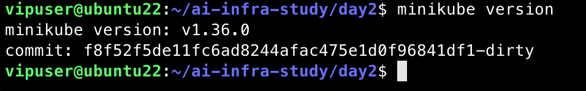
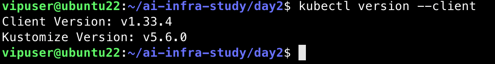
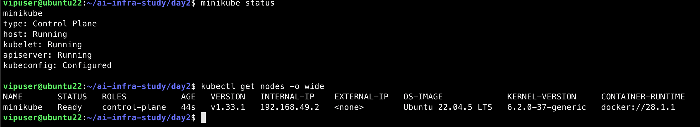
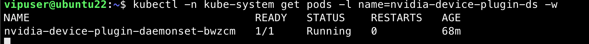
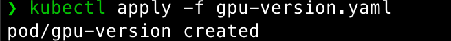
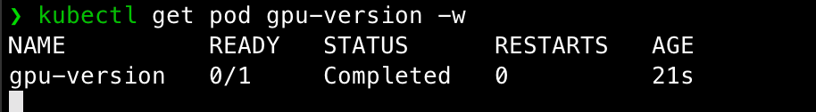
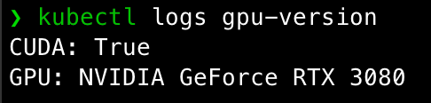

# Day 2 —Kubernetes 基础 & GPU Pod

## 一、🎯学习目标

- 学会基本的 `kubectl` 命令
- 使用 **minikube + docker driver** 启动 K8s
- 部署 **NVIDIA GPU Pod（带 nvidia-device-plugin）**
- 在集群里运行 PyTorch 容器并验证 GPU

## 二、安装并启动 Minikube

> ⚠️ 注意：必须用 **vipuser** 用户（非 root），否则会报 `DRV_AS_ROOT` 错误。

### 1) 安装minikube

```bash
curl -LO https://github.com/kubernetes/minikube/releases/latest/download/minikube-linux-amd64
sudo install minikube-linux-amd64 /usr/local/bin/minikube
rm -f minikube-linux-amd64
minikube version
```



### 2) 确认 **kubectl** 可用

```bash
# 如果你机器上还没有 kubectl：
sudo snap install kubectl --classic  # 或者用你之前装好的版本
# 确保 PATH 里包含 /snap/bin（当前 shell 立即生效）
export PATH=/snap/bin:$PATH
kubectl version --client
```



### 3) 启动集群（Docker 驱动 + 阿里镜像仓库 + 指定版本）

> 必须用 **vipuser**（非 root）运行。你的机器已配置 nvidia-container-toolkit。镜像下载失败请挂代理，或者提前下载镜像作为cache

```bash
# 0) 清理旧环境（可选）
minikube delete --all --purge || true
rm -f ~/.minikube/cache/images/kicbase-v0.0.47-amd64* || true

KIC_VER=v0.0.47
K8S_VER=v1.30.4   # 如果还不行，可降到 v1.29.x
minikube start \
  --driver=docker \
  --kubernetes-version=${K8S_VER} \
  --image-repository=auto \
  --base-image=gcr.io/k8s-minikube/kicbase:${KIC_VER} \
  --gpus=all \
  --force-systemd=true \
  -v=3

```

检查节点状态应为 `Ready`。：

```bash
kubectl get nodes -o wide
```



## 4) 安装 **NVIDIA Device Plugin**

```bash
kubectl apply -f https://raw.githubusercontent.com/NVIDIA/k8s-device-plugin/v0.17.3/deployments/static/nvidia-device-plugin.yml
kubectl -n kube-system get pods -l name=nvidia-device-plugin-ds -w
```



## 5) 跑一个 GPU Pod 验证

保存为 `gpu-test.yaml`：

```yaml
apiVersion: v1
kind: Pod
metadata:
  name: gpu-version
spec:
  restartPolicy: Never
  containers:
  - name: test
    image: nvcr.io/nvidia/pytorch:25.06-py3
    resources:
      limits:
        nvidia.com/gpu: 1
    command: ["bash","-lc"]
    args:
      - |
        python - <<'PY'
        import torch
        print("CUDA:", torch.cuda.is_available())
        if torch.cuda.is_available():
            print("GPU:", torch.cuda.get_device_name(0))
        PY

```

应用并看日志：

```bash
kubectl apply -f gpu-version.yaml  # kubectl describe pod gpu-version 查看执行日志
kubectl get pod gpu-version -w
kubectl logs gpu-version

kubectl delete pod gpu-version # 删除pod
```



看到：


