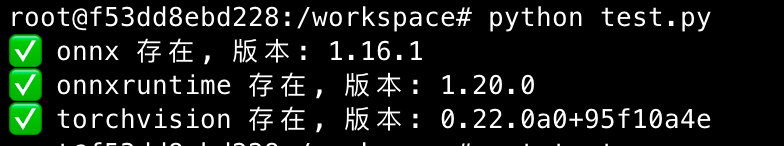
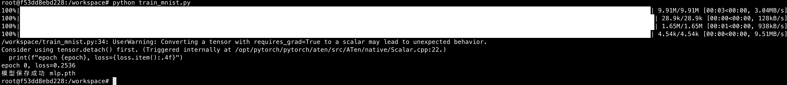
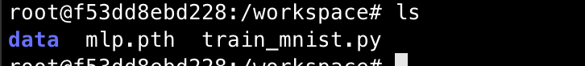
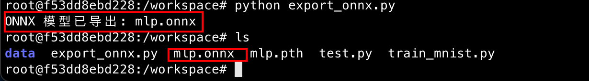
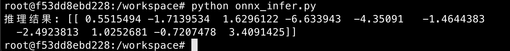
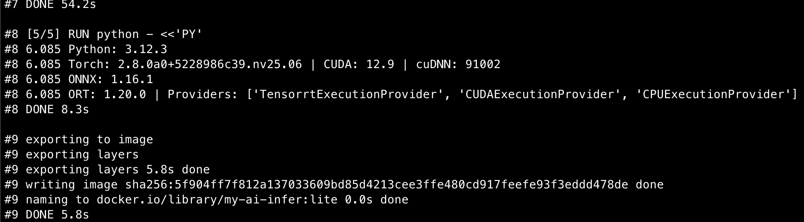
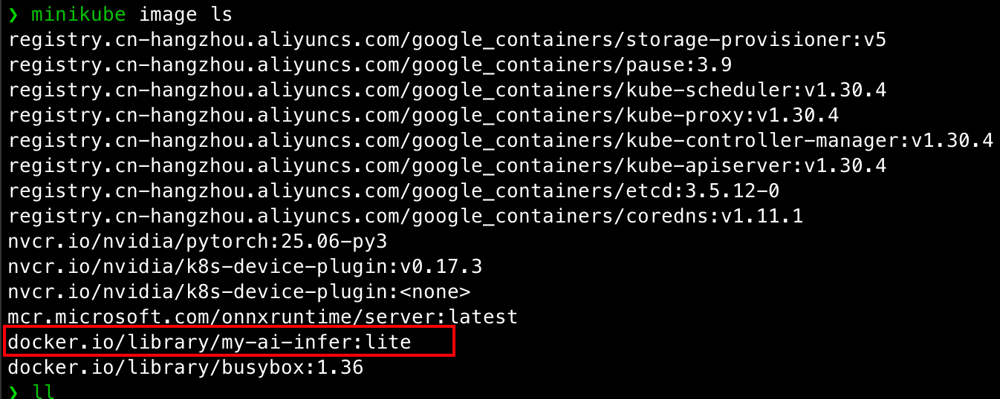
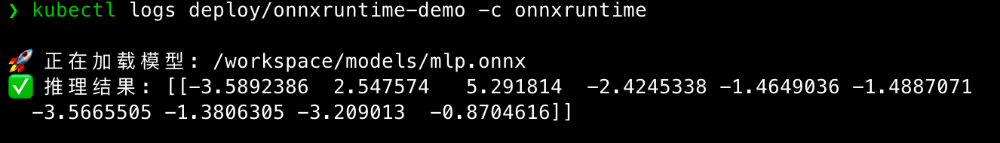

# Day 3 — PyTorch → ONNX 保姆级教程

## 一、🎯学习目标

- 用 PyTorch 训练一个简单模型（MNIST/CIFAR10）
- 导出为 ONNX 格式
- 用 ONNX Runtime 做推理测试
- （进阶）写一个 K8s 部署文件运行 onnxruntime 容器

## 二、准备环境

确保你在 Day1 已经有了 **PyTorch 容器**。如果没有，可以用官方带 CUDA 的镜像：

```bash
docker run --gpus all -it --rm \
  -v $PWD:/workspace \
  ai-infra:day1 /bin/bash
```

进入容器后检查依赖：

```python
import importlib

for pkg in ["onnx", "onnxruntime", "torchvision"]:
    try:
        m = importlib.import_module(pkg)
        print(f"✅ {pkg} 存在, 版本: {getattr(m, '__version__', '未知')}")
    except ImportError:
        print(f"❌ {pkg} 未安装")
```



缺少哪个依赖安装哪个依赖：

```bash
pip install onnx onnxruntime-gpu torchvision
```

------

## 二、训练一个简单的 PyTorch 模型

我们用 **MNIST 手写数字分类**来做实验。

```python
# train_mnist.py
import torch, torch.nn as nn, torch.optim as optim
import torchvision
import torchvision.transforms as transforms

# 1. 数据集
transform = transforms.Compose([transforms.ToTensor()])
trainset = torchvision.datasets.MNIST(root="./data", train=True, download=True, transform=transform)
trainloader = torch.utils.data.DataLoader(trainset, batch_size=64, shuffle=True)

# 2. 模型
class MLP(nn.Module):
    def __init__(self):
        super().__init__()
        self.fc1 = nn.Linear(28*28, 128)
        self.relu = nn.ReLU()
        self.fc2 = nn.Linear(128, 10)
    def forward(self, x):
        x = x.view(-1, 28*28)
        return self.fc2(self.relu(self.fc1(x)))

model = MLP()
criterion = nn.CrossEntropyLoss()
optimizer = optim.Adam(model.parameters(), lr=0.001)

# 3. 训练
for epoch in range(1):
    for imgs, labels in trainloader:
        outputs = model(imgs)
        loss = criterion(outputs, labels)
        optimizer.zero_grad()
        loss.backward()
        optimizer.step()
    print(f"epoch {epoch}, loss={loss.item():.4f}")

# 4. 保存模型
torch.save(model.state_dict(), "mlp.pth")
print("模型保存成功 mlp.pth")
```

运行：

```bash
python train_mnist.py
```



运行后目录如下所示：



------

## 三、导出为 ONNX

写个脚本导出：

```python
# export_onnx.py
import torch, torch.nn as nn

class MLP(nn.Module):
    def __init__(self):
        super().__init__()
        self.fc1 = nn.Linear(28*28, 128)
        self.relu = nn.ReLU()
        self.fc2 = nn.Linear(128, 10)
    def forward(self, x):
        x = x.view(-1, 28*28)
        return self.fc2(self.relu(self.fc1(x)))

model = MLP()
model.load_state_dict(torch.load("mlp.pth"))
model.eval()

dummy_input = torch.randn(1, 1, 28, 28)
torch.onnx.export(
    model, dummy_input, "mlp.onnx",
    input_names=["input"], output_names=["output"],
    dynamic_axes={"input": {0: "batch"}, "output": {0: "batch"}},
    opset_version=12   # 强制导出 ONNX opset 12
)
print("ONNX 模型已导出: mlp.onnx")
```

运行：

```bash
python export_onnx.py
```

结果如下图所示：

------

## 四、用 ONNX Runtime 推理测试

```python
# onnx_infer.py
import onnxruntime as ort
import numpy as np

# 加载 ONNX
sess = ort.InferenceSession("mlp.onnx", providers=["CUDAExecutionProvider", "CPUExecutionProvider"])

# 随机输入
x = np.random.randn(1, 1, 28, 28).astype(np.float32)
inputs = {sess.get_inputs()[0].name: x}
outputs = sess.run(None, inputs)

print("推理结果:", outputs[0])
```

运行：

```bash
python onnx_infer.py
```



------

## 五、（进阶）部署到 K8s

创建`k8s_onnx_infer.py`针对k8s的onnx_infer

```python
import onnxruntime as ort
import numpy as np

# 模型路径（通过 ConfigMap 挂载到 /workspace/models）
MODEL_PATH = "/workspace/models/mlp.onnx"

print(f"🚀 正在加载模型: {MODEL_PATH}")
sess = ort.InferenceSession(MODEL_PATH, providers=["CPUExecutionProvider"])

# 随机输入测试
x = np.random.randn(1, 1, 28, 28).astype(np.float32)
inputs = {sess.get_inputs()[0].name: x}
outputs = sess.run(None, inputs)

print("✅ 推理结果:", outputs[0])
```

创建适合 **推理实验**的 Dockerfile

```dockerfile
# NGC 官方 PyTorch 镜像（含 CUDA/cuDNN/NCCL + TRT SDK）
FROM nvcr.io/nvidia/pytorch:25.06-py3

ENV DEBIAN_FRONTEND=noninteractive \
    PIP_NO_CACHE_DIR=1 PIP_DEFAULT_TIMEOUT=120 PIP_RETRIES=5

# 只补必要工具
RUN apt-get update && apt-get install -y --no-install-recommends \
    ca-certificates curl && rm -rf /var/lib/apt/lists/*

WORKDIR /workspace

# 仅补 ONNX + ORT（TRT SDK 已在基镜像里）
RUN python -m pip install --extra-index-url https://pypi.org/simple -i https://mirrors.aliyun.com/pypi/simple \
    --only-binary=:all: --prefer-binary \
    onnx==1.16.1 onnxruntime-gpu==1.20.0

# 快速自检，构建时就能早发现环境问题（可注释）
RUN python - <<'PY'
import sys, torch, onnx, onnxruntime as ort
print("Python:", sys.version.split()[0])
print("Torch:", torch.__version__, "| CUDA:", torch.version.cuda, "| cuDNN:", torch.backends.cudnn.version())
print("ONNX:", onnx.__version__)
print("ORT:", ort.__version__, "| Providers:", ort.get_available_providers())
PY

# 拷贝推理脚本
COPY k8s_onnx_infer.py /workspace/k8s_onnx_infer.py

# 默认执行脚本（也可在 K8s 里覆盖）
CMD ["python", "/workspace/k8s_onnx_infer.py"]
```

构建镜像

```bash
minikube image build -t my-ai-infer:lite .
```



写个简单的 Deployment 文件：

```yaml
apiVersion: apps/v1
kind: Deployment
metadata:
  name: onnxruntime-demo
spec:
  replicas: 1
  selector:
    matchLabels:
      app: onnxruntime
  template:
    metadata:
      labels:
        app: onnxruntime
    spec:
      volumes:
      - name: model-cm
        configMap:
          name: mlp-onnx-cm
      containers:
      - name: onnxruntime
        image: my-ai-infer:lite
        imagePullPolicy: IfNotPresent
        command: ["python", "/workspace/onnx_infer.py"]
        volumeMounts:
        - name: model-cm
          mountPath: /workspace
        ports:
        - containerPort: 8001
---
apiVersion: v1
kind: Service
metadata:
  name: onnxruntime-svc
spec:
  selector:
    app: onnxruntime
  type: ClusterIP
  ports:
  - port: 8001
    targetPort: 8001
```

部署：

```bash
# 先创建 ConfigMap（挂载模型文件）
kubectl delete configmap mlp-onnx-cm --ignore-not-found
kubectl create configmap mlp-onnx-cm --from-file=mlp.onnx

kubectl delete -f k8s/onnxruntime.yaml

kubectl apply -f k8s/onnxruntime.yaml

kubectl logs deploy/onnxruntime-demo -c onnxruntime
```


