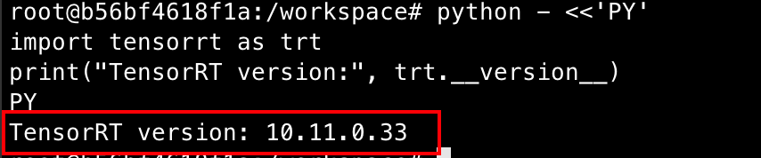
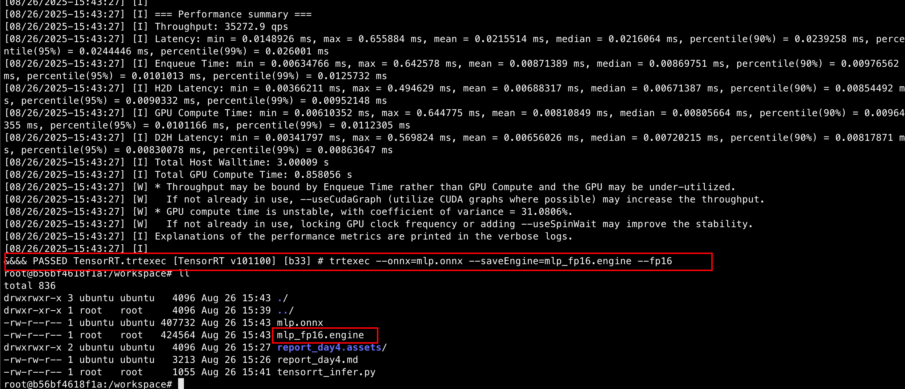
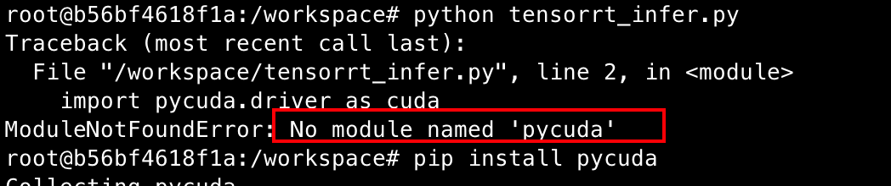
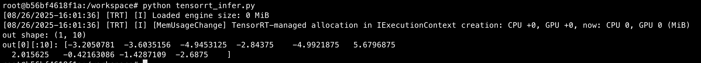
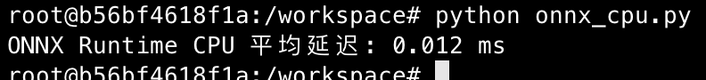
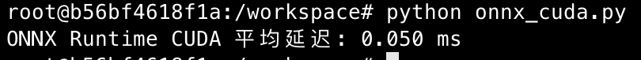
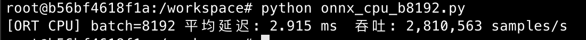
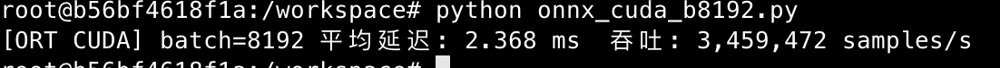

# Day 4 — TensorRT 优化

## 一、🎯 今日目标

- 安装并配置 TensorRT
- 把 `mlp.onnx` 转换成 TensorRT Engine (`.engine`)
- 使用 Python API 加载 `.engine` 做推理
- 学习 FP16/INT8 量化加速

## 二、环境准备

启动docker容器

```bash
docker run --gpus all -it --rm \
  -v $PWD:/workspace \
  --name ai-infer-day4 \
  my-ai-infer:lite /bin/bash
```

你用的基础镜像已经有 TensorRT SDK（如果用 NGC PyTorch 镜像）。验证一下：

```bash
python - <<'PY'
import tensorrt as trt
print("TensorRT version:", trt.__version__)
PY
```

如果报错没有 `tensorrt`，就需要安装对应 wheel（版本要和 CUDA 匹配）。



------

## 三、ONNX → TensorRT Engine

把day3的mlp.onnx复制到docker目录下

最简单的方法是用 **`trtexec`** 工具：

```bash
trtexec --onnx=mlp.onnx --saveEngine=mlp_fp16.engine --fp16
```

- `--onnx`：输入 ONNX 模型

- `--saveEngine`：输出 TensorRT engine

- `--fp16`：启用半精度加速

- 如果要 INT8，还需要校准数据：

  ```bash
  trtexec --onnx=mlp.onnx --saveEngine=mlp_int8.engine --int8 --calib=<calib.cache>
  ```

> 执行完成后，会得到 `mlp_fp16.engine` 文件。ls -lh mlp_fp16.engine即可查看



------

## 四、Python API 加载 TensorRT Engine

新建 `tensorrt_infer.py`：

```python
# tensorrt_infer.py  —— TensorRT 10.x / FP16 / 单次与基准测试
import time
import numpy as np
import tensorrt as trt
import pycuda.driver as cuda
import pycuda.autoinit  # 初始化 CUDA 上下文

TRT_LOGGER = trt.Logger(trt.Logger.INFO)

class TrtRunner:
    def __init__(self, engine_path="mlp_fp16.engine", input_shape=(1,1,28,28)):
        self.input_shape = tuple(input_shape)
        with open(engine_path, "rb") as f, trt.Runtime(TRT_LOGGER) as rt:
            self.engine = rt.deserialize_cuda_engine(f.read())
        if self.engine is None:
            raise RuntimeError("Failed to deserialize engine")

        self.ctx = self.engine.create_execution_context()

        # 发现 1 输入 / 1 输出（TRT 10 API）
        inputs, outputs = [], []
        for i in range(self.engine.num_io_tensors):
            name = self.engine.get_tensor_name(i)
            if self.engine.get_tensor_mode(name) == trt.TensorIOMode.INPUT:
                inputs.append(name)
            else:
                outputs.append(name)
        assert len(inputs) == 1 and len(outputs) == 1, f"IO not 1/1: {inputs}, {outputs}"
        self.in_name, self.out_name = inputs[0], outputs[0]

        # 设输入形状并查询输出形状/类型
        self.ctx.set_input_shape(self.in_name, self.input_shape)
        self.out_shape = tuple(self.ctx.get_tensor_shape(self.out_name))
        self.out_dtype = np.dtype(trt.nptype(self.engine.get_tensor_dtype(self.out_name)))

        # 预分配显存 + 绑定地址（复用）
        self.stream = cuda.Stream()
        self.d_in  = cuda.mem_alloc(int(np.prod(self.input_shape)) * 4)  # float32
        self.d_out = cuda.mem_alloc(int(np.prod(self.out_shape)) * self.out_dtype.itemsize)
        self.ctx.set_tensor_address(self.in_name, int(self.d_in))
        self.ctx.set_tensor_address(self.out_name, int(self.d_out))

    def infer_once(self, x_np):
        # H2D
        cuda.memcpy_htod_async(self.d_in, x_np, self.stream)
        # 执行
        ok = self.ctx.execute_async_v3(self.stream.handle)
        if not ok:
            raise RuntimeError("TensorRT execution failed")
        # D2H
        y = np.empty(self.out_shape, dtype=self.out_dtype)
        cuda.memcpy_dtoh_async(y, self.d_out, self.stream)
        self.stream.synchronize()
        return y

if __name__ == "__main__":
    # 准备输入
    x = np.random.randn(1,1,28,28).astype(np.float32)

    # 初始化 & 单次推理
    runner = TrtRunner("mlp_fp16.engine", input_shape=x.shape)
    y = runner.infer_once(x)
    print("out shape:", y.shape)
    print("out[0][:10]:", y.reshape(-1)[:10])

    # 预热 + 基准测试
    WARMUP, ITERS = 100, 1000
    for _ in range(WARMUP):
        runner.infer_once(x)

    t0 = time.perf_counter()
    for _ in range(ITERS):
        runner.infer_once(x)
    cuda.Context.synchronize()  # 再保险同步一次
    t1 = time.perf_counter()

    print(f"平均延迟: {(t1 - t0) / ITERS * 1000:.3f} ms  (batch=1)")
```

运行：

```bash
python tensorrt_infer.py
```

运行提示No module named 'pycuda'，执行下列命令,重新运行即可

```bash
pip install pycuda
```





------

## 五、对比实验

### 实验步骤

- 先用 **ONNX Runtime** 跑一遍（Day3 的 `onnx_infer.py`）。

- 再用 **TensorRT Engine** 跑一遍（上面的 `tensorrt_infer.py`）

- 记录两次推理耗时对比（CPU vs CUDA EP vs TensorRT FP16）。

### 环境信息

- GPU 型号: NVIDIA GeForce RTX 2080 Ti
- 驱动版本: 550.127.05
- CUDA 版本: 12.9 (nvcc 12.9.86)
- TensorRT 版本: 10.11.0.33
- ONNX Runtime 版本: 1.20.0

```python
# onnx_cpu.py
import os, time, numpy as np, onnxruntime as ort

# 固定 CPU 线程数（避免抖动，可自行调整）
os.environ.setdefault("OMP_NUM_THREADS", "1")
os.environ.setdefault("MKL_NUM_THREADS", "1")

WARMUP, ITERS = 100, 1000
np.random.seed(123)

def main():
    sess = ort.InferenceSession("mlp.onnx", providers=["CPUExecutionProvider"])
    name = sess.get_inputs()[0].name
    x = np.random.randn(1, 1, 28, 28).astype(np.float32)

    # 预热
    for _ in range(WARMUP):
        sess.run(None, {name: x})

    # 计时
    t0 = time.perf_counter()
    for _ in range(ITERS):
        sess.run(None, {name: x})
    t1 = time.perf_counter()

    print(f"ONNX Runtime CPU 平均延迟: {(t1 - t0)/ITERS*1000:.3f} ms")

if __name__ == "__main__":
    main()
```

运行：

```bash
python onnx_cpu.py
```



```python
# onnx_cuda.py
import time, numpy as np, onnxruntime as ort

WARMUP, ITERS = 100, 1000
np.random.seed(123)

def main():
    sess = ort.InferenceSession("mlp.onnx", providers=["CUDAExecutionProvider"])
    name = sess.get_inputs()[0].name
    x = np.random.randn(1, 1, 28, 28).astype(np.float32)

    # 预热
    for _ in range(WARMUP):
        sess.run(None, {name: x})

    # 计时
    t0 = time.perf_counter()
    for _ in range(ITERS):
        sess.run(None, {name: x})
    t1 = time.perf_counter()

    print(f"ONNX Runtime CUDA 平均延迟: {(t1 - t0)/ITERS*1000:.3f} ms")

if __name__ == "__main__":
    main()
```

运行：

```bash
python onnx_cuda.py
```



TensorRT FP16

### 实验结果（batch=1, 1×1×28×28, iters=1000, warmup=100）

| 方法          | 平均延迟 (ms) | 备注                                |
| ------------- | ------------- | ----------------------------------- |
| ORT CPU       | **0.012**     | OMP/MKL 已固定为 1 线程（脚本默认） |
| ORT CUDA EP   | 0.050         | 端到端（含 H2D/D2H）                |
| TensorRT FP16 | 0.040         | FP16 engine，端到端（复用显存）     |

### 分析
- 这个超小模型 + batch=1 场景下，**CPU 最快**（0.012 ms），符合预期。
- **TensorRT FP16 比 ORT CUDA 快 ~1.25×**（0.050 → 0.040 ms），但仍慢于 CPU，原因主要是 GPU 启动 & 拷贝开销在小算子上占主导。

## 六、补充batch=8192

### 0) 先重建 FP16 Engine（支持 batch=8192）

```bash
trtexec --onnx=mlp.onnx --saveEngine=mlp_fp16_b8192.engine --fp16 \
  --minShapes=input:1x1x28x28 \
  --optShapes=input:8192x1x28x28 \
  --maxShapes=input:8192x1x28x28
```

------

### 1) `onnx_cpu_b8192.py`（ORT CPU）

```python
# onnx_cpu_b8192.py
import os, time, numpy as np, onnxruntime as ort

# 为了避免抖动，固定线程数（按需调整更快）
os.environ.setdefault("OMP_NUM_THREADS", "1")
os.environ.setdefault("MKL_NUM_THREADS", "1")

BATCH = 8192
SHAPE = (BATCH, 1, 28, 28)
WARMUP, ITERS = 5, 20   # 大批量很重，次数适当减小
np.random.seed(123)

def main():
    sess = ort.InferenceSession("mlp.onnx", providers=["CPUExecutionProvider"])
    name = sess.get_inputs()[0].name
    x = np.random.randn(*SHAPE).astype(np.float32)

    # 预热
    for _ in range(WARMUP):
        _ = sess.run(None, {name: x})

    # 计时
    t0 = time.perf_counter()
    for _ in range(ITERS):
        _ = sess.run(None, {name: x})
    t1 = time.perf_counter()

    avg_s = (t1 - t0) / ITERS
    thr = BATCH / avg_s
    print(f"[ORT CPU] batch={BATCH} 平均延迟: {avg_s*1000:.3f} ms  吞吐: {thr:,.0f} samples/s")

if __name__ == "__main__":
    main()
```



------

### 2) `onnx_cuda_b8192.py`（ORT CUDA EP）

```python
# onnx_cuda_b8192.py
import time, numpy as np, onnxruntime as ort

BATCH = 8192
SHAPE = (BATCH, 1, 28, 28)
WARMUP, ITERS = 5, 20
np.random.seed(123)

def main():
    # 需要 onnxruntime-gpu + 正确的 CUDA/cuDNN
    sess = ort.InferenceSession("mlp.onnx", providers=["CUDAExecutionProvider"])
    name = sess.get_inputs()[0].name
    x = np.random.randn(*SHAPE).astype(np.float32)

    # 预热
    for _ in range(WARMUP):
        _ = sess.run(None, {name: x})

    # 计时
    t0 = time.perf_counter()
    for _ in range(ITERS):
        _ = sess.run(None, {name: x})
    t1 = time.perf_counter()

    avg_s = (t1 - t0) / ITERS
    thr = BATCH / avg_s
    print(f"[ORT CUDA] batch={BATCH} 平均延迟: {avg_s*1000:.3f} ms  吞吐: {thr:,.0f} samples/s")

if __name__ == "__main__":
    main()
```

> 进阶：想进一步降低 H2D/D2H 开销，可以改为 **IO Binding**（需要你管理 GPU 缓冲区，有需要我再给你一版）。



------

### 3) `tensorrt_fp16_b8192.py`（TensorRT 10.x / FP16）

```python
# tensorrt_fp16_b8192.py  —— TensorRT 10.x / FP16 / 批量=8192
import time, numpy as np, tensorrt as trt
import pycuda.driver as cuda
import pycuda.autoinit  # 初始化 CUDA 上下文

TRT_LOGGER = trt.Logger(trt.Logger.ERROR)
BATCH = 8192
SHAPE = (BATCH, 1, 28, 28)
WARMUP, ITERS = 5, 20
np.random.seed(123)

class TrtRunner:
    def __init__(self, engine_path="mlp_fp16_b8192.engine", input_shape=SHAPE):
        self.input_shape = tuple(input_shape)
        with open(engine_path, "rb") as f, trt.Runtime(TRT_LOGGER) as rt:
            self.engine = rt.deserialize_cuda_engine(f.read())
        if self.engine is None:
            raise RuntimeError("Failed to deserialize engine")
        self.ctx = self.engine.create_execution_context()

        # 发现 IO（1 入 / 1 出）
        ins, outs = [], []
        for i in range(self.engine.num_io_tensors):
            n = self.engine.get_tensor_name(i)
            (ins if self.engine.get_tensor_mode(n)==trt.TensorIOMode.INPUT else outs).append(n)
        assert len(ins)==1 and len(outs)==1, f"IO not 1/1: {ins}, {outs}"
        self.in_name, self.out_name = ins[0], outs[0]

        # 设置输入形状，查询输出形状与类型
        self.ctx.set_input_shape(self.in_name, self.input_shape)
        self.out_shape = tuple(self.ctx.get_tensor_shape(self.out_name))
        self.out_dtype = np.dtype(trt.nptype(self.engine.get_tensor_dtype(self.out_name)))

        # 预分配显存并绑定（复用）
        self.stream = cuda.Stream()
        self.d_in  = cuda.mem_alloc(int(np.prod(self.input_shape)) * 4)  # FP32 输入（端到端）
        self.d_out = cuda.mem_alloc(int(np.prod(self.out_shape)) * self.out_dtype.itemsize)
        self.ctx.set_tensor_address(self.in_name, int(self.d_in))
        self.ctx.set_tensor_address(self.out_name, int(self.d_out))

    def infer_once(self, x_np):
        # H2D
        cuda.memcpy_htod_async(self.d_in, x_np, self.stream)
        # 执行
        ok = self.ctx.execute_async_v3(self.stream.handle)
        if not ok:
            raise RuntimeError("TensorRT execution failed")
        # D2H
        y = np.empty(self.out_shape, dtype=self.out_dtype)
        cuda.memcpy_dtoh_async(y, self.d_out, self.stream)
        self.stream.synchronize()
        return y

def main():
    runner = TrtRunner()
    x = np.random.randn(*SHAPE).astype(np.float32)

    # 预热
    for _ in range(WARMUP):
        runner.infer_once(x)

    # 计时
    t0 = time.perf_counter()
    for _ in range(ITERS):
        runner.infer_once(x)
    cuda.Context.synchronize()
    t1 = time.perf_counter()

    avg_s = (t1 - t0) / ITERS
    thr = BATCH / avg_s
    print(f"[TensorRT FP16] batch={BATCH} 平均延迟: {avg_s*1000:.3f} ms  吞吐: {thr:,.0f} samples/s")

if __name__ == "__main__":
    main()
```


| 方法          | 平均延迟 (ms) | 吞吐 (samples/s) | 备注                  |
| ------------- | ------------: | ---------------: | --------------------- |
| ORT CPU       |         2.915 |        2,810,563 | OMP/MKL=1             |
| ORT CUDA EP   |         2.368 |        3,459,472 | onnxruntime-gpu       |
| TensorRT FP16 |         2.260 |        3,624,212 | mlp_fp16_b8192.engine |

