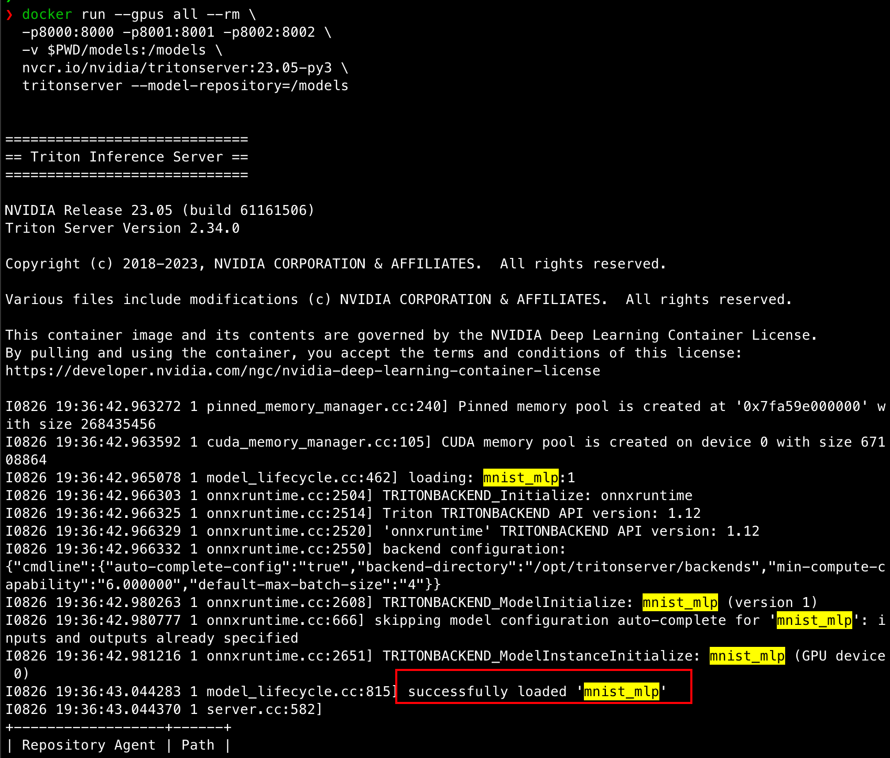
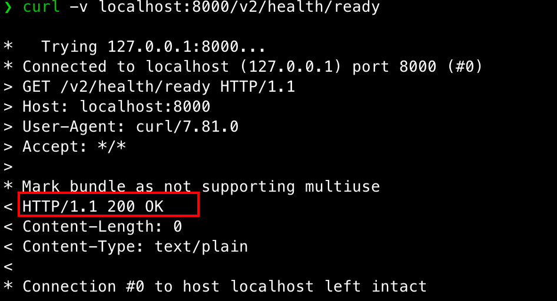
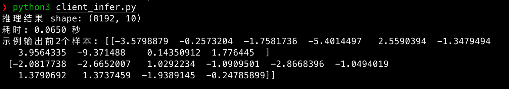
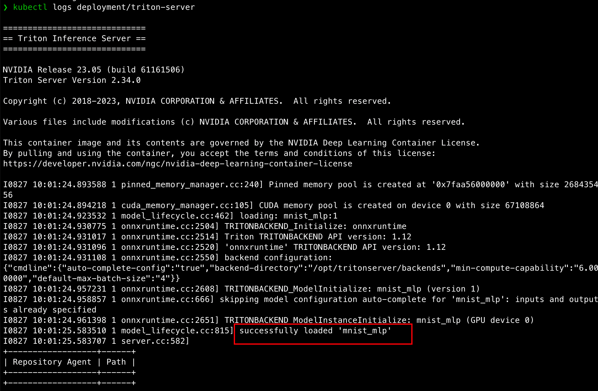

# Day 5 — Triton Inference Server

## 🎯 今日目标

1. 安装并运行 **Triton Inference Server**
2. 理解 **模型仓库（model repository）** 结构
3. 部署一个 ONNX 模型到 Triton
4. 用 **Python Client (HTTP/gRPC)** 发起推理请求

------

## 一、准备模型仓

### 放入模型

把你之前 **Day3 导出的 `mlp.onnx`** 文件复制到：

```bash
mkdir -p models/mnist_mlp/1
cp mlp.onnx models/mnist_mlp/1/model.onnx
```

### 写 `config.pbtxt`

新建文件 `models/mnist_mlp/config.pbtxt`：

```bash
name: "mnist_mlp"
platform: "onnxruntime_onnx"
max_batch_size: 8192

input [
  {
    name: "input"
    data_type: TYPE_FP32
    dims: [1,28,28]
  }
]

output [
  {
    name: "output"
    data_type: TYPE_FP32
    dims: [10]
  }
]
```

------

### Triton 要求特定目录结构：

```bash
models/
└── mnist_mlp/
    └── 1/
        └── model.onnx
    └── config.pbtxt
```

- `mnist_mlp/` → 模型名字
- `1/` → 版本号
- `model.onnx` → ONNX 模型文件
- `config.pbtxt` → 配置文件

## 二、准备环境

拉取 Triton 官方镜像（推荐 GPU 版）：

```bash
docker pull nvcr.io/nvidia/tritonserver:23.05-py3
```

运行容器（映射三种端口：HTTP 8000, gRPC 8001, Metrics 8002）：

```bash
docker run --gpus all --rm \
  -p8000:8000 -p8001:8001 -p8002:8002 \
  -v $PWD/models:/models \
  nvcr.io/nvidia/tritonserver:23.05-py3 \
  tritonserver --model-repository=/models
```

说明：

- `--gpus all` → 使用 GPU
- `-v $PWD/models:/models` → 本地模型目录挂载到容器

------

## 三、启动 Triton

进入 Triton 容器后，启动日志里应该能看到：



测试服务是否可用：

```bash
curl -v localhost:8000/v2/health/ready
```

返回 `200 OK` 表示服务可用。



------

## 四、安装客户端 SDK

新开一个终端，安装 Python Client：

```bash
pip install tritonclient[all] # zsh 使用 pip install "tritonclient[all]"
```

------

## 五、写推理客户端

保存为 `client_infer.py`：

```python
import numpy as np
import tritonclient.http as http
import time

# 连接 Triton HTTP 服务
client = http.InferenceServerClient(url="localhost:8000")

# 构造输入：batch=8192，每个样本 1x28x28
batch_size = 8192
x = np.random.randn(batch_size, 1, 28, 28).astype(np.float32)

# 定义输入
inputs = [http.InferInput("input", x.shape, "FP32")]
inputs[0].set_data_from_numpy(x)

# 定义输出
outputs = [http.InferRequestedOutput("output")]

# 推理并计时
start = time.time()
result = client.infer(model_name="mnist_mlp", inputs=inputs, outputs=outputs)
end = time.time()

# 结果
output_data = result.as_numpy("output")
print(f"推理结果 shape: {output_data.shape}")   # 应该是 (8192, 10)
print(f"耗时: {end - start:.4f} 秒")
print("示例输出前2个样本:", output_data[:2])
```

运行：

```bash
python client_infer.py
```



------

## 六、（进阶）K8s 部署

编写 `triton-deploy.yaml`：

```yaml
apiVersion: apps/v1
kind: Deployment
metadata:
  name: triton-server
spec:
  replicas: 1
  selector:
    matchLabels:
      app: triton
  template:
    metadata:
      labels:
        app: triton
    spec:
      containers:
      - name: triton
        image: nvcr.io/nvidia/tritonserver:23.05-py3
        args: ["tritonserver", "--model-repository=/models"]
        ports:
        - containerPort: 8000
        - containerPort: 8001
        - containerPort: 8002
        resources:
          limits:
            nvidia.com/gpu: 1
        volumeMounts:
        - name: model-repo
          mountPath: /models
      volumes:
      - name: model-repo
        hostPath:
          path: /models
```

在day5目录下：

```bash
# 让宿主机目录挂载到 minikube VM：

minikube mount ./models:/models
```

另起一个终端部署：

```bash
kubectl delete -f triton-deploy.yaml
kubectl apply -f triton-deploy.yaml
kubectl get pods
# 如果失败可以使用下列命令查看错误
kubectl describe pod triton-server
# 查看日志
kubectl logs deployment/triton-server
```




看到model加载成功即可
