# ☸️ AI 推理平台 — Kubernetes 部署完整教程

## 1️⃣ 前置准备

### (1) 环境要求

- 一台支持 NVIDIA GPU 的服务器（Ubuntu 20.04/22.04）
- 已安装：
  - **Docker**
  - **NVIDIA Container Toolkit** (`nvidia-docker2`)
  - **Kubernetes (kubectl + minikube 或 kind)**
  - **helm**

检查 GPU：

```bash
nvidia-smi
```

✅ 输出显卡信息。

检查 Kubernetes：

```bash
kubectl get nodes
```

✅ 至少有一个 `Ready` 节点。

------

### (2) 安装 GPU 插件

K8s 需要 GPU device plugin 才能调度 GPU Pod：

```bash
kubectl apply -f https://raw.githubusercontent.com/NVIDIA/k8s-device-plugin/v0.14.0/nvidia-device-plugin.yml
```

检查是否成功：

```bash
kubectl get pods -n kube-system | grep nvidia
```

✅ 看到 `nvidia-device-plugin-daemonset-xxxxx` 状态是 `Running`。

------

## 2️⃣ 在 Docker 中准备模型

### 1.启动开发容器

首先启动一个带 GPU 的 PyTorch 容器（里面包含 Python, CUDA, PyTorch）：

```dockerfile
FROM nvcr.io/nvidia/pytorch:23.05-py3

# 安装 ONNX / TensorRT / Triton Client
RUN pip install --upgrade pip \
 && pip install onnx onnxruntime-gpu tritonclient[all] tensorrt

WORKDIR /workspace
COPY . /workspace

CMD ["/bin/bash"]
```

创建镜像并执行容器

```bash
docker build -t my-ai-infer:latest .
docker run --gpus all -it -v $PWD:/workspace my-ai-infer:latest
```

### 2.准备两个模型：

- **MNIST (ONNX)**
- **ResNet50 (TensorRT)**

目录：

```bash
ai-infra-inference-service/
├── scripts/
│   ├── train_mnist.py
│   ├── export_mnist.py
│   ├── export_resnet50.py
│   └── prepare_models.sh
├── onnx/
├── tensorrt/
└── triton/
```

------

#### (1) 训练 MNIST

```python
# scripts/train_mnist.py
import torch, torch.nn as nn, torch.optim as optim
import torchvision, torchvision.transforms as transforms

# 数据集
transform = transforms.Compose([transforms.ToTensor()])
trainset = torchvision.datasets.MNIST("./data", train=True, download=True, transform=transform)
trainloader = torch.utils.data.DataLoader(trainset, batch_size=64, shuffle=True)

# 模型
class MLP(nn.Module):
    def __init__(self):
        super().__init__()
        self.fc1 = nn.Linear(28*28, 128)
        self.fc2 = nn.Linear(128, 10)
    def forward(self, x):
        x = x.view(-1, 28*28)
        return self.fc2(torch.relu(self.fc1(x)))

model = MLP()
criterion = nn.CrossEntropyLoss()
optimizer = optim.Adam(model.parameters(), lr=0.001)

# 训练
for epoch in range(1):
    for imgs, labels in trainloader:
        outputs = model(imgs)
        loss = criterion(outputs, labels)
        optimizer.zero_grad()
        loss.backward()
        optimizer.step()
print("训练完成，loss:", loss.item())
torch.save(model.state_dict(), "mlp.pth")
```

#### (2) 导出 MNIST ONNX

```python
# scripts/export_mnist.py
import torch, torch.nn as nn

class MLP(nn.Module):
    def __init__(self):
        super().__init__()
        self.fc1 = nn.Linear(28*28, 128)
        self.fc2 = nn.Linear(128, 10)
    def forward(self, x):
        x = x.view(-1, 28*28)
        return self.fc2(torch.relu(self.fc1(x)))

model = MLP()
model.load_state_dict(torch.load("mlp.pth"))
model.eval()

dummy = torch.randn(1, 1, 28, 28)
torch.onnx.export(model, dummy, "onnx/mnist.onnx",
                  input_names=["input"], output_names=["output"],
                  dynamic_axes={"input": {0: "batch"}, "output": {0: "batch"}})
print("MNIST 导出完成: onnx/mnist.onnx")
```

------

#### (3) 导出 ResNet50 ONNX

```python
# scripts/export_resnet50.py
import torch, torchvision

model = torchvision.models.resnet50(pretrained=True)
model.eval()

dummy = torch.randn(1, 3, 224, 224)
torch.onnx.export(model, dummy, "onnx/resnet50.onnx",
                  input_names=["input"], output_names=["output"],
                  dynamic_axes={"input": {0: "batch"}, "output": {0: "batch"}})
print("ResNet50 导出完成: onnx/resnet50.onnx")
```

#### (4) 转换 TensorRT Engine

```bash
trtexec \
  --onnx=$ONNX_DIR/mnist.onnx \
  --saveEngine=$TRT_DIR/mnist_fp16.engine \
  --fp16 \
  --minShapes=input:1x1x28x28 \
  --optShapes=input:4x1x28x28 \
  --maxShapes=input:8x1x28x28 \
  --explicitBatch \
  > $TRT_DIR/mnist_build.log 2>&1
trtexec \
  --onnx=$ONNX_DIR/resnet50.onnx \
  --saveEngine=$TRT_DIR/resnet50_fp16.engine \
  --fp16 \
  --minShapes=input:1x3x224x224 \
  --optShapes=input:8x3x224x224 \
  --maxShapes=input:16x3x224x224 \
  --explicitBatch \
  > $TRT_DIR/resnet50_build.log 2>&1
```

#### (5) 组织 Triton 模型仓库

```bash
triton/
├── mnist_mlp/
│   ├── 1/model.onnx
│   └── config.pbtxt
└── resnet50/
    ├── 1/model.plan
    └── config.pbtxt
```

#### (6) 一键准备模型

```python
#!/bin/bash
set -e

# =============== 路径配置 ===============
ROOT_DIR=$(dirname $(readlink -f "$0"))/..
ONNX_DIR=$ROOT_DIR/onnx
TRT_DIR=$ROOT_DIR/tensorrt
TRITON_DIR=$ROOT_DIR/triton

mkdir -p $ONNX_DIR $TRT_DIR $TRITON_DIR

echo "📂 项目根目录: $ROOT_DIR"
echo "📂 ONNX 目录: $ONNX_DIR"
echo "📂 TensorRT Engine 目录: $TRT_DIR"
echo "📂 Triton 模型仓库: $TRITON_DIR"

# =============== 1. 训练 MNIST ===============
echo "📝 训练 MNIST 模型..."
python $ROOT_DIR/scripts/train_mnist.py

# =============== 2. 导出 MNIST ONNX ===============
echo "📦 导出 MNIST ONNX..."
python $ROOT_DIR/scripts/export_mnist.py

# =============== 3. 导出 ResNet50 ONNX ===============
echo "📦 导出 ResNet50 ONNX..."
python $ROOT_DIR/scripts/export_resnet50.py

# =============== 4. 转换 TensorRT Engine（支持动态 batch） ===============
echo "⚡ 转换 TensorRT Engine (FP16 + 动态 Batch)..."

# MNIST Engine: batch 1~8
trtexec \
  --onnx=$ONNX_DIR/mnist.onnx \
  --saveEngine=$TRT_DIR/mnist_fp16.engine \
  --fp16 \
  --minShapes=input:1x1x28x28 \
  --optShapes=input:4x1x28x28 \
  --maxShapes=input:8x1x28x28 \
  --explicitBatch \
  > $TRT_DIR/mnist_build.log 2>&1

# ResNet50 Engine: batch 1~16
trtexec \
  --onnx=$ONNX_DIR/resnet50.onnx \
  --saveEngine=$TRT_DIR/resnet50_fp16.engine \
  --fp16 \
  --minShapes=input:1x3x224x224 \
  --optShapes=input:8x3x224x224 \
  --maxShapes=input:16x3x224x224 \
  --explicitBatch \
  > $TRT_DIR/resnet50_build.log 2>&1

echo "✅ TensorRT Engine 已生成: $TRT_DIR/*.engine"

# =============== 5. 构建 Triton 模型仓库 ===============
echo "🚀 构建 Triton 模型仓库..."

# MNIST (ONNX)
mkdir -p $TRITON_DIR/mnist_mlp/1
cp -f $ONNX_DIR/mnist.onnx $TRITON_DIR/mnist_mlp/1/model.onnx
cat > $TRITON_DIR/mnist_mlp/config.pbtxt <<EOF
name: "mnist_mlp"
platform: "onnxruntime_onnx"
max_batch_size: 8
input [
  { name: "input", data_type: TYPE_FP32, dims: [1,28,28] }
]
output [
  { name: "output", data_type: TYPE_FP32, dims: [10] }
]
EOF

# ResNet50 (TensorRT)
mkdir -p $TRITON_DIR/resnet50/1
cp -f $TRT_DIR/resnet50_fp16.engine $TRITON_DIR/resnet50/1/model.plan
cat > $TRITON_DIR/resnet50/config.pbtxt <<EOF
name: "resnet50"
platform: "tensorrt_plan"
max_batch_size: 16
input [
  { name: "input", data_type: TYPE_FP32, dims: [3,224,224] }
]
output [
  { name: "output", data_type: TYPE_FP32, dims: [1000] }
]
EOF

echo "✅ Triton 模型仓库已生成: $TRITON_DIR"
```

##### 🔧 使用方法

1. 确保 `scripts/` 目录下已经有：
   - `train_mnist.py`
   - `export_mnist.py`
   - `export_resnet50.py`
2. 给脚本加执行权限：

```bash
chmod +x scripts/prepare_models.sh
```

3. 执行：

```bash
./scripts/prepare_models.sh
```

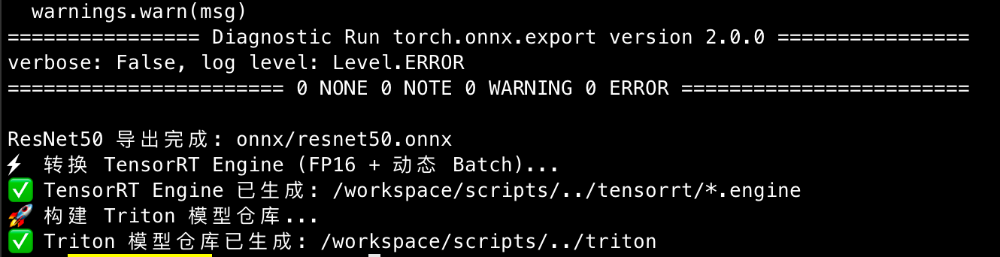

完成后，你会得到：


## 3️⃣ 部署 Triton 到 K8s

#### 1. 准备镜像

编写 Dockerfile（内置模型）

`Dockerfile.triton`

```dockerfile
FROM nvcr.io/nvidia/tritonserver:23.05-py3

# 把模型仓库拷贝到镜像内
COPY triton/ /models/

# 启动 Triton 时直接加载 /models
CMD ["tritonserver", "--model-repository=/models"]
```

#### 2. 构建镜像

在项目根目录执行：

```bash
minikube image build -t my-triton:latest -f Dockerfile.triton .
# 验证镜像已进到节点（containerd 场景）
minikube ssh -- sudo crictl images | grep my-triton
```

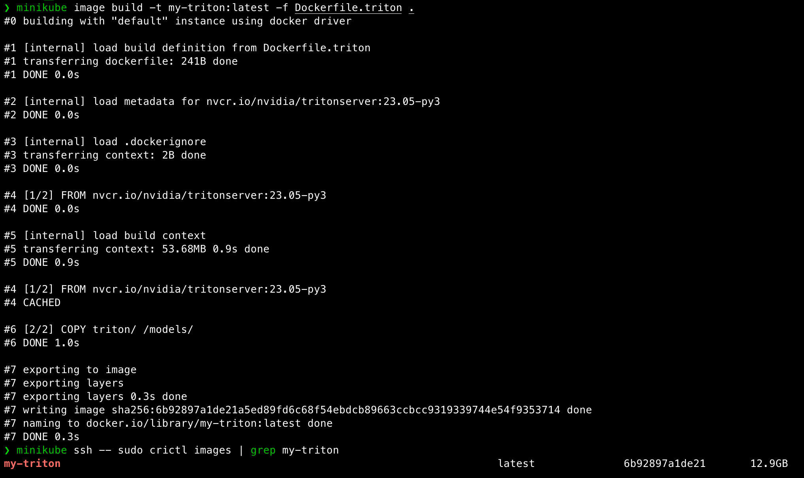

#### 3. 编写 K8s Deployment + Service

```yaml
apiVersion: apps/v1
kind: Deployment
metadata:
  name: triton-server
spec:
  replicas: 1
  selector:
    matchLabels:
      app: triton
  template:
    metadata:
      labels:
        app: triton
    spec:
      containers:
      - name: triton
        image: my-triton:latest   # 用我们刚刚构建的镜像
        imagePullPolicy: Never
        ports:
        - containerPort: 8000   # HTTP
        - containerPort: 8001   # gRPC
        - containerPort: 8002   # Metrics
        resources:
          limits:
            nvidia.com/gpu: 1
---
apiVersion: v1
kind: Service
metadata:
  name: triton-service
spec:
  type: NodePort
  selector:
    app: triton
  ports:
  - name: http
    port: 8000
    nodePort: 30080
  - name: grpc
    port: 8001
    nodePort: 30081
  - name: metrics
    port: 8002
    nodePort: 30082
```

执行：

```bash
kubectl delete -f k8s/triton-deploy.yaml
kubectl apply -f k8s/triton-deploy.yaml
# 查看 Pod & Service 状态
kubectl get pods
kubectl get svc
# 查看 Triton 日志
kubectl logs -f deploy/triton-server
```

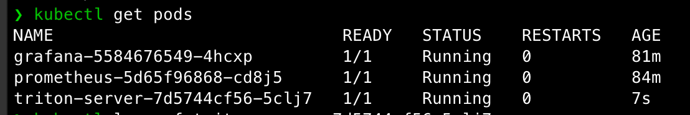

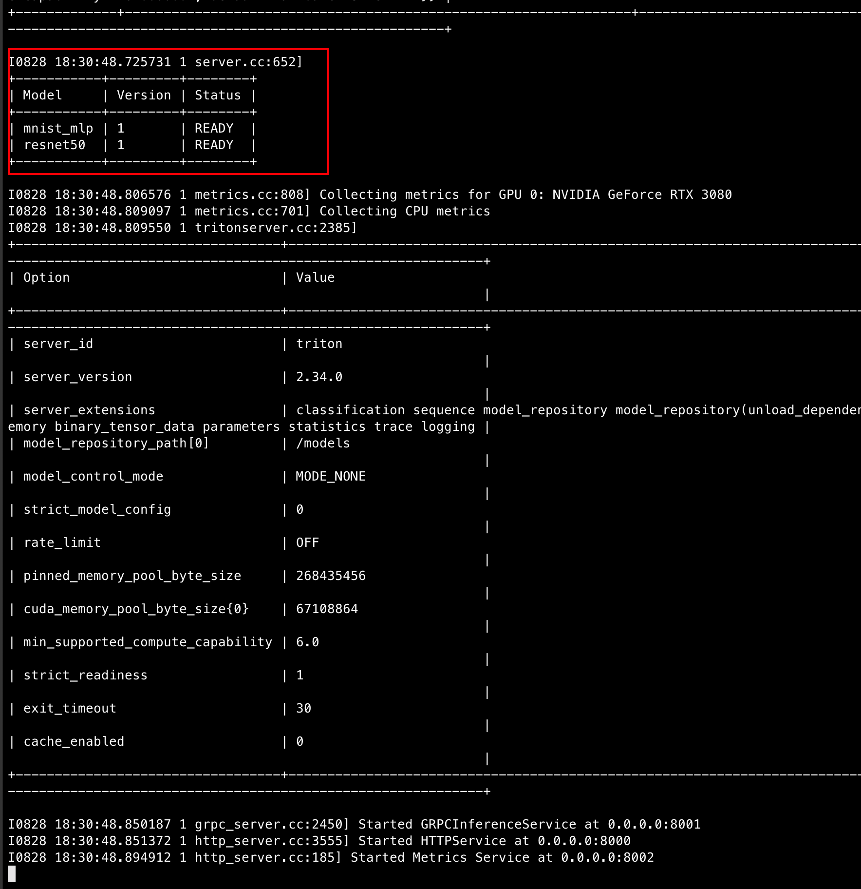

✅ 效果：

- 一个 `triton-server` Pod 运行中

- `triton-service` 暴露了 NodePort (30080/30081/30082)

- 访问：

  ```bash
  curl -v http://192.168.49.2:30080/v2/health/ready
  ```

  → `HTTP 200 OK` 表示 Triton 已启动。

  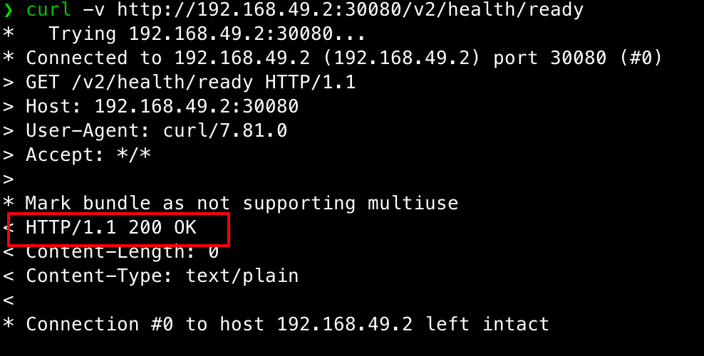

  ```bash
  curl http://192.168.49.2:30080/v2/models/mnist_mlp
  curl http://192.168.49.2:30080/v2/models/resnet50
  ```

  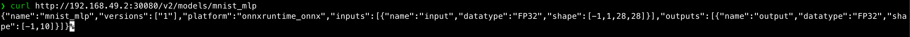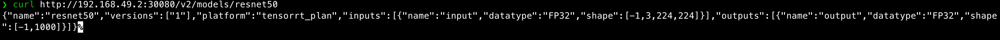

------

## 4️⃣ 部署 Prometheus

```yaml
apiVersion: v1
kind: ConfigMap
metadata:
  name: prometheus-config
data:
  prometheus.yml: |
    global:
      scrape_interval: 5s
    scrape_configs:
      - job_name: 'triton'
        static_configs:
          - targets: ['triton-service:8002']
---
apiVersion: apps/v1
kind: Deployment
metadata:
  name: prometheus
spec:
  replicas: 1
  selector:
    matchLabels:
      app: prometheus
  template:
    metadata:
      labels:
        app: prometheus
    spec:
      containers:
      - name: prometheus
        image: prom/prometheus
        args: ["--config.file=/etc/prometheus/prometheus.yml"]
        ports:
        - containerPort: 9090
        volumeMounts:
        - name: config
          mountPath: /etc/prometheus
      volumes:
      - name: config
        configMap:
          name: prometheus-config
---
apiVersion: v1
kind: Service
metadata:
  name: prometheus-service
spec:
  type: NodePort
  selector:
    app: prometheus
  ports:
  - port: 9090
    nodePort: 30090
```

执行：

```bash
kubectl apply -f k8s/prometheus-deploy.yaml
```

✅ 效果：

- Prometheus Pod 运行中

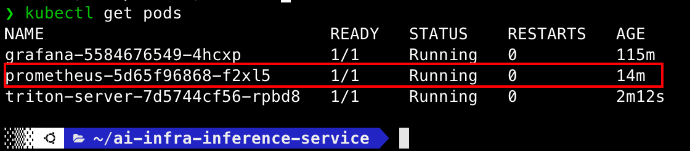

- 访问：

  ```
  http://192.168.49.2:30090
  ```

  进入 **Status → Targets** 页面，确认 `triton-service:8002` 状态为 `UP`。

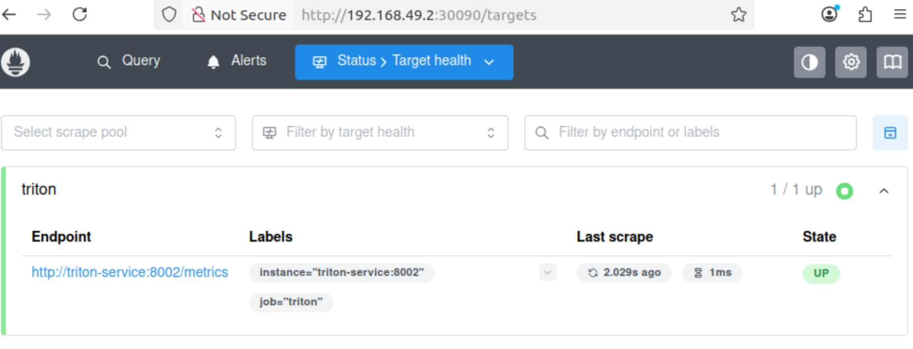

------

## 5️⃣ 部署 Grafana

```yaml
apiVersion: apps/v1
kind: Deployment
metadata:
  name: grafana
spec:
  replicas: 1
  selector:
    matchLabels:
      app: grafana
  template:
    metadata:
      labels:
        app: grafana
    spec:
      containers:
      - name: grafana
        image: grafana/grafana
        ports:
        - containerPort: 3000
---
apiVersion: v1
kind: Service
metadata:
  name: grafana-service
spec:
  type: NodePort
  selector:
    app: grafana
  ports:
  - port: 3000
    nodePort: 30300

```

执行：

```
kubectl apply -f k8s/grafana-deploy.yaml
```

✅ 效果：

- Grafana Pod 运行中

- 访问 http://192.168.49.2:30300

- 登录账号密码：`admin/admin`

- 登录后，点击左侧菜单 **齿轮图标 (⚙️ Configuration)** → **Data Sources**

  点击 **Add data source**

  选择 **Prometheus**

  在 `HTTP > URL` 填写：

  ```
  http://prometheus-service:9090
  ```

- 导入 Dashboard → 可看到 GPU/QPS/延迟实时曲线

------

## 6️⃣ 配置告警

安装helm

```bash
curl https://baltocdn.com/helm/signing.asc | sudo apt-key add -
sudo apt-get install apt-transport-https --yes
echo "deb https://baltocdn.com/helm/stable/debian/ all main" | \
  sudo tee /etc/apt/sources.list.d/helm-stable-debian.list
sudo apt-get update
sudo apt-get install helm
helm version
```

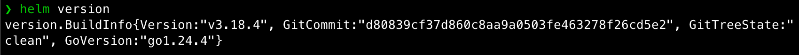

安装 Prometheus Operator

```bash
helm repo add prometheus-community https://prometheus-community.github.io/helm-charts
helm repo update

# 安装 kube-prometheus-stack，会包含 prometheus, grafana, alertmanager, CRDs
helm install monitoring prometheus-community/kube-prometheus-stack
```

安装完成后，CRDs 就会存在，你的 `alertmanager.yaml` 就能正常 apply。

```yaml
apiVersion: monitoring.coreos.com/v1
kind: PrometheusRule
metadata:
  name: triton-alerts
  namespace: monitoring   # ✅ 确保和 Prometheus Operator 在同一 namespace
  labels:
    release: monitoring-kube-prometheus   # ✅ 对应你的 release 名称
spec:
  groups:
  - name: triton-alerts
    rules:
    - alert: HighLatency
      expr: avg(nv_inference_request_duration_us) / 1000 > 200
      for: 2m
      labels:
        severity: warning
      annotations:
        summary: "推理延迟超过200ms"
    - alert: HighGPUUsage
      expr: avg(nv_gpu_utilization) > 90
      for: 1m
      labels:
        severity: critical
      annotations:
        summary: "GPU 利用率过高"
```

应用：

```
kubectl apply -f k8s/alertmanager.yaml
```

✅ 效果：

- 当推理延迟 > 200ms 或 GPU 利用率 > 90% 时，Prometheus 触发告警 → Alertmanager 转发通知（邮件/Slack/Webhook）。

查看 PrometheusRule 是否存在：

```
kubectl get prometheusrules -n monitoring | grep triton
```

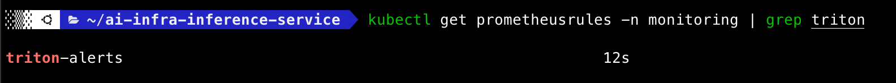

查看规则详情：

```
kubectl describe prometheusrule triton-alerts -n monitoring
```

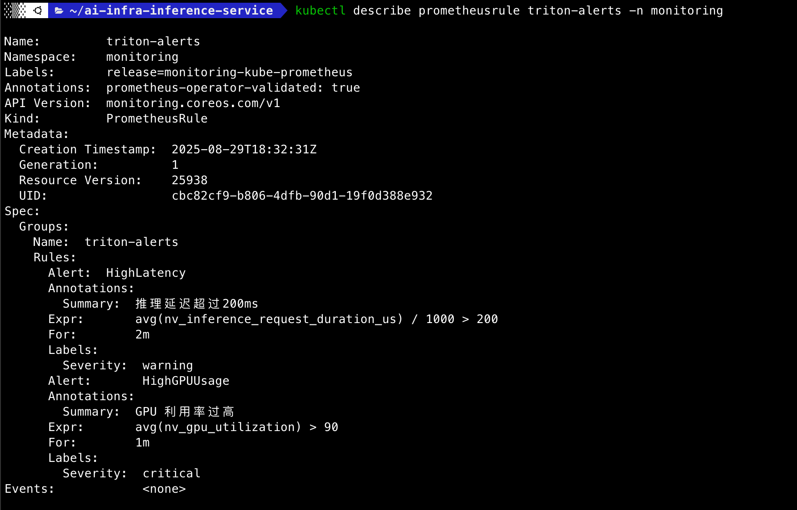