# Day 8 - CUDA 基础

## 🎯 学习目标

- 配置 CUDA 编译环境（`nvcc`）
- 编写第一个 CUDA 程序（Hello CUDA）
- 实现并运行 **向量加法** CUDA Kernel
- 通过修改 blockDim/gridDim 参数，观察性能差异

------

## 1️⃣ 环境准备

### 1. 检查 GPU 驱动与 CUDA

```bash
nvidia-smi
```

]输出里能看到 **驱动版本 / CUDA Version**，确认 CUDA ≥ 11.0。

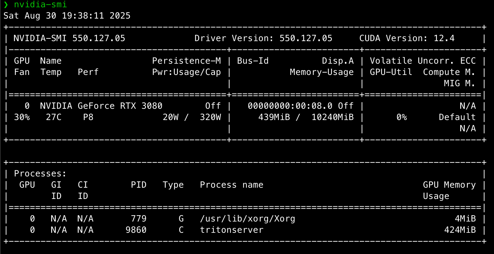

### 2. 检查 `nvcc`

```bash
nvcc --version
```

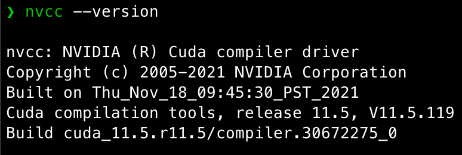

如果没有，安装 CUDA Toolkit（Linux 为例）：

1. 添加 NVIDIA 官方仓库：

```bash
wget https://developer.download.nvidia.com/compute/cuda/repos/ubuntu2204/x86_64/cuda-keyring_1.1-1_all.deb
sudo dpkg -i cuda-keyring_1.1-1_all.deb
sudo apt update
```

1. 安装 CUDA Toolkit（比如 CUDA 12.4）：

```bash
sudo apt install -y cuda-toolkit-12-4
```

配置环境变量（写到 `~/.bashrc`）：

```bash
export PATH=/usr/local/cuda-12.4/bin:$PATH
export LD_LIBRARY_PATH=/usr/local/cuda-12.4/lib64:$LD_LIBRARY_PATH
```

重新加载：

```bash
source ~/.bashrc
```

### 3. 新建工作目录

```
mkdir -p ~/ai-infra-study/day8 && cd ~/ai-infra-study/day8
```

------

## 2️⃣ Hello CUDA 程序

### `cuda_hello.cu`

```c++
#include <stdio.h>

__global__ void hello_kernel() {
    printf("Hello from GPU thread (%d,%d,%d)\n",
           threadIdx.x, blockIdx.x, blockDim.x);
}

int main() {
    // <<<grid, block>>>: 启动 2 个 block，每个 block 3 个线程
    hello_kernel<<<2, 3>>>();
    cudaDeviceSynchronize();  // 等待 GPU 完成
    return 0;
}
```

### 编译 & 运行

```bash
nvcc -o hello cuda_hello.cu
./hello
```

✅ 预期输出（顺序可能不同，因为线程并行）：

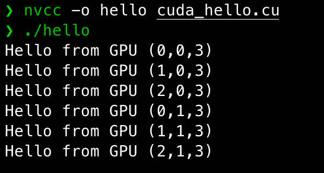

------

## 3️⃣ 向量加法 CUDA 程序

### `vector_add.cu`

```c++
#include <stdio.h>
#include <cuda_runtime.h>

__global__ void vector_add(const float *a, const float *b, float *c,int n) {
    int i = blockIdx.x * blockDim.x + threadIdx.x; // 计算全局索引

    if(i < n) {
        c[i] = a[i] + b[i];
    }
}

int main() {
    int n = 1 << 16; // 65536个元素
    size_t bytes = n * sizeof(float);

    // 分配 host 内存
    float *host_a = (float *)malloc(bytes);
    float *host_b = (float *)malloc(bytes);
    float *host_c = (float *)malloc(bytes);

    // 初始化数据
    for (int i = 0; i < n;i++) {
        host_a[i] = 1.0f;
        host_b[i] = 2.0f;
    }

    // 分配device 内存
    float *device_a, *device_b, *device_c;
    cudaMalloc(&device_a, bytes);
    cudaMalloc(&device_b, bytes);
    cudaMalloc(&device_c, bytes);

    // 复制数据 Host -> Device
    cudaMemcpy(device_a, host_a, bytes, cudaMemcpyHostToDevice);
    cudaMemcpy(device_b, host_b, bytes, cudaMemcpyHostToDevice);

    // 计算 grid/block 配置
    int blockSize = 256;
    int gridSize = (n + blockSize - 1) / blockSize;

    // 启动kernel
    vector_add<<<gridSize, blockSize>>>(device_a, device_b, device_c, n);
    cudaDeviceSynchronize();

    // 复制结果 device -> host;
    cudaMemcpy(host_c, device_c, bytes, cudaMemcpyDeviceToHost);

    // 验证结果
    for (int i = 0; i < 10;i++) {
        printf("c[%d] = %f\n", i, host_c[i]);
    }

    // 清理
    cudaFree(device_a);
    cudaFree(device_b);
    cudaFree(device_c);
    
    free(host_a);
    free(host_b);
    free(host_c);

    return 0;
}
```

### 编译 & 运行

```bash
nvcc -O2 vector_add.cu -o vec
./vec
```

✅ 预期输出：

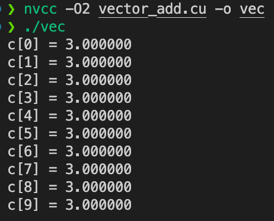

------

## 4️⃣ 性能实验

修改 `blockSize`，重新编译运行，记录时间。
 在 kernel 前后加时间测量：

```c++
// 定义两个 CUDA 事件变量，用来标记时间点
cudaEvent_t start, stop;

// 创建事件对象（类似于在 GPU 上的“时间戳”）
cudaEventCreate(&start);
cudaEventCreate(&stop);

// 在 GPU 上记录一个起始时间点（start）
cudaEventRecord(start);

// 启动 CUDA kernel（这里是向量加法）
// <<<gridSize, blockSize>>> 指定 grid 和 block 的大小
vector_add<<<gridSize, blockSize>>>(d_a, d_b, d_c, n);

// 在 GPU 上记录一个结束时间点（stop）
cudaEventRecord(stop);

// 等待 GPU 完成 stop 事件（保证 kernel 执行完再继续）
cudaEventSynchronize(stop);

// 计算 start 和 stop 之间的时间差（单位：毫秒 ms）
float ms = 0;
cudaEventElapsedTime(&ms, start, stop);

// 打印结果，显示当前 blockSize 下 kernel 的运行时间
printf("blockSize=%d, Time=%.3f ms\n", blockSize, ms);

```

实验建议：

- blockSize = 64, 128, 256, 512, 1024

blockSize 实验结果

| blockSize | 执行时间 (ms) |
| --------- | ------------- |
| 64        | 0.080         |
| 128       | 0.006         |
| 256       | 0.051         |
| 512       | 0.060         |
| 1024      | 0.033         |

结论

- 最优配置在 **blockSize=128**，耗时最低。
- blockSize 过小（64）或过大（1024）都会带来额外开销。
- warp 大小（32）的整数倍一般能获得较好性能。

------

## 5️⃣ 深度追问（思考题）

### 1. grid-stride loop 相比一次性大 grid 的优劣？

#### 🟢 Grid-Stride Loop 的优点

1. **可扩展性强**
   - 你可以只启动一个“适度大小”的 grid（例如 256×32），但 kernel 内部用 `i += gridDim.x*blockDim.x` 循环，就能覆盖任意大数组。
   - 程序员不用担心 n 特别大时 gridSize 超过 GPU 的最大限制。
2. **代码更通用**
   - 写一次 kernel，不用在 host 端频繁改 gridSize，就能应对不同数据规模。
   - 适合写“库函数”风格的通用 kernel。
3. **更好利用 GPU 资源**
   - 如果 gridSize 不足以完全覆盖数据，一次性大 grid 可能就没法运行完整数据；而 grid-stride loop 能保证所有数据都被遍历。
   - 在多 GPU 或动态 workload 的场景下，容易做到“负载均衡”。
4. **支持多次调用**
   - 如果数据量远大于单次 grid 能承受的大小，stride loop 能在单 kernel 内完成，避免多次 kernel launch（减少 CPU-GPU 启动开销）。

------

#### 🔴 Grid-Stride Loop 的缺点

1. **代码可读性稍差**
   - 循环形式对 CUDA 新手不直观，不如一次性大 grid 直白。
2. **每个线程要跑循环**
   - 单个线程可能执行多次循环迭代，相比“一次性大 grid”的“一次搞定”，可能增加寄存器使用量，降低 warp 占用率。
3. **性能上略有 overhead**
   - 在数据规模刚好能被一次性大 grid 整齐覆盖时，stride loop 多了一层 `for` 循环判断，性能可能比大 grid 略低。

------

#### 🟡 一次性大 grid 的优点

1. **实现简单**：只要算好 `gridSize = (n+blockSize-1)/blockSize`，每个线程处理一个元素，写法直观。
2. **性能极简**：没有额外的循环判断，单个线程只跑一次逻辑。
3. **适合小/中等规模数据**：一次就能覆盖的场景下性能通常最佳。

------

#### 🔵 一次性大 grid 的缺点

1. **扩展性差**：如果数据量非常大（> GPU 最大 gridSize * blockSize），这种写法就不能直接跑。
2. **不够灵活**：每次数据规模不同，都要重新算 gridSize，不适合作成通用 kernel。
3. **潜在资源浪费**：如果 gridSize 算得太大，部分线程可能 idle（浪费调度资源）。

------

#### 🎯 总结

- **一次性大 grid**：适合**数据规模已知、能被一次 grid 覆盖**的场景，写法直观，性能略好。
- **grid-stride loop**：适合**通用库函数、数据规模不确定、大规模数据**，扩展性和健壮性更强，是 **CUDA 官方推荐的最佳实践**（NVIDIA 的 sample 和 cuBLAS 都用这种模式）。

### 2. 线程索引计算溢出/越界的常见坑与防御式编程？

#### 🕳️ 常见坑

##### 1. 忘记边界检查

```
__global__ void kernel(float *a, int n) {
    int i = blockIdx.x * blockDim.x + threadIdx.x;
    a[i] = 1.0f;  // ❌ 如果 i >= n 就越界
}
```

- **问题**：如果 `gridSize * blockSize > n`，最后几个线程会访问越界。
- **后果**：可能静默写坏内存，甚至导致不可预测的错误。

------

##### 2. 多维索引计算错误

```
int i = blockIdx.x * blockDim.x + threadIdx.x;
int j = blockIdx.y * blockDim.y + threadIdx.y;
a[i + j] = ...; // ❌ 忘了乘 stride，导致不同线程覆盖同一内存
```

- **问题**：二维/三维 block 计算时，常忘记乘上行宽（stride）。
- **后果**：结果错乱，多个线程写同一地址。

------

##### 3. 整数溢出

```
int idx = blockIdx.x * blockDim.x + threadIdx.x;
```

- **问题**：如果 `gridDim.x * blockDim.x` 超过 `2^31-1`，`int` 溢出。
- **后果**：索引值变负数或错位。
- **真实情况**：大型问题里可能真的超过 `2B` 元素，要用 `size_t` 或 `long long`。

------

##### 4. stride loop 写法错位

```
for (int i = threadIdx.x; i < n; i += blockDim.x) {
    ...
}
```

- **问题**：忘了加上 `blockIdx.x * blockDim.x`，导致多个 block 重叠处理相同数据。

------

##### 5. host/device 不一致

```
int n = 1 << 30; // host 是 long long，device kernel 里却用 int
```

- **问题**：CPU 和 GPU 端数据类型不同，导致索引错乱。

------

#### 🛡️ 防御式编程技巧

##### ✅ 1. 边界检查

在 kernel 内始终做：

```
int i = blockIdx.x * blockDim.x + threadIdx.x;
if (i < n) {
    a[i] = 1.0f;
}
```

> 即使你认为不会越界，也要写这行，属于“防御性习惯”。

------

##### ✅ 2. 使用 `size_t` 或 `long long`

```
size_t i = (size_t)blockIdx.x * blockDim.x + threadIdx.x;
if (i < n) ...
```

> 避免大规模问题时溢出。

------

##### ✅ 3. 多维数组写法要显式 stride4

```
int row = blockIdx.y * blockDim.y + threadIdx.y;
int col = blockIdx.x * blockDim.x + threadIdx.x;
if (row < N && col < M) {
    a[row * M + col] = ...; // 显式写出 M
}
```

------

##### ✅ 4. grid-stride loop 模板

推荐写成：

```
for (size_t i = blockIdx.x * blockDim.x + threadIdx.x;
     i < n;
     i += blockDim.x * gridDim.x) {
    ...
}
```

> 这是 NVIDIA 官方推荐的“黄金模板”，既避免越界，又保证扩展性。

------

##### ✅ 5. 调试工具

- **cuda-memcheck**：运行时捕捉越界访问。
- **`assert(i<n)`**：在 debug build 里加断言，直接报错。
- **sanity check**：在 host 上随机 spot-check kernel 输出。

------

#### 🎯 总结

1. **坑**：忘边界、维度计算错误、int 溢出、stride 写错。
2. **防御**：
   - 永远写 `if (i<n)`
   - 用 `size_t` 代替 `int`
   - 显式 stride（row * M + col）
   - 采用 grid-stride loop 模板
   - 用 `cuda-memcheck` 和 `assert` 辅助

👉 CUDA 的最佳实践是：**写任何 kernel 时，都假设可能越界，先把索引边界防住，再考虑优化**

### 3. register 压力如何影响 occupancy 与溢出到本地内存？

涉及 CUDA **寄存器资源、线程并发度 (occupancy)、本地内存溢出** 三者之间的关系。我们拆开来看：

------

#### 1️⃣ CUDA 寄存器资源有限

- 每个 **SM（Streaming Multiprocessor）** 有固定数量的物理寄存器（例如 A100 上是 64K 32-bit 寄存器）。
- 这些寄存器要被分配给 SM 上的所有 **线程** 使用。

👉 当你编译一个 kernel 时，编译器会估算 **每个线程需要多少寄存器**。
 例如：

- kernel A 每线程 32 个寄存器
- kernel B 每线程 128 个寄存器

------

#### 2️⃣ Occupancy 与寄存器关系

**Occupancy = 已经调度的线程数 / 理论最大线程数**
 寄存器数目会限制能同时驻留的线程数。

例子：

- 假设一个 SM 有 64K 个寄存器。
- 如果每个线程要 64 个寄存器：
  - 一个 block 有 256 线程 → 需要 256 × 64 = 16,384 个寄存器
  - 最多能放 64K / 16,384 ≈ 4 个 block
- 如果每个线程要 128 个寄存器：
  - 一个 block 就需要 256 × 128 = 32,768 个寄存器
  - 最多只能放 2 个 block
     👉 **寄存器用得越多，能并发的 block 越少，occupancy 越低**。

------

#### 3️⃣ Register Spill 到 Local Memory

当 **单线程寄存器需求超过编译器可分配上限** 时，多出来的寄存器会“溢出 (spill)”到 **local memory**。

⚠️ 注意：

- **local memory** 并不是寄存器的一部分，而是显存的一段区域。
- 访问寄存器几乎是 1 cycle，而访问 local memory 需要走显存（上百个 cycle，可能被 L1/L2 缓存缓解）。
- 这会严重拖慢 kernel。

------

#### 4️⃣ 影响总结

- **寄存器过少**：可能导致反复访存（性能差）。
- **寄存器适中**：能让 occupancy 较高，保持吞吐量。
- **寄存器过多**：
  1. 降低 occupancy（SM 上同时驻留的线程减少）。
  2. 可能触发 register spill → 本地内存访问，延迟显著增加。

------

#### 5️⃣ 如何观测和优化

1. **用 `nvcc` 查看寄存器使用情况**

   ```
   nvcc -Xptxas -v my_kernel.cu -o my_kernel
   ```

   输出示例：

   ```
   ptxas info    : Used 64 registers, 48 bytes smem, 0 bytes cmem[0]
   ```

2. **用 Nsight Compute** 查看：

   - Registers per Thread
   - Achieved Occupancy
   - Local Memory Access

3. **优化方法**：

   - 重构 kernel，减少临时变量。

   - 用 `--maxrregcount=N` 限制寄存器数，强制编译器减少使用。

     > 但要小心，设得太小会增加 spill。

   - 合理选择 blockDim，避免过度使用寄存器。

   - 尽量使用 shared memory 替代一些寄存器压力。

------

✅ 总结一句：
 **寄存器是最快的资源，但有限。用太多会降低 occupancy，甚至 spill 到本地内存，导致性能急剧下降。CUDA 优化时要在“寄存器数量 vs 并发度 vs spill 开销”之间找到平衡。**

### 4. block 维度（1D/2D/3D）选择的依据？

#### 1️⃣ 维度与数据结构的映射关系

- **1D Block**
  - 适合一维数据（向量、数组）。
  - 线程索引计算简单：`i = blockIdx.x * blockDim.x + threadIdx.x`。
  - 用于向量加法、向量归约、1D 卷积等。
- **2D Block**
  - 适合二维数据（矩阵、图像）。
  - 索引直观：`r = blockIdx.y * blockDim.y + threadIdx.y; c = blockIdx.x * blockDim.x + threadIdx.x`。
  - 方便行列对应，减少手动展开计算。
  - 常用于矩阵加法/乘法、图像处理、卷积神经网络中的 feature map。
- **3D Block**
  - 适合三维数据（体数据、3D 网格、视频帧堆叠）。
  - 索引：`z = blockIdx.z * blockDim.z + threadIdx.z`。
  - 应用：医学 CT/MRI 三维卷积、流体模拟、3D 体渲染。

👉 **经验法则**：block 维度尽量与数据维度保持一致，代码更直观、访存更规整。

------

#### 2️⃣ 硬件约束

- **每个 block 的最大线程数 ≤ 1024**（大多数架构）。
- **每个维度的最大长度有限制**：
  - blockDim.x ≤ 1024
  - blockDim.y ≤ 1024
  - blockDim.z ≤ 64
- 因此：
  - 1D block 常见配置：128, 256, 512, 1024 线程。
  - 2D block 常见配置：16×16 = 256，32×32 = 1024。
  - 3D block 常见配置：8×8×8 = 512，16×8×8 = 1024。

------

#### 3️⃣ 内存访问模式（Coalescing）

CUDA 的全局内存带宽利用率依赖 **warp 内线程是否顺序访问内存**。

- **1D block**：天然对齐（连续数组 → 线程连续访问）。
- **2D block**：如果矩阵按行存储（row-major），保证 `threadIdx.x` 变化快，访问连续内存。
- **3D block**：需要保证 innermost 维度（x 方向）对应连续内存，否则会有访存不对齐问题。

👉 选择 block 维度时，要确保 **warp 内 32 个线程访问相邻内存**，才能实现最佳带宽利用。

------

#### 4️⃣ Occupancy 与寄存器压力

- block 大小不能一味求大：
  - 太大 → 占用过多寄存器 / shared memory → 降低 occupancy。
  - 太小 → GPU 核心利用率不足。
- 一般推荐：
  - **128–512 线程/block**，在大多数 GPU 上能取得较好平衡。
  - 如果用 2D/3D block，尽量让总线程数落在这个范围（如 16×16、8×8×8）。

------

#### 5️⃣ 工程实践经验

- **1D block**：向量运算（点积、向量加减、前缀和）。
- **2D block**：矩阵运算、图像卷积（CNN、滤波、Pooling）。
- **3D block**：3D 卷积、流体模拟、3D 渲染。

如果是 **混合维度数据**（如 batch × channel × height × width），通常会：

- 把 **内存布局和 block 维度匹配**，选择最快变化的维度对应 `threadIdx.x`。
- 其余维度映射到 `threadIdx.y` / `threadIdx.z`。

------

#### ✅ 总结口诀

> **几维数据就优先用几维 block，保证 warp 内存 coalescing；
>  保持 128–512 线程/block，既能充分利用 GPU，又不至于寄存器压力过大。**

### 5. `__launch_bounds__` 对编译器寄存器分配与性能的影响？

CUDA 提供了 **kernel 修饰符** `__launch_bounds__(maxThreadsPerBlock, minBlocksPerSM)`：

```
__global__ __launch_bounds__(maxThreadsPerBlock, minBlocksPerSM)
void my_kernel(...) { ... }
```

它告诉编译器：

1. **`maxThreadsPerBlock`**：该 kernel **每个 block 的线程数上限**。
   - 编译器可据此限制寄存器分配，保证即使线程数等于这个上限时，也能并发执行。
2. **`minBlocksPerSM`（可选）**：期望每个 SM 至少并行运行多少个 block。
   - 编译器会进一步约束寄存器数量，以满足这个并发度。

------

#### 🧩 对寄存器分配的影响

GPU 每个 SM 的物理寄存器数量是有限的，例如：

- A100: 64K (65536) 个 32-bit 寄存器
- RTX 30xx: 64K 个

寄存器分配关系：

```
寄存器占用 = 每线程寄存器数 × 每 block 线程数
可并发 block 数 = SM寄存器总数 / 每 block 寄存器需求
```

------

##### 1️⃣ 如果不加 `__launch_bounds__`

- 编译器会倾向于 **优化寄存器使用**，可能让每线程用很多寄存器（比如 128）。
- 缺点：
  - 每个 block 寄存器占用过大，导致 **可并发 block 数减少** → occupancy 低。
  - 有时一个 SM 上只能跑 1 个 block。

------

##### 2️⃣ 如果加了 `__launch_bounds__`

- 编译器会被迫 **减少单线程寄存器分配**，以满足期望的并发度。

- 例子：

  ```
  __launch_bounds__(256, 2)
  ```

  含义：

  - kernel 最多会用 256 线程/block。

  - 要求编译器保证 **至少 2 个 block/SM 并发**。

  - 如果 SM 有 64K 寄存器：

    ```
    64K / (256 × 2) = 每线程最多 128 寄存器
    ```

  - 编译器可能会优化成 ~64 寄存器/线程，以留出余量。

------

#### ⚖️ 性能影响

##### 👍 优点

- 可以人为约束编译器，**避免寄存器过度膨胀**。
- 增加 **occupancy**，提升并行度和吞吐量。
- 对访存型 kernel（memory bound）效果明显，因为 occupancy 高了能更好地掩盖访存延迟。

##### 👎 缺点

- 如果寄存器数被压缩太狠 → 会发生 **register spill**（寄存器溢出到 local memory）。
- 访问 local memory 延迟很高（几百 cycle），反而拖慢性能。
- 对计算型 kernel（compute bound），可能降低单线程效率。

------

#### 🔬 实际应用场景

- **需要高 occupancy 的内核**（比如有大量全局内存访问的 kernel）：
   用 `__launch_bounds__` 提升并发度，掩盖内存延迟。
- **计算密集型内核**（例如矩阵乘法、卷积）：
   可能宁愿让单线程用更多寄存器（避免 spill），而不是强行提高 occupancy。

👉 所以，**`__launch_bounds__` 是一种“刀刃”**，要结合 profile 工具（Nsight Compute）测试：

- Registers Per Thread
- Achieved Occupancy
- Local Memory Access

------

#### ✅ 总结一句

`__launch_bounds__` 是 CUDA 编译器的优化 hint：

- **强制编译器降低寄存器分配**，以保证一定的 occupancy。
- **好处**：提升并行度，掩盖访存延迟。
- **风险**：寄存器过少可能导致 spill，本地内存访问拖慢性能。

### 6. `nvcc -O2/-O3` 与 `--use_fast_math` 的风险？

#### 1️⃣ `-O2` / `-O3` 优化风险

##### 🚀 做了什么

- `-O2`：常规优化，启用大多数安全优化（循环展开、常量传播、寄存器分配优化）。
- `-O3`：比 `-O2` 更激进，增加了 **向量化/循环融合/函数内联** 等。

##### ⚠️ 风险

1. **浮点数运算重排**

   - 编译器可能改变计算顺序，以减少访存或提高并行度。

   - 但浮点数加减法 **不满足结合律**，结果可能出现微小差异。

   - 例如：

     ```
     float x = (a+b)+c;   // 精确
     float y = a+(b+c);   // O3 可能重排
     ```

     → 数值差异在 1e-6 ~ 1e-8 量级。

2. **激进的循环优化**

   - `-O3` 会尝试展开和重新排布循环。
   - 某些内存访问模式可能因为展开后寄存器压力过大，导致 **spill 到 local memory**，反而变慢。

3. **调试困难**

   - 在 `-O3` 下，编译器可能内联/优化掉某些变量，使得调试信息缺失。
   - `cuda-gdb`/`printf` 调试会更难用。

👉 建议：

- 生产环境常用 `-O2`，性能和稳定性平衡。
- `-O3` 要结合 Nsight Compute/Systems 实测，避免寄存器爆炸。

------

#### 2️⃣ `--use_fast_math` 的风险

##### 🚀 做了什么

- 将数学函数替换为 **快速近似实现**（如 `rsqrtf` 代替 `1/sqrtf`）。
- 启用编译选项：
  - `--ftz=true`（flush-to-zero，小数接近 0 的值直接置 0）
  - `--prec-div=false`（近似除法）
  - `--prec-sqrt=false`（近似平方根）

##### ⚠️ 风险

1. **数值精度下降**
   - 结果误差通常在 **1e-4 ~ 1e-6** 之间。
   - 在深度学习推理中影响不大（模型对噪声鲁棒）。
   - 在科学计算/金融仿真中可能完全不可接受。
2. **不可移植性**
   - 不同 GPU 架构的近似实现可能略有差别，导致跨平台结果不一致。
3. **隐藏的数值错误**
   - `--ftz=true` 会把 denormal（非常小的数，1e-38 级别）直接置为 0。
   - 如果程序依赖于这些小数（如迭代算法、稳定性分析），可能导致 **收敛失败**。

------

#### 3️⃣ 综合比较

| 选项              | 风险等级 | 风险点                           | 适用场景                   |
| ----------------- | -------- | -------------------------------- | -------------------------- |
| `-O2`             | 低       | 稍微改变浮点计算顺序，稳定性好   | 默认推荐                   |
| `-O3`             | 中等     | 浮点重排、寄存器压力大、调试困难 | 需 Profile 验证            |
| `--use_fast_math` | 高       | 精度损失、FTZ、不可移植性        | 推理/渲染 OK，科学计算危险 |

------

#### ✅ 建议

- **开发/调试**：`-O0` 或 `-O1`（方便调试，变量不会被优化掉）。
- **常规优化**：用 `-O2`，足够稳定。
- **极限优化**：尝试 `-O3` + Profile，确认寄存器数和 occupancy 是否合理。
- **追求速度**：`-O2 --use_fast_math`，但要验证误差是否能接受。

## 6️⃣ 实验

### 🧪 实验 1：Grid-Stride Loop vs 大 Grid

#### 👉 背景：

之前 `vector_add` 是一次性开足够大的 grid 覆盖所有元素。
 Grid-Stride Loop 允许你用较小的 grid，就能处理任意长度的数据，更具扩展性。

#### 代码：`vector_add_gridstride.cu`

```c++
#include <stdio.h>
#include <cuda_runtime.h>

// grid-stride loop 写法
__global__ void vector_add_gridstride(const float *a, const float *b, float *c, int n) {
    for (int i = blockIdx.x * blockDim.x + threadIdx.x;
         i < n;
         i += blockDim.x * gridDim.x) {
        c[i] = a[i] + b[i];
    }
}

int main() {
    int n = 1 << 20; // 1M 元素
    size_t bytes = n * sizeof(float);

    float *h_a = (float*)malloc(bytes);
    float *h_b = (float*)malloc(bytes);
    float *h_c = (float*)malloc(bytes);
    for (int i = 0; i < n; i++) { h_a[i] = 1.0f; h_b[i] = 2.0f; }

    float *d_a, *d_b, *d_c;
    cudaMalloc(&d_a, bytes); cudaMalloc(&d_b, bytes); cudaMalloc(&d_c, bytes);
    cudaMemcpy(d_a, h_a, bytes, cudaMemcpyHostToDevice);
    cudaMemcpy(d_b, h_b, bytes, cudaMemcpyHostToDevice);

    // 比较两种写法
    int blockSize = 256;
    int gridSize_small = 32;  // Grid-Stride Loop 用小 grid
    int gridSize_big   = (n + blockSize - 1) / blockSize;  // 传统大 grid

    // 计时用事件
    cudaEvent_t start, stop;
    cudaEventCreate(&start);
    cudaEventCreate(&stop);

    // Grid-Stride Loop
    cudaEventRecord(start);
    vector_add_gridstride<<<gridSize_small, blockSize>>>(d_a, d_b, d_c, n);
    cudaEventRecord(stop);
    cudaEventSynchronize(stop);
    float ms1; cudaEventElapsedTime(&ms1, start, stop);

    // 单发大 grid
    cudaEventRecord(start);
    vector_add_gridstride<<<gridSize_big, blockSize>>>(d_a, d_b, d_c, n);
    cudaEventRecord(stop);
    cudaEventSynchronize(stop);
    float ms2; cudaEventElapsedTime(&ms2, start, stop);

    printf("Grid-Stride Loop: %.3f ms\n", ms1);
    printf("One Big Grid:    %.3f ms\n", ms2);

    cudaFree(d_a); cudaFree(d_b); cudaFree(d_c);
    free(h_a); free(h_b); free(h_c);
    return 0;
}
```

#### 编译 & 运行

```bash
nvcc -O2 vector_add_gridstride.cu -o vec_gs
./vec_gs
```

#### 预期效果

两种方式结果正确

**Grid-Stride Loop** 在 grid 数量不足时也能覆盖大数组，更有扩展性。

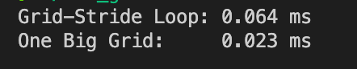

------

### 🧪 实验 2：越界访问 + `compute-sanitizer`

#### 👉 背景：

 GPU kernel 如果越界访问数组，结果可能是“静默错误”（不崩溃但数据错误）。
 CUDA 提供 `compute-sanitizer ` 工具捕获这种 bug。

#### 修改 `vector_add.cu` 内核

```c++
__global__ void vector_add(const float *a, const float *b, float *c, int n) {
    int i = blockIdx.x * blockDim.x + threadIdx.x;
    // ❌ 去掉 if(i<n) 的检查，强制越界
    c[i] = a[i] + b[i];
}


int blockSize = 256;
int gridSize = (n + blockSize - 1) / blockSize + 10;  // 故意多加 10 个 block
```

#### 编译 & 运行

```bash
nvcc -O2 vector_add.cu -o vec_err
compute-sanitizer ./vec_err
```

#### 预期效果

会报错类似：

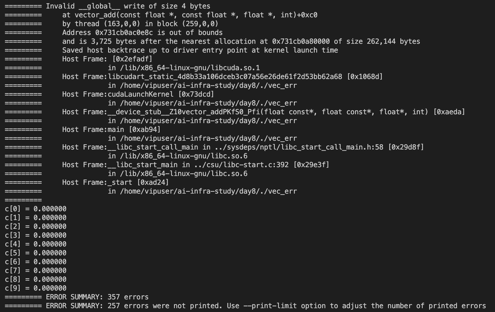

👉 说明 `compute-sanitizer` 能帮你捕获 GPU 内存错误。

------

### 🧪 实验 3：增大 blockDim，观察寄存器与 Occupancy

👉 背景：
 block 太大可能导致寄存器压力，occupancy（并发度）下降。

#### 工具：Nsight Compute

```bash
nvcc -O2 vector_add.cu -o vec
ncu --metrics launch__registers_per_thread,sm__warps_active.avg.pct_of_peak_sustained_active ./vec
```

在报告中关注：

- **Registers Per Thread**（寄存器使用量）
- **Achieved Occupancy**（实际并发度）

#### 实验步骤

1. 修改 `blockSize = 64, 128, 256, 512, 1024`
2. 每次运行`ncu --metrics launch__registers_per_thread,sm__warps_active.avg.pct_of_peak_sustained_active  ./vec`
3. 比较寄存器数量与 Occupancy 的变化趋势。

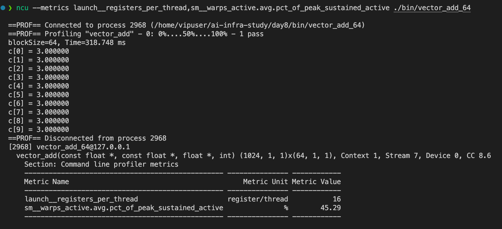

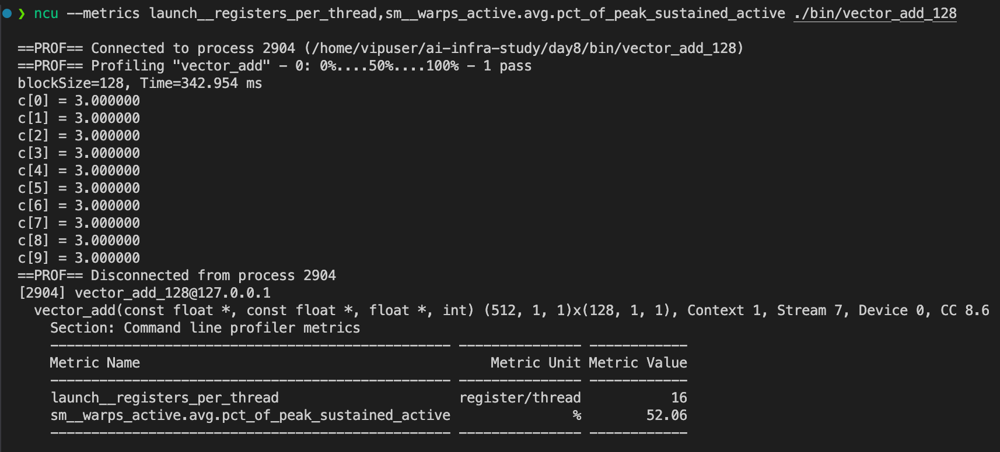

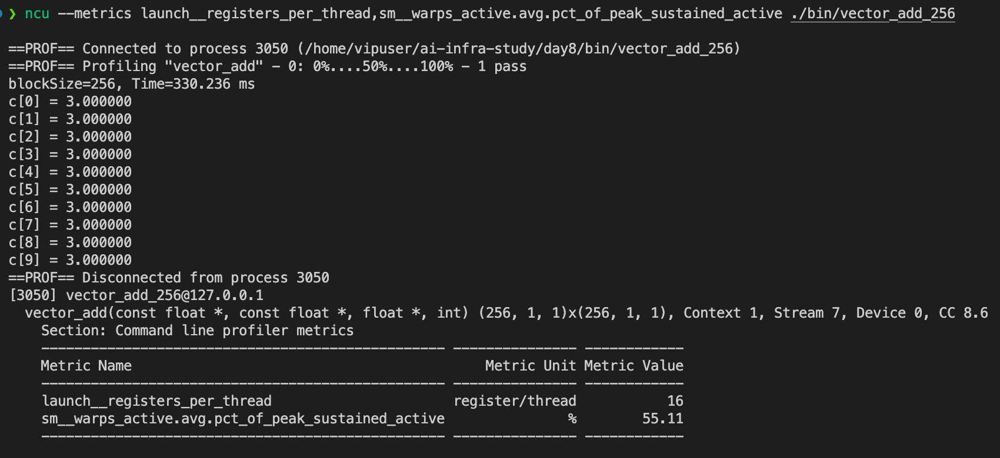

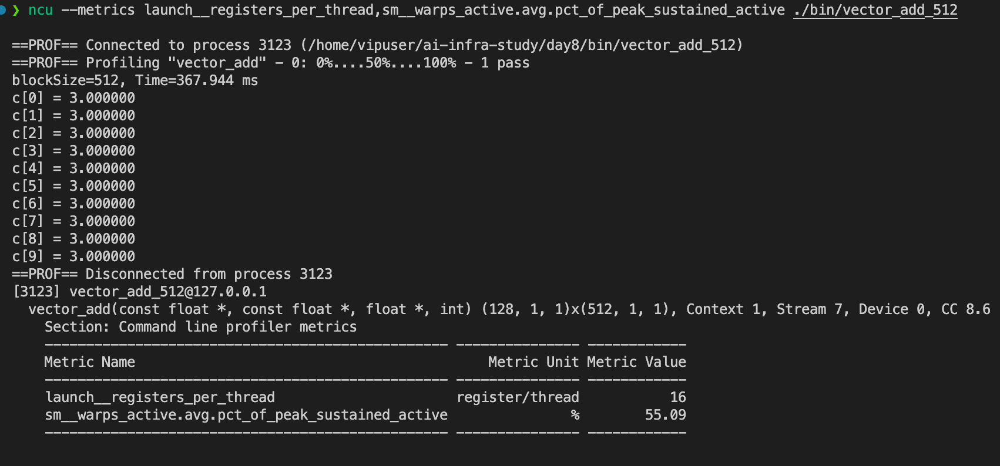

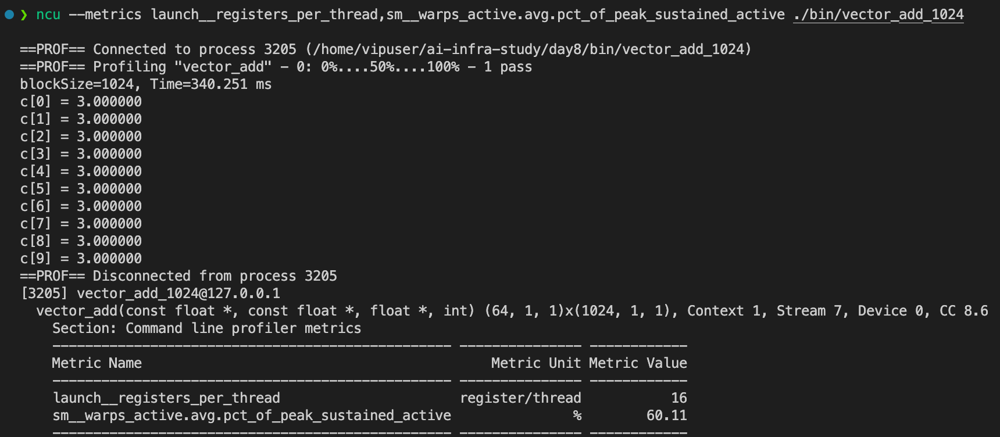

#### 📊 实验数据整理

| blockSize | Time (ms) | Registers / Thread | Achieved Occupancy (%) |
| --------- | --------- | ------------------ | ---------------------- |
| 64        | 318.7     | 16                 | 45.3                   |
| 128       | 342.9     | 16                 | 52.1                   |
| 256       | 330.2     | 16                 | 55.1                   |
| 512       | 367.9     | 16                 | 55.1                   |
| 1024      | 340.3     | 16                 | 60.1                   |

------

### 🧪 实验 4：1D vs 2D Block 访问二维数组

👉 背景：
 二维数据（矩阵）用 2D block 更直观，可读性更好，而且能优化 **内存 coalescing（合并访存）**。

#### 1️⃣ 实验目标

- 对比 **1D block** 和 **2D block** 在矩阵加法中的写法和执行效果。
- 理解为什么 2D block 更自然，且有利于内存 coalescing（合并访存）。

------

#### 2️⃣ 完整代码：`matrix_add.cu`

```c++
#include <stdio.h>
#include <cuda_runtime.h>

// 1D Block 的矩阵加法
__global__ void mat_add_1D(const float *A, const float *B, float *C, int N) {
    int i = blockIdx.x * blockDim.x + threadIdx.x;
    if(i < N * N) {
        C[i] = A[i] + B[i];
    }
}

// 2D Block 的矩阵加法
__global__ void mat_add_2D(const float *A, const float *B, float *C, int N) {
    int r = blockIdx.y * blockDim.y + threadIdx.y;
    int c = blockIdx.x * blockDim.x + threadIdx.x;

    if(r < N && c < N) {
        int idx = r * N + c;// 行主序展开
        C[idx] = A[idx] + B[idx];
    }
}

int main() {
    const int N = 1024; // 矩阵大小N * N
    size_t bytes = N * N * sizeof(float);

    // 分配Host内存
    float *host_a = (float *)malloc(bytes);
    float *host_b = (float *)malloc(bytes);
    float *host_c1d = (float *)malloc(bytes);
    float *host_c2d = (float *)malloc(bytes);

    // 初始化矩阵数据
    for (int i = 0; i < N * N;i++) {
        host_a[i] = 1.0f;
        host_b[i] = 2.0f;
    }

    // 分配device内存
    float *device_a, *device_b, *device_c;
    cudaMalloc(&device_a, bytes);
    cudaMalloc(&device_b, bytes);
    cudaMalloc(&device_c, bytes);

    // 拷贝数据
    cudaMemcpy(device_a, host_a, bytes, cudaMemcpyHostToDevice);
    cudaMemcpy(device_b, host_b, bytes, cudaMemcpyHostToDevice);

    // 配置1D kernel 启动参数
    dim3 block1(256);
    dim3 grid1((N * N + block1.x - 1) / block1.x);

    cudaEvent_t start, stop;
    cudaEventCreate(&start);
    cudaEventCreate(&stop);

    cudaEventRecord(start);

    // 启动1D 内核
    mat_add_1D<<<grid1, block1>>>(device_a, device_b, device_c, N);
    cudaEventRecord(stop);
    cudaEventSynchronize(stop);

    float c1d_ms;
    cudaEventElapsedTime(&c1d_ms, start, stop);

    cudaMemcpy(host_c1d, device_c, bytes, cudaMemcpyDeviceToHost);

    // 配置2D kernel 启动参数
    dim3 block2(16, 16);
    dim3 grid2((N + block2.x - 1) / block2.x, (N + block2.y - 1) / block2.y);

    cudaEventRecord(start);
    // 启动2D 内核
    mat_add_2D<<<grid2, block2>>>(device_a, device_b, device_c, N);
    cudaEventRecord(stop);

    cudaEventSynchronize(stop);

    float c2d_ms;
    cudaEventElapsedTime(&c2d_ms, start, stop);
    cudaMemcpy(host_c2d, device_c, bytes, cudaMemcpyDeviceToHost);

    // 验证结果10 个元素
    printf("check results (first 10 elements):\n");
    for (int i = 0; i < 10; i++) {
        printf("C1D[%d]=%.1f C2D[%d]=%.1f\n", i, host_c1d[i], i, host_c2d[i]);
    }

    // 打印性能对比
    printf("\nPerformance comparison (Matrix %d x %d):\n", N, N);
    printf("1D Block: %.3f ms\n", c1d_ms);
    printf("2D Block: %.3f ms\n", c2d_ms);

    // 清理资源
    cudaFree(device_a);
    cudaFree(device_b);
    cudaFree(device_c);

    free(host_a);
    free(host_b);
    free(host_c1d);
    free(host_c2d);

    return 0;
}
```

------

#### 3️⃣ 编译 & 运行

```bash
nvcc -O2 matrix_add.cu -o mat_add
./mat_add
```

✅ 输出：

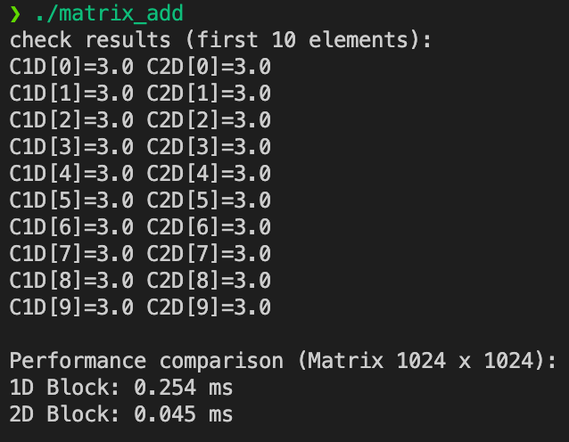

说明 1D 和 2D 写法结果一致。

------

#### 4️⃣ 对比与分析

##### 1D block

- 索引是 `i = blockIdx.x * blockDim.x + threadIdx.x`。
- 本质上把二维矩阵 **拍平成一维数组**来访问。
- 缺点：如果要写矩阵操作逻辑（如矩阵乘法），行列计算不直观，可读性差。

##### 2D block

- 索引是 `(r, c)`，直接对应矩阵的行列。
- 更接近数学定义，容易扩展到矩阵乘、卷积等复杂运算。
- 内存访问模式更自然（行主序存储），线程排列方式更容易 **内存合并访问（coalescing）**。

------

### 🧪 实验 5：`--use_fast_math` 的影响

👉 背景：
 `--use_fast_math` 会启用快速但近似的数学运算（例如用快速 `rsqrt` 替代精确 `sqrt`）。

#### 代码：`fast_math.cu`

```c++
#include <stdio.h>
#include <math.h>

// 简单数学运算kernel
__global__ void test_math(float *out) {
    int i = threadIdx.x;
    float x = i * 0.1f;

    // 调用sinf, cosf, sqrtf 这些数学函数
    out[i] = sinf(x) + cosf(x) + sqrt(x);
}

int main() {
    const int N = 128;
    float host_out[N], *device_out;

    // 分配device 内存
    cudaMalloc(&device_out, N * sizeof(float));

    // 启动kernel
    test_math<<<1, N>>>(device_out);

    // 拷回结果
    cudaMemcpy(host_out, device_out, N * sizeof(float), cudaMemcpyDeviceToHost);

    // 打印前十个元素
    for (int i = 0; i < 10; i++) {
        printf("out[%d] = %.8f\n", i, host_out[i]);
    }

    cudaFree(device_out);
    return 0;
}
```

#### 编译对比

```bash
nvcc -O2 fast_math.cu -o fm_normal
nvcc -O2 --use_fast_math fast_math.cu -o fm_fast
```

#### 运行

```bash
./fm_normal > normal.txt
./fm_fast   > fast.txt
diff normal.txt fast.txt
```

#### 预期效果

- `--use_fast_math` 运行更快，但结果和标准版有些许误差。
- 误差通常在小数点后 3~5 位，对深度学习推理影响不大，但对科学计算可能危险。

