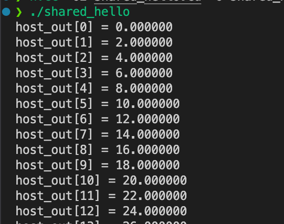
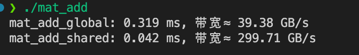
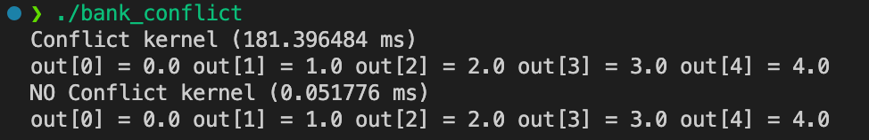
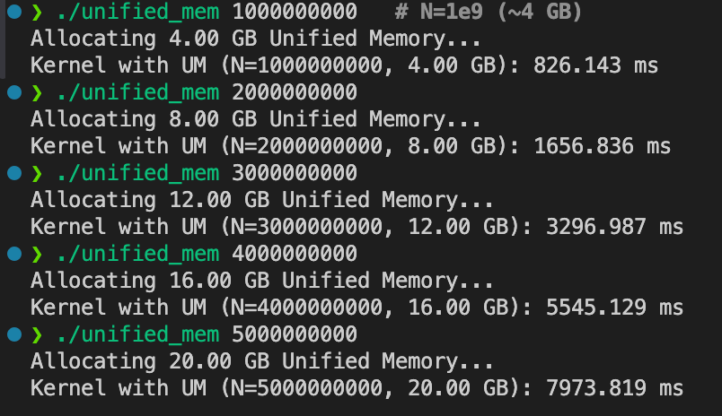
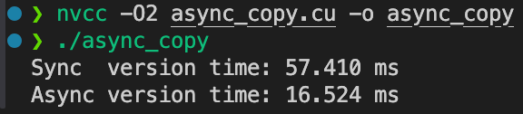

# Day 9 - CUDA 内存管理

## 🎯 学习目标

- 掌握 **CUDA 内存层次**：寄存器、共享内存 (shared)、全局内存 (global)。
- 学会 **声明、使用、同步 shared memory**。
- 在 **归约 (Reduction)** 场景中体会 shared memory 的性能优势。
- 通过实验验证 **block 大小、bank conflict、atomicAdd 的作用**。

------

## 1️⃣ CUDA 内存层次复习

| 类型       | 作用范围     | 特点                         | 延迟           | 用途                       |
| ---------- | ------------ | ---------------------------- | -------------- | -------------------------- |
| 寄存器     | 每个线程私有 | 最快，数量有限               | ~1 cycle       | 保存临时变量               |
| Shared Mem | 每个 Block   | Block 内共享，需手动管理     | ~10 cycles     | Block 内线程通信、缓存数据 |
| Global Mem | 全局可见     | 所有线程可见，带宽大但延迟高 | 400–800 cycles | 主数据存储                 |

👉 **优化关键**：尽量减少 Global Memory 访问，利用 shared memory 在 block 内缓存 & 并行计算。

------

## 2️⃣ 基础实验：Hello Shared Memory

### 背景

- 每个 block 的线程可以通过 **shared memory** 共享数据。
- 必须用 `__syncthreads()` 保证线程同步，否则可能有线程还没写数据就被别人读走。

### 代码：`shared_hello.cu`

```c++
#include <stdio.h>

__global__ void copy_shared(float* device_out, const float* device_in, int N)
{
    // 声明 Block 内的共享内存(固定 256 个float)
    __shared__ float share_data[256];

    int global_tid = blockIdx.x * blockDim.x + threadIdx.x;
    int local_tid = threadIdx.x;

    if (global_tid < N)
    {
        // step 1:从 global memory 拷贝到 shared memory
        share_data[local_tid] = device_in[global_tid];

        // 等待所有线程完成拷贝
        __syncthreads();

        // step 2: 使用shared memory 的值
        device_out[global_tid] = share_data[local_tid] * 2.0f;
    }
}

int main()
{
    const int N = 256;
    size_t bytes = N * sizeof(float);
    float host_in[N], host_out[N];
    for (int i = 0; i < N; i++)
    {
        host_in[i] = i;
    }

    float *device_in, *device_out;
    cudaMalloc(&device_in, bytes);
    cudaMalloc(&device_out, bytes);

    cudaMemcpy(device_in, host_in, bytes, cudaMemcpyHostToDevice);

    copy_shared<<<1, 256>>>(device_out, device_in, N);
    cudaMemcpy(host_out, device_out, bytes, cudaMemcpyDeviceToHost);

    for (int i = 0; i < N; i++)
    {
        printf("host_out[%d] = %f\n", i, host_out[i]);
    }

    cudaFree(device_in);
    cudaFree(device_out);

    return 0;
}

```

### 运行

```bash
nvcc -O2 shared_hello.cu -o shared_hello
./shared_hello
```

### 结果



👉 证明数据确实在 shared memory 中被修改。

------

## 3️⃣  深度追问（思考题）

1. ### shared memory bank 冲突具体是怎么发生的？避免策略有哪些？  

2. ### constant memory 读取的广播机制与失效场景？  

3. ### texture memory 在采样/插值中的优势，何时优于 global？  

4. ### Unified Memory 如何迁移页面？过量使用会如何 thrash？  

5. ### `cudaMemcpyAsync` 与 stream 关联的前提？  

6. ### L2 缓存命中与 stride 访问关系？  

## 4️⃣ 实验

### 🧪 实验 1：`matrix_add` —— Global vs Shared

#### 1️⃣ 实验目标

- 对比 **直接使用 global memory** vs **tile 进 shared memory 再计算** 的性能差异。
- 用 CUDA **事件 API** 测量耗时，并根据公式估算 **内存带宽利用率**。

------

#### 2️⃣ 准备代码

在学习目录下新建 `matrix_add_shared.cu`，把下面的代码粘贴进去：

```c++
#include <cuda_runtime.h>
#include <stdio.h>

#define SIZE 1024 // 矩阵大小 N * N
// Global memory版本
__global__ void mat_add_global(const float* A, const float* B, float* C, int N)
{
    int r = blockIdx.y * blockDim.y + threadIdx.y;
    int c = blockIdx.x * blockDim.x + threadIdx.x;

    if (r < N && c < N)
    {
        C[r * N + c] = A[r * N + c] + B[r * N + c];
    }
}

// Shared memory版本
__global__ void mat_add_shared(const float* A, const float* B, float* C, int N)
{
    __shared__ float A_shared[32][32];
    __shared__ float B_shared[32][32];

    int r = blockIdx.y * blockDim.y + threadIdx.y;
    int c = blockIdx.x * blockDim.x + threadIdx.x;
    int ty = threadIdx.y, tx = threadIdx.x;

    if (r < N && c < N)
    {
        // 把数据搬到shared memory
        A_shared[ty][tx] = A[r * N + c];
        B_shared[ty][tx] = B[r * N + c];

        // 确保所有线程写完
        __syncthreads();

        // 从 shared memory 读出再计算
        C[r * N + c] = A_shared[ty][tx] + B_shared[ty][tx];
    }
}

int main()
{
    size_t bytes = SIZE * SIZE * sizeof(float);

    // 分配 host 内存
    float* host_a = (float*)malloc(bytes);
    float* host_b = (float*)malloc(bytes);
    float* host_c = (float*)malloc(bytes);

    for (int i = 0; i < SIZE * SIZE; i++)
    {
        host_a[i] = 1.0f;
        host_b[i] = 2.0f;
    }

    // 分配 device 内存
    float *device_a, *device_b, *device_c;
    cudaMalloc(&device_a, bytes);
    cudaMalloc(&device_b, bytes);
    cudaMalloc(&device_c, bytes);

    cudaMemcpy(device_a, host_a, bytes, cudaMemcpyHostToDevice);
    cudaMemcpy(device_b, host_b, bytes, cudaMemcpyHostToDevice);

    // 每个 Block 32 * 32 个线程
    dim3 block(32, 32);
    dim3 grid((SIZE + 31) / 32, (SIZE + 31) / 32);

    // cuda 事件用于计时
    cudaEvent_t start, stop;
    float ms;

    // Global memory版本
    cudaMemset(device_c, 0, bytes);
    cudaEventCreate(&start);
    cudaEventCreate(&stop);

    cudaEventRecord(start);
    mat_add_global<<<grid, block>>>(device_a, device_b, device_c, SIZE);
    cudaEventRecord(stop);
    cudaEventSynchronize(stop);

    cudaEventElapsedTime(&ms, start, stop);
    printf("mat_add_global: %.3f ms, 带宽≈ %.2f GB/s\n", ms,
           (3 * SIZE * SIZE * sizeof(float) / 1e9) / (ms / 1000));

    // Shared memory版本
    cudaMemset(device_c, 0, bytes);
    cudaEventRecord(start);
    mat_add_shared<<<grid, block>>>(device_a, device_b, device_c, SIZE);
    cudaEventRecord(stop);
    cudaEventSynchronize(stop);
    cudaEventElapsedTime(&ms, start, stop);

    printf("mat_add_shared: %.3f ms, 带宽≈ %.2f GB/s\n", ms,
           (3 * SIZE * SIZE * sizeof(float) / 1e9) / (ms / 1000));

    // 清理
    cudaFree(device_a);
    cudaFree(device_b);
    cudaFree(device_c);

    free(host_a);
    free(host_b);
    free(host_c);

    return 0;
}

```

------

#### 3️⃣ 编译运行

```bash
nvcc -O2 matrix_add_shared.cu -o mat_add
./mat_add
```

------

#### 4️⃣ 预期结果



- **Global 版**：每个元素相加都要访问两次 global memory。
- **Shared 版**：block 内把数据搬到 shared memory，再局部计算，减少全局访存。
- 结果：**shared memory 版更快，带宽利用率更高**。

------

### 🧪 实验 2：Stride=17 访问 Bank Conflict & Padding 消除

#### 1️⃣ 实验目标

- 理解 CUDA **Shared Memory 的 bank 架构**。
- 制造 **Bank Conflict**（冲突），然后通过 **Padding** 消除。
- 用 **Nsight Compute** 观察冲突对性能的影响。

------

#### 2️⃣ Bank 背景知识

- **Shared Memory** 被分成 **32 个 bank**，每个 bank 一次能服务 1 个线程。
- **Warp = 32 个线程**，理想情况：warp 内每个线程访问不同 bank → **并行无冲突**。
- 如果多个线程访问同一个 bank，就会产生 **冲突**，访问会被 **串行化**，延迟大大增加。
- 举例：
  - stride=1：线程 0→bank0, 线程 1→bank1 … → ✅ 无冲突
  - stride=17：线程 0→bank0, 线程 1→bank17, 线程 2→bank2 … 线程 16→bank16, 线程 17→bank1 → ❌ 冲突发生

------

#### 3️⃣ 实验代码

保存为 `bank_conflict_stride.cu`：

```c++
#include <stdio.h>
#include <cuda_runtime.h>

// 冲突版本：stride=17
__global__ void conflict(float *out) {
    __shared__ float s_data[32*17]; // stride=17
    int tid = threadIdx.x;
    s_data[tid*17] = tid;           // 多个线程映射到同一个 bank
    __syncthreads();
    out[tid] = s_data[tid*17];
}

// 无冲突版本：stride=17 + padding
__global__ void no_conflict(float *out) {
    __shared__ float s_data[32*17+1]; // padding +1
    int tid = threadIdx.x;
    s_data[tid*17] = tid;             // padding 打散 bank 映射
    __syncthreads();
    out[tid] = s_data[tid*17];
}

// 计时封装函数
float run_and_time(void (*kernel)(float*), float *d_out, int N) {
    cudaEvent_t start, stop;
    cudaEventCreate(&start); cudaEventCreate(&stop);

    cudaEventRecord(start);
    kernel<<<1, N>>>(d_out);
    cudaEventRecord(stop);
    cudaEventSynchronize(stop);

    float ms = 0;
    cudaEventElapsedTime(&ms, start, stop);
    cudaEventDestroy(start); cudaEventDestroy(stop);

    return ms;
}

int main() {
    const int N = 32; // warp 内 32 线程
    size_t bytes = N * sizeof(float);

    float h_out[N];
    float *d_out;
    cudaMalloc(&d_out, bytes);

    // 计时并运行冲突版本
    float t1 = run_and_time(conflict, d_out, N);
    cudaMemcpy(h_out, d_out, bytes, cudaMemcpyDeviceToHost);
    printf("Conflict kernel (%.6f ms):\n", t1);
    for (int i=0;i<5;i++) printf("out[%d]=%.1f ", i, h_out[i]);
    printf("\n");

    // 计时并运行无冲突版本
    float t2 = run_and_time(no_conflict, d_out, N);
    cudaMemcpy(h_out, d_out, bytes, cudaMemcpyDeviceToHost);
    printf("No Conflict kernel (%.6f ms):\n", t2);
    for (int i=0;i<5;i++) printf("out[%d]=%.1f ", i, h_out[i]);
    printf("\n");

    cudaFree(d_out);
    return 0;
}

```

------

#### 4️⃣ 编译 & 运行

```bash
nvcc -O2 bank_conflict_stride.cu -o bank_conflict
./bank_conflict
```

预期输出示例：



------

#### 5️⃣ 结果分析

- 结果一样，说明 bank conflict 不影响正确性。
- **有冲突版本** 时间明显更长（冲突导致串行化）。
- **无冲突版本** 时间更短（padding 消除了冲突）。

------

### 🧪 实验 3：Constant Memory 优势

#### 1️⃣ 背景知识

- **Constant Memory**
  - 每个 SM 有 **64KB 常量缓存**，主要优化 **warp 内所有线程访问相同地址** 的情况。
  - 如果一个 warp 的 32 个线程访问同一个常量地址 → 只需 **1 次取数 + 广播**，效率极高。
  - 如果 warp 内的线程访问不同地址 → 会发生 **序列化**，性能可能比 global memory 还差。
- **应用场景**
  - CNN 卷积核权重（全线程用相同参数）。
  - 归一化系数、超参数（比如学习率、缩放因子）。
  - 不适合：线程各自读取不同常量的情况。

------

#### 2️⃣ 实验代码

保存为 `const_memory.cu`：

```c++
#include <cuda_runtime.h>
#include <stdio.h>

// 常量内存
#define COEF_SIZE 1024
__constant__ float device_coef[COEF_SIZE]; // GPU常量内存

__global__ void kernel_const(const float* in, float* out, int N)
{
    int i = blockIdx.x * blockDim.x + threadIdx.x;
    if (i < N)
    {
        float val = in[i];
        for (int j = 0; j < 1000; j++)
        {
            val *= device_coef[j % COEF_SIZE];
        }
        out[i] = val;
    }
}

__global__ void kernel_global(const float* in, float* out, const float* coef, int N)
{
    int i = blockIdx.x * blockDim.x + threadIdx.x;
    if (i < N)
    {
        float val = in[i];
        for (int j = 0; j < 1000; j++)
        {
            val *= coef[j % COEF_SIZE];
        }
        out[i] = val;
    }
}

// float run_and_time(void (*kernel)(float))

int main()
{
    const int N = 1 << 24; // 16M 元素
    size_t bytes = N * sizeof(float);

    float* host_in = (float*)malloc(bytes);
    float* host_out = (float*)malloc(bytes);
    for (int i = 0; i < N; i++)
    {
        host_in[i] = 1.0f;
    }

    float *device_in, *device_out, *device_coef_global;
    cudaMalloc(&device_in, bytes);
    cudaMalloc(&device_out, bytes);
    cudaMalloc(&device_coef_global, COEF_SIZE * sizeof(float));

    cudaMemcpy(device_in, host_in, bytes, cudaMemcpyHostToDevice);

    float host_coef[COEF_SIZE];
    for (int i = 0; i < COEF_SIZE; i++)
    {
        host_coef[i] = 1.0f;
    }
    // 把 coef 放到 constant memory
    cudaMemcpyToSymbol(device_coef, host_coef, COEF_SIZE * sizeof(float));
    // 把 coef 放到 global memory
    cudaMemcpy(device_coef_global, host_coef, COEF_SIZE * sizeof(float), cudaMemcpyHostToDevice);

    dim3 block(256);
    dim3 grid((N + block.x - 1) / block.x);

    cudaEvent_t start, stop;
    cudaEventCreate(&start);
    cudaEventCreate(&stop);

    float ms;

    // constant memory
    cudaEventRecord(start);
    kernel_const<<<grid, block>>>(device_in, device_out, N);
    cudaEventRecord(stop);
    cudaEventSynchronize(stop);
    cudaEventElapsedTime(&ms, start, stop);
    printf("Const memory kernel: %.3f ms\n", ms);

    // global memory
    cudaEventRecord(start);
    kernel_global<<<grid, block>>>(device_in, device_out, device_coef_global, N);
    cudaEventRecord(stop);
    cudaEventSynchronize(stop);
    cudaEventElapsedTime(&ms, start, stop);
    printf("Global memory kernel: %.3f ms\n", ms);

    cudaFree(device_in);
    cudaFree(device_out);
    cudaFree(device_coef_global);

    free(host_in);
    free(host_out);

    return 0;
}

```

------

#### 3️⃣ 编译运行

```bash
nvcc -O2 const_memory.cu -o const_mem
./const_mem
```

------

#### 4️⃣ 预期输出（示例）


- **常量内存版本在广播访问模式下更快**，因为 warp 内所有线程访问同一个常量地址时，只需一次取数即可广播给 32 个线程。
- **全局内存版本在这种场景下更慢**，即便有 L1/L2 cache，warp 内仍要多次请求相同地址，开销更大。

⚠️ 注意补充说明：

- 如果 warp 内线程访问的是 **不同地址**，那么常量内存会发生 **序列化**，性能可能与全局内存相当甚至更差。

------

### 🧪 实验 4：Unified Memory 超过显存容量

#### 1️⃣ 背景

- **Unified Memory (UM)**：用 `cudaMallocManaged` 分配的内存，可以在 CPU 和 GPU 之间自动迁移。
- 当数据量 **超过显存容量** 时，GPU 在访问数据时会触发 **page migration（页迁移）**：
  - 把数据从系统内存搬到显存。
  - 如果显存不够 → 会不断换入/换出，吞吐量骤降。

------

#### 2️⃣ 实验代码

保存为 `unified_mem.cu`：

```c++
#include <cuda_runtime.h>
#include <stdio.h>

__global__ void touch(float* data, long N)
{
    long i = blockIdx.x * blockDim.x + threadIdx.x;
    if (i < N)
    {
        data[i] += 1.0f;
    }
}

int main(int argc, char* argv[])
{
    // N 太大可能导致系统直接OOM
    long N = (long)1e9; // 默认 1e9 (~4 GB)
    if (argc > 1)
    {
        N = atol(argv[1]); // 可以从命令行传 N
    }
    size_t bytes = N * sizeof(float);

    printf("Allocating %.2f GB Unified Memory...\n", bytes / 1e9);

    float* data;
    cudaMallocManaged(&data, bytes); // unified memory

    dim3 block(256);
    dim3 grid((N + block.x - 1) / block.x);

    cudaEvent_t start, stop;
    cudaEventCreate(&start);
    cudaEventCreate(&stop);

    cudaEventRecord(start);
    touch<<<grid, block>>>(data, N);
    cudaEventRecord(stop);
    cudaEventSynchronize(stop);

    float ms;
    cudaEventElapsedTime(&ms, start, stop);

    printf("Kernel with UM (N=%ld, %.2f GB): %.3f ms\n", N, bytes / 1e9, ms);

    cudaFree(data);

    return 0;
}
```

------

#### 3️⃣ 编译运行

```bash
nvcc -O2 unified_mem.cu -o unified_mem
./unified_mem 1000000000
```

------

#### 4️⃣ 结果分析



- 如果 `N=1e9 (~4 GB)`，在 3080 (10GB 显存) 上运行正常，性能接近 global memory。
- 如果 `N=2e9 (~8 GB)`，依然能放进显存（10GB），性能略下降。
- 如果你改成 `N=5e9 (~20 GB)`，**超过显存容量**，就会触发 **page migration**：
  - 程序还能运行，但时间会明显变长（几十倍）。
  - 用 `ncu` 或 `nsys` profile，可以看到大量 **UM page migration** 事件。

------

#### 5️⃣ 进一步实验

1. ### (a) 用 Nsight Compute

   运行：

   ```bash
   ncu --set full ./unified_mem 3000000000
   ```

   在报告里看 `Unified Memory Memcpy`，会看到大量迁移事件。

   ### (b) 用 nvidia-smi 动态观察

   另开一个终端运行：

   ```
   watch -n 0.5 nvidia-smi
   ```

   如果你跑 `./unified_mem 3000000000`，显存占用会 **上下波动**（页迁移进进出出）。

------

⚠️ 注意事项：

- 一次性分配超过 20–30GB（超系统内存）可能直接报 `cudaErrorMemoryAllocation`。
- 建议 **先试 4GB / 8GB / 12GB**，逐步增大。

------

### 🧪 实验 5：`cudaMemcpyAsync` + Stream 重叠拷贝/计算

#### 1️⃣ 背景

- `cudaMemcpy` 默认是 **同步的**：CPU 会等数据拷贝完成后再继续执行，GPU 也不能同时计算。
- `cudaMemcpyAsync` + **pinned memory（页锁定内存）** + **stream** 可以让：
  - 数据拷贝和计算并行进行。
  - 提升整体吞吐。
- ⚠️ 关键条件：必须用 **cudaMallocHost** 分配 host 内存，否则拷贝无法真正异步。

------

#### 2️⃣ 实验代码

保存为 `async_copy.cu`：

```c++
#include <cuda_runtime.h>
#include <stdio.h>

// 简单的计算kernel (模拟耗时计算)
__global__ void computer(float* data, int N)
{
    int i = blockIdx.x * blockDim.x + threadIdx.x;
    if (i < N)
    {
        float x = data[i];
        for (int j = 0; j < 10000; j++)
        {
            x = x * 0.999f + 0.001f;
        }
        data[i] = x;
    }
}

int main()
{
    const int N = 1 << 24;
    size_t bytes = N * sizeof(float);

    float *host_data, *device_data;
    cudaMallocHost(&host_data, bytes); // 页锁定内存(必须)
    cudaMalloc(&device_data, bytes);

    for (int i = 0; i < N; i++)
    {
        host_data[i] = 1.0f;
    }

    dim3 block(256);
    dim3 grid((N + block.x - 1) / block.x);

    // 同步版本
    cudaEvent_t start, stop;
    float ms_sync, ms_async;
    cudaEventCreate(&start);
    cudaEventCreate(&stop);

    cudaEventRecord(start);
    // 同步拷贝 H2D
    cudaMemcpy(device_data, host_data, bytes, cudaMemcpyHostToDevice);
    // 计算
    computer<<<grid, block>>>(device_data, N);
    // 同步拷贝 D2H
    cudaMemcpy(host_data, device_data, bytes, cudaMemcpyDeviceToHost);

    cudaEventRecord(stop);
    cudaEventSynchronize(stop);

    cudaEventElapsedTime(&ms_sync, start, stop);

    // 异步版本
    cudaStream_t s1, s2;
    cudaStreamCreate(&s1);
    cudaStreamCreate(&s2);

    cudaEventRecord(start);
    // H2D 异步拷贝
    cudaMemcpyAsync(device_data, host_data, bytes, cudaMemcpyHostToDevice, s1);
    // 计算放到另一个stream
    computer<<<grid, block, 0, s2>>>(device_data, N);
    // D2H 异步拷贝
    cudaMemcpyAsync(host_data, device_data, bytes, cudaMemcpyDeviceToHost, s1);
    cudaEventRecord(stop);
    cudaEventSynchronize(stop);
    cudaEventElapsedTime(&ms_async, start, stop);

    printf("Sync  version time: %.3f ms\n", ms_sync);
    printf("Async version time: %.3f ms\n", ms_async);

    cudaStreamDestroy(s1);
    cudaStreamDestroy(s2);
    cudaFree(device_data);
    cudaFreeHost(host_data);

    return 0;
}

```

------

#### 3️⃣ 编译 & 运行

```bash
nvcc -O2 async_copy.cu -o async_copy
./async_copy
```

------

#### 4️⃣ 预期结果



- **同步版**：拷贝(H2D) → 计算 → 拷贝(D2H)，完全串行。
- **异步版**：拷贝和计算 **部分重叠**，总时间更短。

#### 5️⃣ 深度追问

1. 为什么需要 `cudaMallocHost`（pinned memory）才能真正异步？
   - 因为只有 pinned 内存才能被 DMA 引擎直接访问，非 pinned 内存会隐式转成同步拷贝。
2. 为什么用了两个 stream？
   - 避免拷贝和计算在同一个 stream 串行化。
3. 如何验证拷贝和计算是否真的重叠？
   - 用 `nsys profile ./async_copy` 或 Nsight Systems 查看时间线，可以看到 **memcpy 和 kernel 重叠执行**。

------

### ✅ 总结

- **实验 1**：Shared Memory 显著减少全局访存，带宽利用更高。
- **实验 2**：stride=17 导致 bank conflict，加 padding 消除后性能恢复。
- **实验 3**：constant memory 广播访问效率极高。
- **实验 4**：Unified Memory 超显存时频繁迁移，性能骤降。
- **实验 5**：异步拷贝 + stream 可实现拷贝/计算重叠，显著加速。