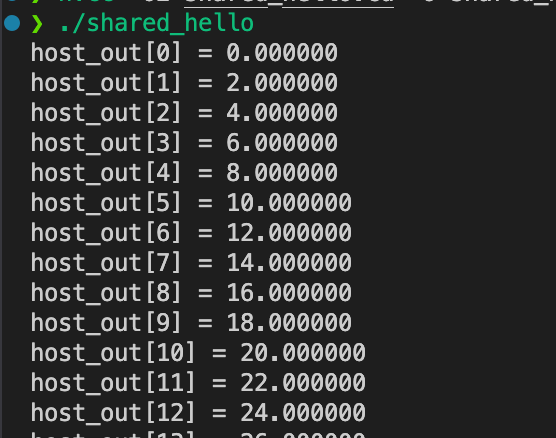
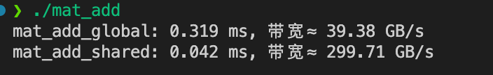
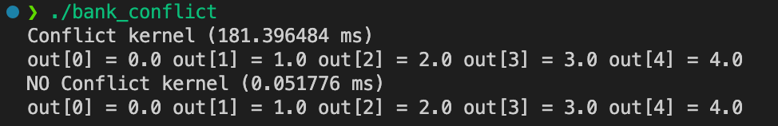
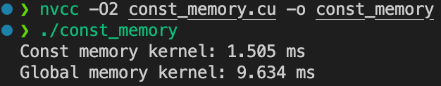
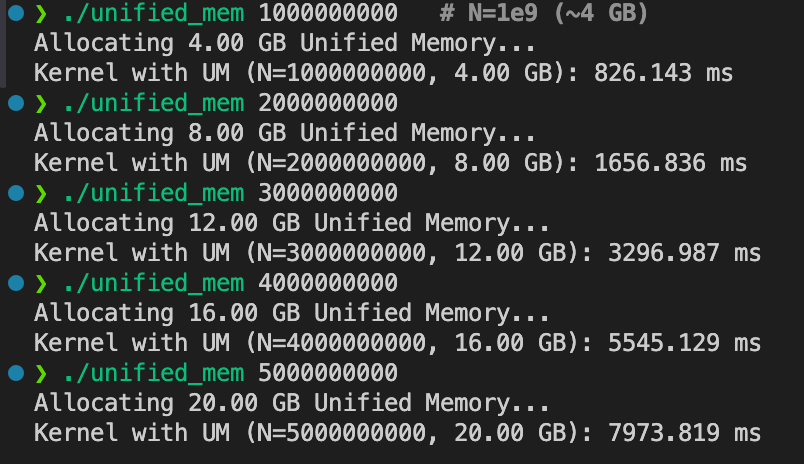
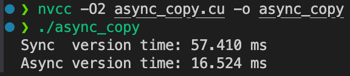

# Day 9 - CUDA 内存管理

## 🎯 学习目标

1. 理解 GPU 的多级存储体系（register、shared、global、constant、texture、L2 cache）。
2. 学会使用 **constant memory** 和 **texture memory**。
3. 掌握 shared memory **bank conflict** 产生原因和解决方法。
4. 用 Nsight Compute 观察不同内存层次的利用率（cache hit / bank conflict）。

------

## 1️⃣CUDA 内存层次复习

| 类型         | 作用范围   | 特点                    | 延迟           | 典型用途            |
| ------------ | ---------- | ----------------------- | -------------- | ------------------- |
| 寄存器       | 每线程私有 | 最快，数量有限          | ~1 cycle       | 保存局部变量        |
| Shared Mem   | 每个 Block | Block 内共享，需同步    | ~10 cycles     | 线程通信、tile 缓存 |
| Global Mem   | 全局可见   | 带宽大，但延迟高        | 400–800 cycles | 主数据存储          |
| Constant Mem | 全局只读   | 广播优化，warp 内高效   | ~寄存器速度    | 超参数、卷积核      |
| Texture Mem  | 全局只读   | 空间局部性 cache + 插值 | ~100 cycles    | 图像处理、采样/插值 |
| L2 Cache     | 全局共享   | SM 之间共享，128B 行宽  | 100–200 cycles | 缓解全局内存延迟    |

------

## 2️⃣ 基础实验：Hello Shared Memory

### 背景

- 每个 block 的线程可以通过 **shared memory** 共享数据。
- 必须用 `__syncthreads()` 保证线程同步，否则可能有线程还没写数据就被别人读走。

### 代码：`shared_hello.cu`

```c++
#include <stdio.h>

__global__ void copy_shared(float* device_out, const float* device_in, int N)
{
    // 声明 Block 内的共享内存(固定 256 个float)
    __shared__ float share_data[256];

    int global_tid = blockIdx.x * blockDim.x + threadIdx.x;
    int local_tid = threadIdx.x;

    if (global_tid < N)
    {
        // step 1:从 global memory 拷贝到 shared memory
        share_data[local_tid] = device_in[global_tid];

        // 等待所有线程完成拷贝
        __syncthreads();

        // step 2: 使用shared memory 的值
        device_out[global_tid] = share_data[local_tid] * 2.0f;
    }
}

int main()
{
    const int N = 256;
    size_t bytes = N * sizeof(float);
    float host_in[N], host_out[N];
    for (int i = 0; i < N; i++)
    {
        host_in[i] = i;
    }

    float *device_in, *device_out;
    cudaMalloc(&device_in, bytes);
    cudaMalloc(&device_out, bytes);

    cudaMemcpy(device_in, host_in, bytes, cudaMemcpyHostToDevice);

    copy_shared<<<1, 256>>>(device_out, device_in, N);
    cudaMemcpy(host_out, device_out, bytes, cudaMemcpyDeviceToHost);

    for (int i = 0; i < N; i++)
    {
        printf("host_out[%d] = %f\n", i, host_out[i]);
    }

    cudaFree(device_in);
    cudaFree(device_out);

    return 0;
}
```

### 运行

```bash
nvcc -O2 shared_hello.cu -o shared_hello
./shared_hello
```

### 结果



👉 证明数据确实在 shared memory 中被修改。

------

## 3️⃣  深度追问（思考题）

### 1. shared memory bank 冲突具体是怎么发生的？避免策略有哪些？

#### 1️⃣ Shared Memory 架构

- **Shared Memory** 在硬件上被划分为 **32 个 bank**（对应 warp 的 32 个线程）。
- 每个 bank 宽度 = **4 bytes**（即 1 个 `float`）。
- Warp 内的 32 个线程如果在 **同一个时钟周期** 各自访问的地址属于 **不同 bank** → ✅ 并行无冲突。
- 如果多个线程访问 **同一个 bank 的不同地址** → ❌ 冲突，访问会 **串行化**，延迟成倍增加。

👉 类比：32 个收银台（bank），32 个人（线程）同时排队，如果刚好一人一个窗口 → 秒过；如果全挤到一个窗口 → 串行处理。

------

#### 2️⃣ 什么时候发生冲突？

假设 `s_data[]` 是 shared memory 数组：

- 地址到 bank 的映射公式大致是：

  ```
  bank_id = (address / 4) % 32
  ```

- 举例：

  - `s_data[tid]` (tid=0..31) → 每个线程访问不同 bank → ✅ 无冲突
  - `s_data[tid*2]` → thread0→bank0, thread16→bank0 → ❌ 两个线程冲突
  - `s_data[tid*17]` → stride=17，所有访问周期性落到同一 bank → ❌ 严重冲突

⚠️ 特殊情况：**所有线程访问同一地址** → 会被硬件优化成 **广播**，不算冲突。

------

#### 3️⃣ 避免 bank 冲突的策略

1. **按 warp 顺序访问（stride=1）**

   - 保证 warp 内线程访问连续地址：`s_data[threadIdx.x]`。

2. **使用 padding 打散映射**

   - 在二维 shared memory 数组里，每行多加 1 列：

     ```
     __shared__ float s_data[BLOCK_SIZE][BLOCK_SIZE+1];
     ```

   - 避免 stride 导致多个线程落在同一 bank。

3. **保证 warp 内访问 4B 对齐**

   - 如果每个线程访问的数据不是 `float`，要对齐到 bank 宽度（比如 `float2` 要 8B 对齐）。

4. **利用广播特性**

   - 如果多个线程确实需要相同数据，可以让它们访问 **同一个地址**，硬件会自动广播。

5. **数据布局优化**

   - 如果是 2D/3D 数据，优先让 `threadIdx.x` 映射到连续元素，`threadIdx.y/z` 用 stride。

### 2. constant memory 读取的广播机制与失效场景？

#### 1️⃣ 广播机制

- Constant Memory 在每个 SM 上有 **64KB 的专用 cache**。
- 当 **warp 内的 32 个线程访问相同的 constant 地址** 时：
  - **只需 1 次内存取数**（cache line 命中）。
  - 硬件会自动 **广播给整个 warp**。
  - 延迟 ≈ 访问寄存器的速度，非常快。

👉 场景：`out[i] = in[i] * d_coef[0];`

- 所有线程都用 `d_coef[0]` → 一次取数，warp 全部得到结果。

------

#### 2️⃣ 失效场景（广播不成立）

当 **warp 内线程访问不同 constant 地址** 时：

- 每个不同地址都需要单独的内存请求。
- 访问请求会被 **串行化**，性能急剧下降。
- 极端情况：32 个线程访问 32 个不同地址 → 退化为 **32 次 global memory 访问**。

👉 场景：`out[i] = in[i] * d_coef[threadIdx.x];`

- 每个线程访问不同的 `d_coef[]` → 无法广播，性能接近 global memory。

------

#### 3️⃣ 特殊情况

- **多个线程访问同一个地址**：✅ 广播，最快。
- **多个线程访问同一个 cache line 的不同地址**：部分命中，性能介于广播与全串行之间。
- **超出 64KB constant cache 容量**：数据会从 global memory 取，性能下降。

------

#### 4️⃣ 应用建议

- Constant memory 适合存放 **小且 warp 内所有线程都要用的只读参数**：
  - 卷积核权重（小 kernel）
  - 归一化系数
  - 网络常数（学习率、激活参数）
- 不适合存放 **大数组或线程索引访问的数据**（因为无法利用广播）。

------

#### ✅ 总结：

- **广播机制成立**：warp 内访问相同地址 → 超高效。
- **广播失效**：warp 内访问不同地址 → 严重退化。

### 3. texture memory 在采样/插值中的优势，何时优于 global？

#### 1️⃣ 背景

- CUDA 提供了一种特殊的内存绑定方式：**texture / surface memory**。
- 最初是为 **图像处理 / 图形渲染** 设计的，但在 GPGPU 场景里也能用。
- 其底层利用了 GPU 的 **纹理缓存 (texture cache)**，对 **2D/3D 空间局部性** 有优化。

------

#### 2️⃣ Texture Memory 的优势

1. **空间局部性缓存优化**
   - Texture cache 专为 **2D/3D 空间访问模式** 设计。
   - 如果相邻线程访问相邻像素/体素，cache 命中率比 global memory 高。
2. **支持硬件插值 (Interpolation)**
   - 纹理单元支持 **自动双线性插值 (bilinear interpolation)**、三线性插值。
   - 这对图像缩放、滤波、卷积操作特别有用：
     - 不需要自己写插值逻辑。
     - 插值计算在硬件中完成，速度快。
3. **边界处理（clamping / wrapping）**
   - Texture API 可以直接指定边界策略：
     - Clamp（取边缘值）
     - Wrap（循环取值）
   - 避免自己写 if 判断，减少分支开销。
4. **只读数据优化**
   - 纹理内存是 **只读的**（kernel 内不能写），这让缓存设计更高效。

------

#### 3️⃣ 什么时候优于 Global Memory？

1. **图像/体数据处理**
   - 比如 **图像卷积、缩放、旋转、采样、体渲染**。
   - 相邻线程访问相邻像素时 → texture cache 提供更高带宽。
2. **需要插值采样的场景**
   - 例如光线追踪中的采样，深度学习中的上采样。
   - 用 global memory 必须自己写插值逻辑；
   - 用 texture memory → 硬件直接做 bilinear/trilinear 插值，更快更省代码。
3. **访问模式不规则，但有局部性**
   - 如果线程的访问模式不是严格顺序（coalesced），但有空间局部性，texture cache 能帮忙。
   - 而 global memory 在不对齐时会浪费带宽。

------

#### 4️⃣ 什么时候不用 Texture？

- **纯顺序访问 (coalesced)**：
  - 如果 warp 内线程访问严格连续地址（比如大规模矩阵乘法），**global memory 带宽利用率最高**。
  - 此时用 texture 反而没额外优势。
- **需要写操作**：
  - texture memory 是只读的，如果需要写（比如矩阵结果存储），必须用 global 或 shared memory。

------

#### 5️⃣ 总结口诀

**图像体数据 → Texture Memory，硬件插值/边界处理超省心；规则顺序访问 → Global Memory，带宽利用率最高。**

### 4. Unified Memory 如何迁移页面？过量使用会如何 thrash？

#### 🔎 Unified Memory 的页面迁移机制

##### 1️⃣ 基本机制

- 使用 `cudaMallocManaged` 分配的内存，CPU 和 GPU 都能访问。
- 数据按 **页面 (page)** 管理，通常大小为 **4KB**（也有 64KB/2MB 的大页）。
- GPU 访问某个页面时：
  1. 硬件检测该页面是否在显存里。
  2. 如果 **不在显存** → 触发 **Page Fault**。
  3. 驱动会从 **主机内存** 把该页面迁移到 GPU 显存。
  4. 更新页表 (page table)，后续访问命中显存。

👉 类似 CPU 的虚拟内存分页机制，只不过这里在 CPU ↔ GPU 之间迁移。

------

##### 2️⃣ 迁移触发场景

- **GPU 访问主机端刚写的数据** → 迁移到显存。
- **CPU 访问 GPU 刚写的数据** → 迁移回主机内存。
- **多个 GPU**：可能需要在不同 GPU 之间来回拷贝页面。

------

##### 3️⃣ 性能开销

- 一次页面迁移 = **PCIe/NVLink 拷贝延迟 + 页表更新**。
- PCIe 4.0 带宽 ~16 GB/s，但显存带宽 ~800 GB/s，差距约 50 倍。
- 如果频繁迁移，会严重拖慢性能。

------

#### 🔎 过量使用显存导致 Thrashing¢

##### 1️⃣ 什么是 thrashing？

- **Thrashing = 页抖动**。
- 当 UM 分配的内存 **远大于 GPU 显存**时：
  - GPU 访问一个页面 → 迁移进来。
  - 访问另一个页面 → 上一个页面可能被驱逐。
  - 下次再访问第一个页面 → 又要迁移回来。
- 结果：GPU 一直在 **迁移页面 ↔ 驱逐页面**，而不是在计算。

👉 类似于 CPU 内存不足时的 swap 风暴。

------

##### 2️⃣ Thrashing 的表现

- **性能骤降**：kernel 执行时间从毫秒级 → 秒级甚至分钟级。
- **nvidia-smi** 看到显存占用波动（进出频繁）。
- **Profiler (Nsight Systems)** 里能看到大量 “Unified Memory memcpy” 事件。

------

##### 3️⃣ 如何避免 Thrashing？

1. **避免超显存使用**
   - 分配 UM 内存时不要超过显存容量的 1.2~1.5 倍。
2. **分块计算 (chunking)**
   - 把大数据分成小块，逐块迁移/计算，避免全量放在 UM。
3. **预取 (Prefetch)**
   - 使用 `cudaMemPrefetchAsync(ptr, size, device)` 把数据提前迁移到 GPU，减少 Page Fault。
4. **固定驻留 (cudaMemAdvise)**
   - 告诉驱动某些数据主要由 GPU 使用 (`cudaMemAdviseSetPreferredLocation`)，减少来回迁移。

------

#### ✅ 总结

- **UM 迁移机制**：按页面 (4KB) 在 CPU/GPU 之间迁移，Page Fault 触发。
- **过量使用显存**：会导致 thrashing（页抖动），GPU 一直在搬数据，性能暴跌。
- **优化手段**：预取 + 分块 + 内存访问模式优化。

### 5. `cudaMemcpyAsync` 与 stream 关联的前提？

#### 1️⃣ 必须使用 **页锁定内存 (Pinned Memory)**

- **Host 内存** 必须通过 `cudaMallocHost()` 或 `cudaHostAlloc()` 分配。
- 如果用普通的 `malloc/new` 分配的 pageable memory：
  - CUDA 在拷贝时会自动先把数据拷到一个 pinned buffer，再 DMA 到 GPU。
  - 这个过程是同步的 → **异步失效**。

✅ 正确：

```
float *h_data;
cudaMallocHost(&h_data, size);   // pinned host memory
cudaMemcpyAsync(d_data, h_data, size, cudaMemcpyHostToDevice, stream);
```

❌ 错误：

```
float *h_data = (float*)malloc(size); // pageable memory
cudaMemcpyAsync(d_data, h_data, size, cudaMemcpyHostToDevice, stream); // 会阻塞
```

------

#### 2️⃣ 必须显式指定 **stream**

- `cudaMemcpyAsync(..., stream)` 最后一个参数是 **stream 句柄**。
- 如果不传 → 默认用 `stream 0`，但注意：
  - **默认流 (legacy default stream)** 会与所有其他流 **同步**。
  - 如果想真正并行拷贝+计算，需要用 **非默认流** (`cudaStreamCreate`)。

👉 示例：

```
cudaStream_t s1;
cudaStreamCreate(&s1);
cudaMemcpyAsync(d_data, h_data, size, cudaMemcpyHostToDevice, s1);
```

------

#### 3️⃣ 硬件必须支持 **并发拷贝与计算**

- GPU 必须有 **独立 copy engine**（通常从 Kepler 架构开始都有）。

- 可用 `deviceQuery` 查看：

  ```
  Concurrent copy and kernel execution: Yes with 2 copy engines
  ```

- 如果只有 1 个 copy engine，则只能同时做一个方向的拷贝。

------

#### 4️⃣ API 语义

- `cudaMemcpyAsync` 只是把拷贝任务 **排进某个 stream 的队列**，不会立刻阻塞 CPU。
- 只有当：
  - `cudaStreamSynchronize(stream)`
  - 或 `cudaEventSynchronize(event)`
  - 或 `cudaDeviceSynchronize()`
     这些同步 API 被调用时，才会等待拷贝完成。

#### ✅ 总结

`cudaMemcpyAsync` 要想真正异步并和 stream 关联，必须满足：

1. **Host 内存是 pinned memory**（用 `cudaMallocHost` 分配）。
2. **使用非默认 stream**（用 `cudaStreamCreate` 创建）。
3. **GPU 支持并发拷贝和计算**（有独立 copy engine）。

### 6. L2 缓存命中与 stride 访问关系？

#### 1️⃣ GPU L2 缓存特点

- L2 cache 是 **全局共享**的（所有 SM 访问同一个 L2）。
- cache line 通常是 **128 字节**（即 32 个 `float`）。
- L2 命中率取决于 **线程访存模式是否具有空间局部性**。

------

#### 2️⃣ Stride 访问模式

设 warp 内有 32 个线程，每个线程访问 `A[tid * stride]`：

- **stride = 1（连续访问）**
  - 线程 0→A[0], 线程 1→A[1], ...
  - 32 个线程访问正好落在 **一个 cache line (128B)** 里。
  - ✅ 完美 coalescing，L2 命中率最高，带宽利用率最高。
- **stride = 2**
  - 线程 0→A[0], 线程 1→A[2], 线程 2→A[4]...
  - warp 内访问跨度大，可能需要 **2 个 cache line**。
  - L2 命中率下降一半。
- **stride = 4**
  - warp 内 32 个线程访问间隔更大，可能需要 **4 个 cache line**。
  - L2 命中率再下降。
- **stride ≥ 32**
  - 每个线程访问的地址都落在不同的 cache line。
  - ❌ 完全没有空间局部性，L2 命中率接近 0。
  - 每次访问都要走显存，带宽利用率最低。

------

#### 3️⃣ 总结规律

- **小 stride（≤1）**：访问集中在同一个或少数 cache line → L2 命中率高。
- **大 stride（≥warp 大小）**：每线程独占一个 cache line → L2 命中率几乎为 0。
- **命中率与 stride 成反比**：stride 越大，cache line 的空间局部性越差。

------

#### 4️⃣ 避免 stride 带来的 L2 Miss

1. **调整数据布局**
   - 改变数组维度排列，让线程访问连续内存。
   - 比如矩阵转置时，使用 **shared memory tile** 重排数据。
2. **利用 shared memory 缓存**
   - 把 stride 访问的数据块先搬到 shared memory，再按行访问。
3. **软件 prefetch**
   - 提前加载未来需要的数据，减少 L2 miss 开销。

------

#### ✅ 总结

**GPU 的 L2 缓存命中率高度依赖 warp 内线程的访问模式。 连续访问（stride=1）命中率最高；stride 越大，命中率越低，最终退化成全局显存访问。**

## 4️⃣ 实验

### 🧪 实验 1：`matrix_add` —— Global vs Shared

#### 1️⃣ 实验目标

- 对比 **直接使用 global memory** vs **tile 进 shared memory 再计算** 的性能差异。
- 用 CUDA **事件 API** 测量耗时，并根据公式估算 **内存带宽利用率**。

------

#### 2️⃣ 准备代码

在学习目录下新建 `matrix_add_shared.cu`，把下面的代码粘贴进去：

```c++
#include <cuda_runtime.h>
#include <stdio.h>

#define SIZE 1024 // 矩阵大小 N * N
// Global memory版本
__global__ void mat_add_global(const float* A, const float* B, float* C, int N)
{
    int r = blockIdx.y * blockDim.y + threadIdx.y;
    int c = blockIdx.x * blockDim.x + threadIdx.x;

    if (r < N && c < N)
    {
        C[r * N + c] = A[r * N + c] + B[r * N + c];
    }
}

// Shared memory版本
__global__ void mat_add_shared(const float* A, const float* B, float* C, int N)
{
    __shared__ float A_shared[32][32];
    __shared__ float B_shared[32][32];

    int r = blockIdx.y * blockDim.y + threadIdx.y;
    int c = blockIdx.x * blockDim.x + threadIdx.x;
    int ty = threadIdx.y, tx = threadIdx.x;

    if (r < N && c < N)
    {
        // 把数据搬到shared memory
        A_shared[ty][tx] = A[r * N + c];
        B_shared[ty][tx] = B[r * N + c];

        // 确保所有线程写完
        __syncthreads();

        // 从 shared memory 读出再计算
        C[r * N + c] = A_shared[ty][tx] + B_shared[ty][tx];
    }
}

int main()
{
    size_t bytes = SIZE * SIZE * sizeof(float);

    // 分配 host 内存
    float* host_a = (float*)malloc(bytes);
    float* host_b = (float*)malloc(bytes);
    float* host_c = (float*)malloc(bytes);

    for (int i = 0; i < SIZE * SIZE; i++)
    {
        host_a[i] = 1.0f;
        host_b[i] = 2.0f;
    }

    // 分配 device 内存
    float *device_a, *device_b, *device_c;
    cudaMalloc(&device_a, bytes);
    cudaMalloc(&device_b, bytes);
    cudaMalloc(&device_c, bytes);

    cudaMemcpy(device_a, host_a, bytes, cudaMemcpyHostToDevice);
    cudaMemcpy(device_b, host_b, bytes, cudaMemcpyHostToDevice);

    // 每个 Block 32 * 32 个线程
    dim3 block(32, 32);
    dim3 grid((SIZE + 31) / 32, (SIZE + 31) / 32);

    // cuda 事件用于计时
    cudaEvent_t start, stop;
    float ms;

    // Global memory版本
    cudaMemset(device_c, 0, bytes);
    cudaEventCreate(&start);
    cudaEventCreate(&stop);

    cudaEventRecord(start);
    mat_add_global<<<grid, block>>>(device_a, device_b, device_c, SIZE);
    cudaEventRecord(stop);
    cudaEventSynchronize(stop);

    cudaEventElapsedTime(&ms, start, stop);
    printf("mat_add_global: %.3f ms, 带宽≈ %.2f GB/s\n", ms,
           (3 * SIZE * SIZE * sizeof(float) / 1e9) / (ms / 1000));

    // Shared memory版本
    cudaMemset(device_c, 0, bytes);
    cudaEventRecord(start);
    mat_add_shared<<<grid, block>>>(device_a, device_b, device_c, SIZE);
    cudaEventRecord(stop);
    cudaEventSynchronize(stop);
    cudaEventElapsedTime(&ms, start, stop);

    printf("mat_add_shared: %.3f ms, 带宽≈ %.2f GB/s\n", ms,
           (3 * SIZE * SIZE * sizeof(float) / 1e9) / (ms / 1000));

    // 清理
    cudaFree(device_a);
    cudaFree(device_b);
    cudaFree(device_c);

    free(host_a);
    free(host_b);
    free(host_c);

    return 0;
}

```

------

#### 3️⃣ 编译运行

```bash
nvcc -O2 matrix_add_shared.cu -o mat_add
./mat_add
```

------

#### 4️⃣ 预期结果



- **Global 版**：每个元素相加都要访问两次 global memory。
- **Shared 版**：block 内把数据搬到 shared memory，再局部计算，减少全局访存。
- 结果：**shared memory 版更快，带宽利用率更高**。

------

### 🧪 实验 2：Stride=17 访问 Bank Conflict & Padding 消除

#### 1️⃣ 实验目标

- 理解 CUDA **Shared Memory 的 bank 架构**。
- 制造 **Bank Conflict**（冲突），然后通过 **Padding** 消除。
- 用 **Nsight Compute** 观察冲突对性能的影响。

------

#### 2️⃣ Bank 背景知识

- **Shared Memory** 被分成 **32 个 bank**，每个 bank 一次能服务 1 个线程。
- **Warp = 32 个线程**，理想情况：warp 内每个线程访问不同 bank → **并行无冲突**。
- 如果多个线程访问同一个 bank，就会产生 **冲突**，访问会被 **串行化**，延迟大大增加。
- 举例：
  - stride=1：线程 0→bank0, 线程 1→bank1 … → ✅ 无冲突
  - stride=17：线程 0→bank0, 线程 1→bank17, 线程 2→bank2 … 线程 16→bank16, 线程 17→bank1 → ❌ 冲突发生

------

#### 3️⃣ 实验代码

保存为 `bank_conflict_stride.cu`：

```c++
#include <stdio.h>
#include <cuda_runtime.h>

// 冲突版本：stride=17
__global__ void conflict(float *out) {
    __shared__ float s_data[32*17]; // stride=17
    int tid = threadIdx.x;
    s_data[tid*17] = tid;           // 多个线程映射到同一个 bank
    __syncthreads();
    out[tid] = s_data[tid*17];
}

// 无冲突版本：stride=17 + padding
__global__ void no_conflict(float *out) {
    __shared__ float s_data[32*17+1]; // padding +1
    int tid = threadIdx.x;
    s_data[tid*17] = tid;             // padding 打散 bank 映射
    __syncthreads();
    out[tid] = s_data[tid*17];
}

// 计时封装函数
float run_and_time(void (*kernel)(float*), float *d_out, int N) {
    cudaEvent_t start, stop;
    cudaEventCreate(&start); cudaEventCreate(&stop);

    cudaEventRecord(start);
    kernel<<<1, N>>>(d_out);
    cudaEventRecord(stop);
    cudaEventSynchronize(stop);

    float ms = 0;
    cudaEventElapsedTime(&ms, start, stop);
    cudaEventDestroy(start); cudaEventDestroy(stop);

    return ms;
}

int main() {
    const int N = 32; // warp 内 32 线程
    size_t bytes = N * sizeof(float);

    float h_out[N];
    float *d_out;
    cudaMalloc(&d_out, bytes);

    // 计时并运行冲突版本
    float t1 = run_and_time(conflict, d_out, N);
    cudaMemcpy(h_out, d_out, bytes, cudaMemcpyDeviceToHost);
    printf("Conflict kernel (%.6f ms):\n", t1);
    for (int i=0;i<5;i++) printf("out[%d]=%.1f ", i, h_out[i]);
    printf("\n");

    // 计时并运行无冲突版本
    float t2 = run_and_time(no_conflict, d_out, N);
    cudaMemcpy(h_out, d_out, bytes, cudaMemcpyDeviceToHost);
    printf("No Conflict kernel (%.6f ms):\n", t2);
    for (int i=0;i<5;i++) printf("out[%d]=%.1f ", i, h_out[i]);
    printf("\n");

    cudaFree(d_out);
    return 0;
}

```

------

#### 4️⃣ 编译 & 运行

```bash
nvcc -O2 bank_conflict_stride.cu -o bank_conflict
./bank_conflict
```

预期输出示例：



------

#### 5️⃣ 结果分析

- 结果一样，说明 bank conflict 不影响正确性。
- **有冲突版本** 时间明显更长（冲突导致串行化）。
- **无冲突版本** 时间更短（padding 消除了冲突）。

------

### 🧪 实验 3：Constant Memory 优势

#### 1️⃣ 背景知识

- **Constant Memory**
  - 每个 SM 有 **64KB 常量缓存**，主要优化 **warp 内所有线程访问相同地址** 的情况。
  - 如果一个 warp 的 32 个线程访问同一个常量地址 → 只需 **1 次取数 + 广播**，效率极高。
  - 如果 warp 内的线程访问不同地址 → 会发生 **序列化**，性能可能比 global memory 还差。
- **应用场景**
  - CNN 卷积核权重（全线程用相同参数）。
  - 归一化系数、超参数（比如学习率、缩放因子）。
  - 不适合：线程各自读取不同常量的情况。

------

#### 2️⃣ 实验代码

保存为 `const_memory.cu`：

```c++
#include <cuda_runtime.h>
#include <stdio.h>

// 常量内存
#define COEF_SIZE 1024
__constant__ float device_coef[COEF_SIZE]; // GPU常量内存

__global__ void kernel_const(const float* in, float* out, int N)
{
    int i = blockIdx.x * blockDim.x + threadIdx.x;
    if (i < N)
    {
        float val = in[i];
        for (int j = 0; j < 1000; j++)
        {
            val *= device_coef[j % COEF_SIZE];
        }
        out[i] = val;
    }
}

__global__ void kernel_global(const float* in, float* out, const float* coef, int N)
{
    int i = blockIdx.x * blockDim.x + threadIdx.x;
    if (i < N)
    {
        float val = in[i];
        for (int j = 0; j < 1000; j++)
        {
            val *= coef[j % COEF_SIZE];
        }
        out[i] = val;
    }
}

// float run_and_time(void (*kernel)(float))

int main()
{
    const int N = 1 << 24; // 16M 元素
    size_t bytes = N * sizeof(float);

    float* host_in = (float*)malloc(bytes);
    float* host_out = (float*)malloc(bytes);
    for (int i = 0; i < N; i++)
    {
        host_in[i] = 1.0f;
    }

    float *device_in, *device_out, *device_coef_global;
    cudaMalloc(&device_in, bytes);
    cudaMalloc(&device_out, bytes);
    cudaMalloc(&device_coef_global, COEF_SIZE * sizeof(float));

    cudaMemcpy(device_in, host_in, bytes, cudaMemcpyHostToDevice);

    float host_coef[COEF_SIZE];
    for (int i = 0; i < COEF_SIZE; i++)
    {
        host_coef[i] = 1.0f;
    }
    // 把 coef 放到 constant memory
    cudaMemcpyToSymbol(device_coef, host_coef, COEF_SIZE * sizeof(float));
    // 把 coef 放到 global memory
    cudaMemcpy(device_coef_global, host_coef, COEF_SIZE * sizeof(float), cudaMemcpyHostToDevice);

    dim3 block(256);
    dim3 grid((N + block.x - 1) / block.x);

    cudaEvent_t start, stop;
    cudaEventCreate(&start);
    cudaEventCreate(&stop);

    float ms;

    // constant memory
    cudaEventRecord(start);
    kernel_const<<<grid, block>>>(device_in, device_out, N);
    cudaEventRecord(stop);
    cudaEventSynchronize(stop);
    cudaEventElapsedTime(&ms, start, stop);
    printf("Const memory kernel: %.3f ms\n", ms);

    // global memory
    cudaEventRecord(start);
    kernel_global<<<grid, block>>>(device_in, device_out, device_coef_global, N);
    cudaEventRecord(stop);
    cudaEventSynchronize(stop);
    cudaEventElapsedTime(&ms, start, stop);
    printf("Global memory kernel: %.3f ms\n", ms);

    cudaFree(device_in);
    cudaFree(device_out);
    cudaFree(device_coef_global);

    free(host_in);
    free(host_out);

    return 0;
}

```

------

#### 3️⃣ 编译运行

```bash
nvcc -O2 const_memory.cu -o const_mem
./const_mem
```

------

#### 4️⃣ 预期输出（示例）



- **常量内存版本在广播访问模式下更快**，因为 warp 内所有线程访问同一个常量地址时，只需一次取数即可广播给 32 个线程。
- **全局内存版本在这种场景下更慢**，即便有 L1/L2 cache，warp 内仍要多次请求相同地址，开销更大。

⚠️ 注意补充说明：

- 如果 warp 内线程访问的是 **不同地址**，那么常量内存会发生 **序列化**，性能可能与全局内存相当甚至更差。

------

### 🧪 实验 4：Unified Memory 超过显存容量

#### 1️⃣ 背景

- **Unified Memory (UM)**：用 `cudaMallocManaged` 分配的内存，可以在 CPU 和 GPU 之间自动迁移。
- 当数据量 **超过显存容量** 时，GPU 在访问数据时会触发 **page migration（页迁移）**：
  - 把数据从系统内存搬到显存。
  - 如果显存不够 → 会不断换入/换出，吞吐量骤降。

------

#### 2️⃣ 实验代码

保存为 `unified_mem.cu`：

```c++
#include <cuda_runtime.h>
#include <stdio.h>

__global__ void touch(float* data, long N)
{
    long i = blockIdx.x * blockDim.x + threadIdx.x;
    if (i < N)
    {
        data[i] += 1.0f;
    }
}

int main(int argc, char* argv[])
{
    // N 太大可能导致系统直接OOM
    long N = (long)1e9; // 默认 1e9 (~4 GB)
    if (argc > 1)
    {
        N = atol(argv[1]); // 可以从命令行传 N
    }
    size_t bytes = N * sizeof(float);

    printf("Allocating %.2f GB Unified Memory...\n", bytes / 1e9);

    float* data;
    cudaMallocManaged(&data, bytes); // unified memory

    dim3 block(256);
    dim3 grid((N + block.x - 1) / block.x);

    cudaEvent_t start, stop;
    cudaEventCreate(&start);
    cudaEventCreate(&stop);

    cudaEventRecord(start);
    touch<<<grid, block>>>(data, N);
    cudaEventRecord(stop);
    cudaEventSynchronize(stop);

    float ms;
    cudaEventElapsedTime(&ms, start, stop);

    printf("Kernel with UM (N=%ld, %.2f GB): %.3f ms\n", N, bytes / 1e9, ms);

    cudaFree(data);

    return 0;
}
```

------

#### 3️⃣ 编译运行

```bash
nvcc -O2 unified_mem.cu -o unified_mem
./unified_mem 1000000000
```

------

#### 4️⃣ 结果分析



- 如果 `N=1e9 (~4 GB)`，在 3080 (10GB 显存) 上运行正常，性能接近 global memory。
- 如果 `N=2e9 (~8 GB)`，依然能放进显存（10GB），性能略下降。
- 如果你改成 `N=5e9 (~20 GB)`，**超过显存容量**，就会触发 **page migration**：
  - 程序还能运行，但时间会明显变长（几十倍）。
  - 用 `ncu` 或 `nsys` profile，可以看到大量 **UM page migration** 事件。

------

#### 5️⃣ 进一步实验

1. ### (a) 用 Nsight Compute

   运行：

   ```bash
   ncu --set full ./unified_mem 3000000000
   ```

   在报告里看 `Unified Memory Memcpy`，会看到大量迁移事件。

   ### (b) 用 nvidia-smi 动态观察

   另开一个终端运行：

   ```
   watch -n 0.5 nvidia-smi
   ```

   如果你跑 `./unified_mem 3000000000`，显存占用会 **上下波动**（页迁移进进出出）。

------

⚠️ 注意事项：

- 一次性分配超过 20–30GB（超系统内存）可能直接报 `cudaErrorMemoryAllocation`。
- 建议 **先试 4GB / 8GB / 12GB**，逐步增大。

------

### 🧪 实验 5：`cudaMemcpyAsync` + Stream 重叠拷贝/计算

#### 1️⃣ 背景

- `cudaMemcpy` 默认是 **同步的**：CPU 会等数据拷贝完成后再继续执行，GPU 也不能同时计算。
- `cudaMemcpyAsync` + **pinned memory（页锁定内存）** + **stream** 可以让：
  - 数据拷贝和计算并行进行。
  - 提升整体吞吐。
- ⚠️ 关键条件：必须用 **cudaMallocHost** 分配 host 内存，否则拷贝无法真正异步。

------

#### 2️⃣ 实验代码

保存为 `async_copy.cu`：

```c++
#include <cuda_runtime.h>
#include <stdio.h>

// 简单的计算kernel (模拟耗时计算)
__global__ void computer(float* data, int N)
{
    int i = blockIdx.x * blockDim.x + threadIdx.x;
    if (i < N)
    {
        float x = data[i];
        for (int j = 0; j < 10000; j++)
        {
            x = x * 0.999f + 0.001f;
        }
        data[i] = x;
    }
}

int main()
{
    const int N = 1 << 24;
    size_t bytes = N * sizeof(float);

    float *host_data, *device_data;
    cudaMallocHost(&host_data, bytes); // 页锁定内存(必须)
    cudaMalloc(&device_data, bytes);

    for (int i = 0; i < N; i++)
    {
        host_data[i] = 1.0f;
    }

    dim3 block(256);
    dim3 grid((N + block.x - 1) / block.x);

    // 同步版本
    cudaEvent_t start, stop;
    float ms_sync, ms_async;
    cudaEventCreate(&start);
    cudaEventCreate(&stop);

    cudaEventRecord(start);
    // 同步拷贝 H2D
    cudaMemcpy(device_data, host_data, bytes, cudaMemcpyHostToDevice);
    // 计算
    computer<<<grid, block>>>(device_data, N);
    // 同步拷贝 D2H
    cudaMemcpy(host_data, device_data, bytes, cudaMemcpyDeviceToHost);

    cudaEventRecord(stop);
    cudaEventSynchronize(stop);

    cudaEventElapsedTime(&ms_sync, start, stop);

    // 异步版本
    cudaStream_t s1, s2;
    cudaStreamCreate(&s1);
    cudaStreamCreate(&s2);

    cudaEventRecord(start);
    // H2D 异步拷贝
    cudaMemcpyAsync(device_data, host_data, bytes, cudaMemcpyHostToDevice, s1);
    // 计算放到另一个stream
    computer<<<grid, block, 0, s2>>>(device_data, N);
    // D2H 异步拷贝
    cudaMemcpyAsync(host_data, device_data, bytes, cudaMemcpyDeviceToHost, s1);
    cudaEventRecord(stop);
    cudaEventSynchronize(stop);
    cudaEventElapsedTime(&ms_async, start, stop);

    printf("Sync  version time: %.3f ms\n", ms_sync);
    printf("Async version time: %.3f ms\n", ms_async);

    cudaStreamDestroy(s1);
    cudaStreamDestroy(s2);
    cudaFree(device_data);
    cudaFreeHost(host_data);

    return 0;
}

```

------

#### 3️⃣ 编译 & 运行

```bash
nvcc -O2 async_copy.cu -o async_copy
./async_copy
```

------

#### 4️⃣ 预期结果



- **同步版**：拷贝(H2D) → 计算 → 拷贝(D2H)，完全串行。
- **异步版**：拷贝和计算 **部分重叠**，总时间更短。

#### 5️⃣ 深度追问

1. 为什么需要 `cudaMallocHost`（pinned memory）才能真正异步？
   - 因为只有 pinned 内存才能被 DMA 引擎直接访问，非 pinned 内存会隐式转成同步拷贝。
2. 为什么用了两个 stream？
   - 避免拷贝和计算在同一个 stream 串行化。
3. 如何验证拷贝和计算是否真的重叠？
   - 用 `nsys profile ./async_copy` 或 Nsight Systems 查看时间线，可以看到 **memcpy 和 kernel 重叠执行**。

------

## ✅ 总结

- **Global memory**：大带宽，但必须 coalesced。
- **Shared memory**：延迟低，但要避免 bank conflict（可用 padding）。
- **Constant memory**：warp 广播极快，访问不同地址会退化。
- **Texture memory**：适合空间局部性强的随机访问 + 插值场景。
- **L2 cache**：受 stride 访问模式影响显著。
